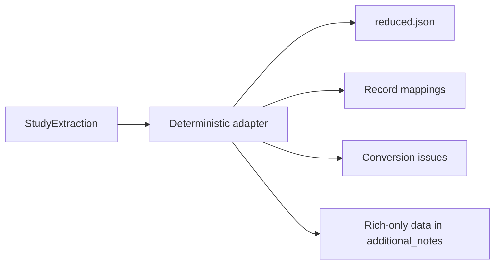

<!-- generated-by: gsd-doc-writer -->
# Reduced PERLA schema

The rich study model and the historical reduced PERLA schema do not carry the same
information. PERLA Extract therefore keeps one optional deterministic direction—rich
to reduced—with an explicit conversion report. It does not claim a lossless round
trip, and NOMAD export does not depend on this format.



## Projection rules

Each rich performance observation, population statistic, and stability test becomes a
separate reduced cell. An individual device without an observation and a family not
represented by another record also receive a row. The adapter never combines an
individual measurement, aggregate, and stability result into one reduced cell.

The adapter projects only unambiguous supported fields:

- PCE, short-circuit current density, open-circuit voltage, and fill factor when one
  recognized reported value has a compatible numeric value and unit;
- family polarity, ordered layers, one absorber formula only when the family has
  exactly one scoped absorber, and layer-linked processing; and
- explicit aggregation semantics such as champion, single device, stabilized, mean,
  median, or distribution.

The small list of recognized metric names and units is used only while writing the
reduced file. It does not control what the model extracts.

## Preserved losses

Rich information that has no faithful reduced field is serialized into
`additional_notes` with stable source identifiers and evidence-block references. This
includes full family provenance, every scoped absorber and its constituents,
multi-absorber formulas that cannot fit the flat slot, unprojected values, detailed
processing conditions, protocol identity, and ordered stability checkpoints.

`reduced_conversion.json` contains:

- `cells`: the validated reduced rows;
- `mappings`: each rich source kind and ID mapped to its reduced row index; and
- `issues`: explicit conversion limitations such as incompatible units, ambiguous
  metrics, dangling references, and stability retained in notes.

## Why the reverse direction is not deterministic

A reduced cell does not retain enough information to reconstruct stable rich entity
identifiers, multiple measurement protocols for one device, ordered stability
checkpoints, complete evidence, or the pre-assembly source-claim ledger. Converting it
back could therefore create only a partial rich record; it cannot recover values that
were never encoded. The authoritative ground truth should remain `StudyExtraction`.

## Use the adapter

Pass `--reduced-export` to make the extraction workflow write `reduced.json` and
`reduced_conversion.json`. From Python:

```python
from pathlib import Path

from perla_extract.study_extraction import StudyExtraction, to_reduced_with_report

study = StudyExtraction.model_validate_json(
    Path("extraction.json").read_text(encoding="utf-8")
)
export = to_reduced_with_report(study)

Path("reduced.json").write_text(
    export.cells.model_dump_json(indent=2), encoding="utf-8"
)
Path("reduced_conversion.json").write_text(
    export.model_dump_json(indent=2), encoding="utf-8"
)
```
