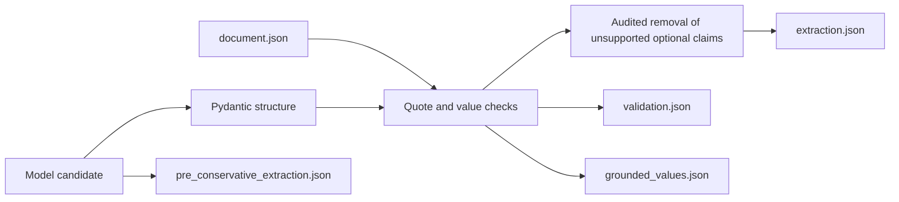

<!-- generated-by: gsd-doc-writer -->
# Evidence and validation

Evidence serves two different purposes: it tells a reviewer where a claim came from,
and it lets the software reject unsupported source links without asking another model.

## Parser-independent blocks

Both parser backends produce ordered `EvidenceBlock` records with:

- a content-derived `block_id`;
- `source` (`main` or `supplement`) and one-based `page`;
- parser-derived section context and block kind;
- the source text; and
- an optional page bounding box and parser metadata.

Docling is the default because it provides document structure, layout-aware tables,
and semantic content labels. PyMuPDF is an explicit lightweight alternative that reads
native PDF text and tables and uses typography to infer headings. It also adds a
typography-preserving rendering when raised or lowered glyphs can clarify chemical
subscripts or superscripts. Both map into the same block contract, so downstream
extraction is independent of parser-specific objects.

The document cache retains every parsed block. Before model calls, a scientific evidence
view withholds only content Docling explicitly labels as references or document
furniture, such as page headers and footers. Unknown content is retained. This avoids
journal-specific heading rules while keeping the original parse recoverable.

`DOCUMENT_CACHE_FORMAT_VERSION` is the only manually maintained parser-cache version.
It changes only when the cache envelope becomes incompatible. Parser implementation,
`EvidenceBlock` schema, backend version, and source changes are fingerprinted
automatically and therefore require no manual version bump.

## Evidence citations

Every scientific record carries one or more `EvidenceCitation` values. A citation names a
supplied block and contains an exact supporting passage. Every `ReportedValue.raw_value`
must also occur in at least one cited block. A value assembled from multiple exact
quotes is accepted only when their normalized contents join to the complete raw value.
Extraction validation and human corrections use the same conservative matcher, so
Unicode normalization and harmless OCR spacing are accepted consistently at both
boundaries without allowing text to join across surrounding word characters.

The extractor is instructed not to digitize plots, interpolate, infer unreported
identity, or import values from cited background work. Human ground truth follows the
same boundary.

Before generation, parser blocks are deterministically divided into sentence,
table-row, or bounded text spans with content-derived IDs. Model-facing responses use
only those IDs. PERLA inserts the exact span text and parent block ID before writing
the public `StudyExtraction`, so review and export continue to see ordinary nested
citations while the model neither reproduces nor alters quotation text.

If a citation points to the wrong or an unknown block, PERLA searches for its complete
unchanged quotation. A unique normalized match repairs only the block pointer. A
missing or ambiguous match is never guessed and remains visible in
`citation_repairs.json` and `validation.json`.

Historical or manually imported data may contain a quotation that stitches two real
passages from one block while omitting the text between them. That is not one verbatim
quote. PERLA repairs it only when both
normalized spans are at least 40 characters and together account for every normalized
character in the model excerpt. A short claimed block becomes one exact block quote; a
longer block becomes the two exact source citations when the evidence field has room.
The audit records the old and new quotes; block identity and scientific values never
change.

## What local validation proves

After extraction, `validate_study` checks:

1. cited block identifiers exist;
2. evidence quotes occur in those blocks after conservative Unicode and whitespace
   normalization, including an internal dash omitted by PDF text extraction while
   preserving unary signs;
3. reported values occur in their cited evidence;
4. source-reported material-form wording occurs in its cited evidence;
5. top-level and nested identifiers are unique;
6. processing targets and absorber layers resolve within their family;
7. device, observation, population, and stability references resolve; and
8. linked stability devices and families agree.

Pydantic additionally rejects non-finite normalized numbers, contradictory champion
fields, and a stability `link_status` whose required identifiers are absent.

`grounded_values.json` is a conservative value-level subset. It is useful when precision
matters more than recall, but it is not a replacement for `extraction.json`: local text
matching cannot prove that a supported value was attached to the correct scientific
entity or that no device was missed.

If finalization removes an unsupported optional claim, the exact original object is
available in `pre_conservative_extraction.json` and its decision is recorded in
`conservative_finalization.json`. This turns an otherwise invalid study into a safer
review seed without erasing evidence of what the model attempted.

## What still requires review

A passing source check proves textual support and valid links, not scientific
completeness. It cannot independently determine whether:

- all devices and variants were found;
- two differently named candidates are the same physical device;
- a quoted value has the correct semantic role; or
- the paper itself leaves a relationship ambiguous.

Those questions belong to the [ground-truth workflow](../workflows/ground-truth-review.md).
`claim_coverage_audit.json` helps by comparing the grounded source-claim ledger with
the assembled study. It distinguishes study targets from context specimens, flags
top-level records unsupported by target objects, and checks explicitly shared
quantities target by target. Unmatched or uncertain claims still require adjudication.
