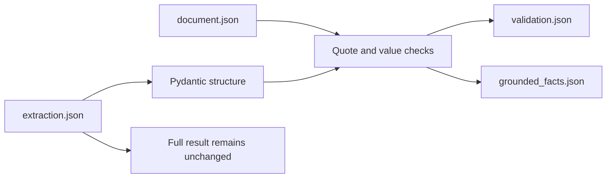

<!-- generated-by: gsd-doc-writer -->
# Evidence and validation

Evidence serves two different purposes: it tells a reviewer where a claim came from,
and it lets the software reject unsupported source links without asking another model.

## Parser-independent blocks

Both parser backends produce ordered `EvidenceBlock` records with:

- a content-derived `block_id`;
- `source` (`main` or `supplement`) and one-based `page`;
- parser-derived section context and block kind;
- the source text; and
- an optional page bounding box and parser metadata.

Docling is the default because it provides document structure, layout-aware tables,
and semantic content labels. PyMuPDF is an explicit lightweight alternative that reads
native PDF text and tables and uses typography to infer headings. It also adds a
typography-preserving rendering when raised or lowered glyphs can clarify chemical
subscripts or superscripts. Both map into the same block contract, so downstream
extraction is independent of parser-specific objects.

The document cache retains every parsed block. Before model calls, a scientific evidence
view withholds only content Docling explicitly labels as references or document
furniture, such as page headers and footers. Unknown content is retained. This avoids
journal-specific heading rules while keeping the original parse recoverable.

`DOCUMENT_CACHE_FORMAT_VERSION` is the only manually maintained parser-cache version.
It changes only when the cache envelope becomes incompatible. Parser implementation,
`EvidenceBlock` schema, backend version, and source changes are fingerprinted
automatically and therefore require no manual version bump.

## Evidence references

Every scientific record carries one or more `EvidenceRef` values. A reference names a
supplied block and copies the smallest useful supporting quote. Every `Fact.raw_value`
must also occur in at least one cited block. A fact assembled from multiple exact
quotes is accepted only when their normalized contents join to the complete raw value.

The extractor is instructed not to digitize plots, interpolate, infer unreported
identity, or import values from cited background work. Human ground truth follows the
same boundary.

## What local validation proves

After extraction, `validate_study` checks:

1. cited block identifiers exist;
2. evidence quotes occur in those blocks after conservative Unicode and whitespace
   normalization;
3. fact values occur in their cited evidence;
4. family and device identifiers are unique;
5. device, observation, population, and stability links resolve; and
6. equivalence members exist and are not claimed more than once.

`grounded_facts.json` is a conservative fact-level subset. It is useful when precision
matters more than recall, but it is not a replacement for `extraction.json`: local text
matching cannot prove that a supported value was attached to the correct scientific
entity or that no device was missed.

## What still requires review

A passing source check proves textual support and valid links, not scientific
completeness. It cannot independently determine whether:

- all devices and variants were found;
- two differently named candidates are the same physical device;
- a quoted value has the correct semantic role; or
- the paper itself leaves a relationship ambiguous.

Those questions belong to the [ground-truth workflow](../workflows/ground-truth-review.md).
