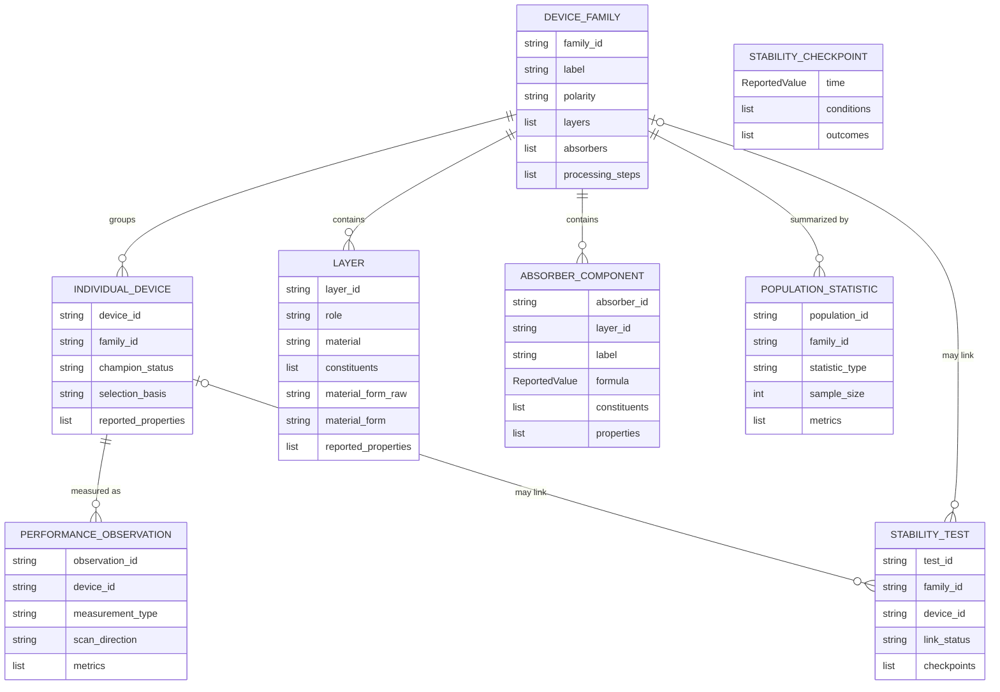

<!-- generated-by: gsd-doc-writer -->
# Study model

`StudyExtraction` represents the claims in one supplied paper and its Supporting
Information. Its entities reflect what the source actually reports, not the flat row
shape of a downstream database.

## Device families and composition

A `DeviceFamily` is one complete photovoltaic design that can describe several
fabricated specimens. Its identity comes from the ordered functional-layer materials,
absorber composition or compositions, and cell polarity or topology. Split families
when one of those design-defining features changes. A material intentionally retained
in the finished device can distinguish a family.

Do not create another family solely because the paper changes a fabrication parameter,
post-treatment, thickness, area, measurement protocol, scan direction, aging
condition, or champion label while keeping the underlying design. Those distinctions
belong to the linked specimen when the source identifies one. If a paper reports only
a group-level process arm that the schema cannot attach faithfully, preserve that gap
in `unresolved_notes` rather than manufacturing another family. Films, partial stacks,
substrates, and other specimens made only for characterization are context rather than
photovoltaic device families.

An `IndividualDevice` is one particular measured specimen distinguished by the paper,
for example a champion, representative, or certified cell. Multiple measurements on
that specimen link back to it rather than being counted as additional devices. When
the paper reports only a group mean or distribution, create a `PopulationStatistic`
and do not invent individual devices.

A `DeviceFamily` holds information shared by its reported variant: the architecture,
polarity, full stack, ordered layers, scoped absorbers, and processing steps. Each
`AbsorberComponent` keeps one absorber layer or subcell's formula, constituents, and
properties together. A tandem can therefore contain separate wide-bandgap and
narrow-bandgap absorbers without merging their ions. Layers keep their electrical
role, material name, chemical constituents, and physical form separate while
retaining arbitrary reported details as `ReportedValue` records. For example, a
2PACz layer can be a `hole_transport_layer`, contain `2PACz`, and have the normalized
form `self_assembled_monolayer` without combining those facts into one material name.
Processing steps similarly store an operation, target layers, materials, and generic
conditions.

Version-1 inputs with one family-level absorber are read as one explicitly unscoped
component. That migration preserves data but does not guess how a historical tandem
composition should be split. New output always uses the scoped `absorbers` array.

This arrangement captures chemical detail without adding a Python field or regular
expression for every possible material property, additive, treatment, or process
condition.

## Reporting levels are not interchangeable

| Source statement | Record type | Why |
| --- | --- | --- |
| “Device A reached 24.1% in the reverse scan and 23.7% in the forward scan.” | One `IndividualDevice` named Device A and two linked `PerformanceObservation` records | Both numbers were measured on Device A using different scan directions |
| “The mean efficiency of 20 devices was 22.8%.” | One `PopulationStatistic` with `sample_size=20` | The mean describes the group and is not assigned to Device A or another individual cell |
| “Champion device” with a reported JV curve | `IndividualDevice` with `champion_status=yes` plus an observation | Champion status is explicit source semantics |
| Best voltage among variants | Usually no champion claim | An extremum for one property does not establish champion identity |
| “Unencapsulated specimens retained 90% after 1000 hours.” | One `StabilityTest`; `device_id` remains empty unless the paper names the aged device | An unnamed aged specimen must not silently inherit Device A's JV measurements |

Unknown relationships remain unknown. A stability record can link to a family, an
individual device, or only a separately described specimen through `link_status`.
Values shared by a family stay on its processing steps; values that distinguish one
measured specimen use `IndividualDevice.reported_properties`. A condition that changes
during an aging sequence belongs to the corresponding checkpoint, while conditions
that apply throughout the test remain on `StabilityTest`.

## Reported values and qualifiers

`ReportedValue` keeps:

- the source label in `name`;
- the reported text in `raw_value`;
- a numeric value and unit only when normalization is unambiguous; and
- one or more exact evidence references.

One `ReportedValue` denotes one semantic quantity. A reported uncertainty or range
may remain in the same `raw_value`, but different metrics or table columns are separate
objects. During model generation, evidence arrays contain only deterministic span IDs;
Python restores exact ordinary nested evidence objects before `extraction.json` is
written.

Bounds, ranges, approximations, and other qualifiers therefore remain visible in
`raw_value` instead of being coerced into an exact scalar. Missing information is
represented with `null`, `not_reported`, or an empty collection as allowed by the
specific field; the extractor must not create a placeholder value.

## Cross-window identity links

Long documents can cause the same entity to be proposed in more than one extraction
window. `CrossWindowIdentityLink` records positive identity evidence between those
candidates. It does not merge them or choose a preferred candidate. This keeps
disagreements and partial records available for inspection and later curation.
