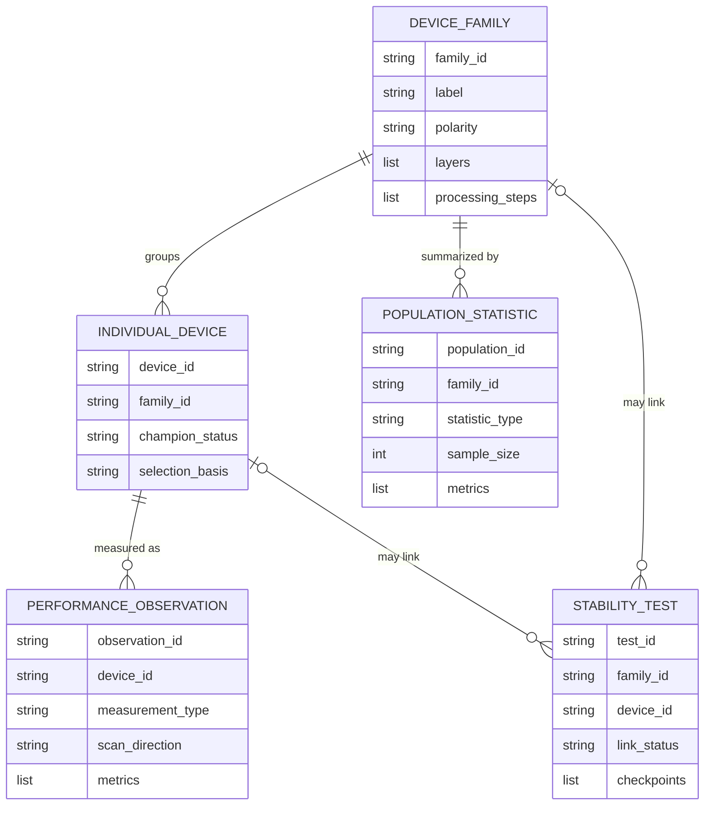

<!-- generated-by: gsd-doc-writer -->
# Study model

`StudyExtraction` represents the claims in one supplied paper and its Supporting
Information. Its entities reflect what the source actually reports, not the flat row
shape of a downstream database.

## Device families and composition

A `DeviceFamily` holds information shared by a reported variant: the architecture,
polarity, full stack, ordered layers, absorber formula and constituents, absorber
properties, and processing steps. Layers identify their role and material while
retaining arbitrary reported details as `ReportedValue` records. Processing steps similarly
store an operation, target layers, materials, and generic conditions.

This arrangement captures chemical detail without adding a Python field or regular
expression for every possible material property, additive, treatment, or process
condition.

## Reporting levels are not interchangeable

| Source statement | Record type | Why |
| --- | --- | --- |
| One cell has a reverse and a forward JV scan | One `IndividualDevice`, two `PerformanceObservation` records | Protocol-specific measurements of the same cell |
| Mean PCE over 20 cells | `PopulationStatistic` | An aggregate is not an individual device |
| “Champion device” with a reported JV curve | `IndividualDevice` with `champion_status=yes` plus an observation | Champion status is explicit source semantics |
| Best voltage among variants | Usually no champion claim | An extremum for one property does not establish champion identity |
| Retained efficiency after aging | `StabilityTest` with ordered checkpoints | A stability experiment is not a JV observation |

Unknown relationships remain unknown. A stability record can link to a family, an
individual device, or only a separately described specimen through `link_status`.

## Reported values and qualifiers

`ReportedValue` keeps:

- the source label in `name`;
- the reported text in `raw_value`;
- a numeric value and unit only when normalization is unambiguous; and
- one or more exact evidence references.

One `ReportedValue` denotes one semantic quantity. A reported uncertainty or range
may remain in the same `raw_value`, but different metrics or table columns are separate
objects. During model generation, repeated quotations are represented once in a
temporary citation catalog; deterministic expansion restores the ordinary nested
evidence objects before `extraction.json` is written.

Bounds, ranges, approximations, and other qualifiers therefore remain visible in
`raw_value` instead of being coerced into an exact scalar. Missing information is
represented with `null`, `not_reported`, or an empty collection as allowed by the
specific field; the extractor must not create a placeholder value.

## Cross-window identity links

Long documents can cause the same entity to be proposed in more than one extraction
window. `CrossWindowIdentityLink` records positive identity evidence between those
candidates. It does not merge them or choose a preferred candidate. This keeps
disagreements and partial records available for inspection and later curation.
