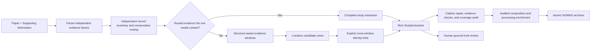

<!-- generated-by: gsd-doc-writer -->
# PERLA Extract

PERLA Extract creates an evidence-backed representation of every photovoltaic device
reported in one paper and its Supporting Information. The core design decision is to
model the study first and export flat rows only afterward. This prevents a champion
cell, an average over many cells, and a stability specimen from being silently treated
as the same measurement.

## System at a glance

The parser retains source, page, section, block text, and—when available—page
coordinates. The model returns strict Pydantic records with exact evidence quotes.
Local checks then report unsupported quotes, raw values that are absent from their
cited evidence, duplicate identifiers, and dangling links. These checks annotate the
result; they do not erase model output.

## Design principles

- **Keep scientific reporting levels separate.** Individual measurements,
  population statistics, and stability experiments are different record types.
- **Prefer a complete-study view.** A shallow inventory removes only cited,
  high-confidence irrelevant blocks from the expensive request. The complete parse is
  preserved, and remaining long inputs use structural windows.
- **Preserve candidates.** Cross-window linking adds identity links instead of
  guessing which candidate should replace another.
- **Use generic reported values.** Layers and processing steps contain `ReportedValue`
  records. Every value denotes one semantic quantity, while shared citation IDs avoid
  repeating the same evidence. Property-specific regular expressions do not decide
  what can be extracted.
- **Make uncertainty inspectable.** The full output, conservative grounded subset,
  failed responses, configuration, and conversion losses are separate artifacts.

## Choose a path

- [Run your first extraction](getting-started.md)
- [Discover new papers with PapersBot](workflows/papersbot.md)
- [Understand the study model](concepts/study-model.md)
- [Understand evidence validation](concepts/evidence.md)
- [Review and curate ground truth](workflows/ground-truth-review.md)
- [Interpret composition and processing](workflows/enrichment.md)
- [Export directly to NOMAD](workflows/nomad-export.md)
- [Export to the historical reduced PERLA schema](compatibility/reduced-schema.md)
