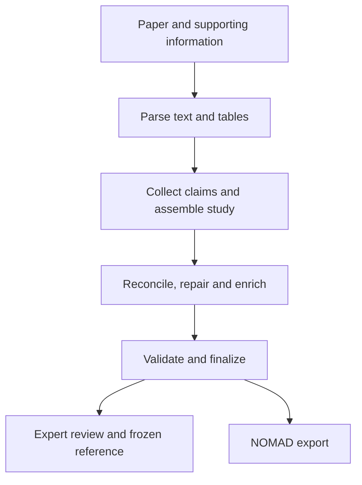

<!-- generated-by: gsd-doc-writer -->
# PERLA Extract

PERLA Extract turns photovoltaic papers and supporting information into source-linked
records for device structure, composition, processing, performance and stability.
It represents individual measurements separately from population statistics and
stability tests. This supports correct attribution; it does not guarantee complete
extraction or correct scientific interpretation.

## Workflow

```mermaid
flowchart TD
    A[Paper and supporting information] --> B[Parse text and tables]
    B --> C[Collect claims and assemble study]
    C --> D[Reconcile, repair and enrich]
    D --> E[Validate and finalize]
    E --> F[Expert review and frozen reference]
    E --> G[NOMAD export]
```

The parser retains source, page, text and available coordinates. Models select
evidence-span IDs; the application restores exact quotations. Source checks detect
invalid citations, absent raw values, duplicate identifiers and broken links. They
do not establish that a passage scientifically supports a claim.

Configured conservative finalization can remove unsupported optional claims from
the final extraction. The complete candidate and exact removals remain in separate
audit artifacts. Expert review starts from the final result, with those artifacts
available for inspection. [Evidence and validation](concepts/evidence.md) describes
these boundaries.

For evaluation, start with [Methods and evidence status](methods/benchmark.md) or
[run the synthetic scoring example](workflows/scoring-example.md).

## Design principles

- **Keep scientific reporting levels separate.** Individual measurements,
  population statistics, and stability experiments are different record types.
- **Separate reading from record construction.** Long inputs may use structural
  windows and repeated source readings to collect neutral claims, but one global call
  constructs the final records from their grounded union and cited passages.
- **Re-read before review.** A second pass audits the complete draft against the same
  evidence. The first draft and a record-level change index remain inspectable.
- **Treat scope as data.** Study targets, processing arms, characterization specimens,
  populations, and measurements remain distinct before any are mapped to records.
- **Use generic reported values.** Layers and processing steps contain `ReportedValue`
  records. Every value denotes one scientific quantity, while shared citation IDs avoid
  repeating the same evidence. Property-specific regular expressions do not decide
  what can be extracted.
- **Make uncertainty inspectable.** The full output, conservative grounded subset,
  failed responses, configuration, and conversion losses are separate artifacts.

## Choose a path

- [Run your first extraction](getting-started.md)
- [Discover new papers with PapersBot](workflows/papersbot.md)
- [Understand the study model](concepts/study-model.md)
- [Understand evidence validation](concepts/evidence.md)
- [Review and curate ground truth](workflows/ground-truth-review.md)
- [Score rich extractions deterministically](workflows/evaluation.md)
- [Create quality-first review seeds, then reduce cost](workflows/quality-first-ground-truth.md)
- [Interpret composition and processing](workflows/enrichment.md)
- [Export directly to NOMAD](workflows/nomad-export.md)
- [Export to the historical reduced PERLA schema](compatibility/reduced-schema.md)
