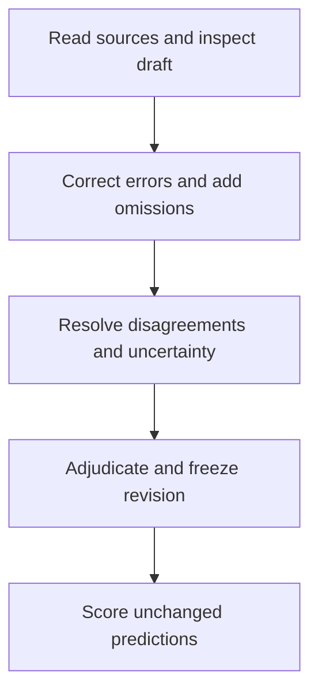

# Evaluation method

PERLA compares an extraction with a source-checked reference. A fact receives credit
when both its value and its experimental context agree: PCE = 20% on a reverse scan
does not match the same value assigned to a forward scan.

The scorer is deterministic and makes no model calls. Start with the
[worked example](../workflows/scoring-example.md) to run it without papers or an API
key. The [scoring reference](../workflows/evaluation.md) documents the exact matching,
tolerance and reporting rules.

## Inputs

An evaluation uses two `StudyExtraction` documents:

- **Reference:** the source-checked records used as the comparison target.
- **Prediction:** an unchanged extraction being evaluated.

A frozen reference directory adds schema and content hashes, review provenance and
record-level uncertainty. A complete prediction directory adds source evidence and
run accounting. Bare JSON inputs are supported for development, but lack these
additional checks. No real-paper reference dataset is included with the software;
the bundled example uses synthetic data.

Reference and prediction must cover the same sources and scientific scope. The
extraction workflow reads parser-produced text and tables. Figure classification
is separate; classifying a panel does not create reference labels for its values.

## Construct the reference

Experts read the main paper and supporting information, correct proposed records,
and add omitted information. Corrections and source-wide omission checks are both
needed: approving the records already present does not establish completeness.

Families, individual specimens, observations, population summaries and stability
tests remain separate. Reverse and forward scans can describe one cell; a mean over
20 cells is a population result. A stability specimen is linked to another measured
cell only when the source supports that identity.

The workbench saves corrections, additions, decisions and their evidence. An
administrator adjudicates the current revision before export. Export checks the
current decisions, schema and citations; it cannot establish that a source was
read completely or interpreted correctly. The [review-to-benchmark guide](
../workflows/review-to-benchmark.md) explains how to reconcile feedback and freeze it.

A final `uncertain` decision is an abstention. The scorer excludes the uncertain
reference record and a remaining prediction matched to it. It reports those
exclusions explicitly. Uncertainty is currently handled for whole records, not
individual fields.

## Match records, then compare facts

Generated IDs are not scientific identities. PERLA pairs records by content within
each record type, using established parent links and measurement conditions to
prefer compatible matches. The assignment is one-to-one: a prediction cannot match
several reference records.

Within paired records, the scorer compares facts in six groups: performance,
population statistics, stability, stack, composition and processing. Context
identifies the relevant cell, scan, layer, constituent, operation or stability
checkpoint. Explicit layer and operation sequence is meaningful; JSON array order
is not.

Single unqualified numbers with compatible explicit units are converted before
comparison. The default relative tolerance is `1e-6`; the absolute tolerance is
`1e-9` in canonical base units. These accommodate numeric representation, not
experimental uncertainty. Formulas, ranges and unfamiliar descriptions use
conservative text comparison. The [scoring reference](../workflows/evaluation.md)
gives examples and the full matching algorithm.

## Read the results

| Result | Question answered |
| --- | --- |
| Correct value in correct context | Is the scientific fact correctly represented? |
| Value only | Was the value recovered within the paired record, ignoring nested context? |
| Attribution only | Is the property in the correct context, regardless of its value? |
| Citation validation | Do source pointers and literal values resolve? |

For each scientific group, the report includes reference, predicted and matched
fact counts, precision, recall and F1. A wrong value contributes an unmatched
prediction and an unmatched reference fact. Extra predictions reduce precision;
missing facts reduce recall. Duplicate predictions cannot reuse one reference fact.

The group-balanced F1 averages groups populated on either side. Empty groups are
excluded rather than given perfect scores. Pooled counts and per-group scores are
also retained: equal group weighting is a reporting choice, not a measure of every
field's scientific importance.

Dataset aggregation combines paper reports with compatible versions and configuration.
Its uncertainty intervals resample papers, not individual fields. These are
single-system intervals, not paired significance tests. The caller supplies the paper
roster; missing or failed runs must be accounted for separately.

## Limitations

Record matching is an estimate of identity. Similar specimens or differently grouped
operations can produce incorrect pairings. The report exposes selected pairs,
unmatched paths and detected ambiguity so these can be inspected against the source.
No ambiguity warning does not prove that a pairing is correct.

Equivalent chemical names or alternative descriptions may fail conservative equality
checks. Conversely, literal presence in a citation does not prove that a value belongs
to the asserted device or property. Citation validity and scientific correctness are
therefore reported separately.

Precision and recall are relative to the reference's reviewed scope and completeness.
A perfect score against an incomplete reference does not establish complete extraction
from the paper. Regression tests and the synthetic example check software behavior;
they do not measure agreement with experts on arbitrary papers.

## Reproduce a score

Keep the reference, prediction, evidence, code revision and scoring configuration
with the result. Reports record input hashes and scorer versions; the example also
records its environment. Reusing fixed inputs and configuration reproduces the
deterministic comparison.

When reference labels change, freeze a new revision and rescore saved predictions
against that revision. Do not compare scores based on different reference versions
as if only the extractor had changed.
