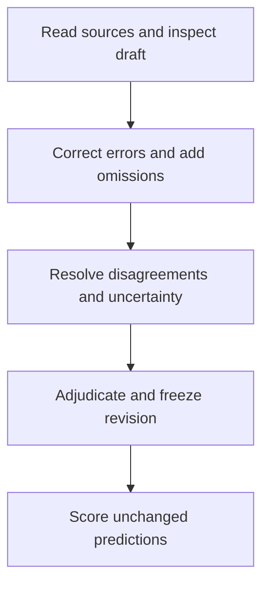

# Evaluation method

PERLA compares an extraction with a source-checked reference. A fact receives credit
when both its value and its experimental context agree: PCE = 20% on a reverse scan
does not match the same value assigned to a forward scan.

The scorer is deterministic and makes no model calls. Start with the
[worked example](../workflows/scoring-example.md) to run it without papers or an API
key. The [scoring reference](../workflows/evaluation.md) documents the exact matching,
tolerance and reporting rules.

## Inputs

An evaluation uses two `StudyExtraction` documents:

- **Reference:** the source-checked records used as the comparison target.
- **Prediction:** an unchanged extraction being evaluated.

A frozen reference directory records the reviewed version, its schema and content
hashes and the final review decisions. A complete prediction
directory includes source evidence and saved call, token, cost and timing totals.
Bare JSON inputs are also accepted, but lack these checks and supporting records. No real-paper reference dataset is included with the software;
the bundled example uses synthetic data.

Reference and prediction must cover the same sources and scientific scope. The
extraction workflow reads parser-produced text and tables. Figure classification
is separate; classifying a panel does not create reference labels for its values.

## Construct the reference

Experts read the main paper and supporting information, correct proposed records,
and add omitted information. Corrections and source-wide omission checks are both
needed: approving the records already present does not establish completeness.

Families, individual specimens, observations, population summaries and stability
tests remain separate. Reverse and forward scans can describe one cell; a mean over
20 cells is a population result. A stability specimen is linked to another measured
cell only when the source supports that identity.

The workbench saves corrections, additions, decisions and their evidence. An
administrator makes the final review decisions before export. The exporter checks
that every current record has a final decision and that the schema and citations
pass validation. It cannot tell whether a reviewer read the whole source or
interpreted it correctly. The [review-to-benchmark guide](
../workflows/review-to-benchmark.md) explains how to reconcile feedback and freeze it.

Reviewers can leave records uncertain while working, but final adjudication and
export require verified decisions for every current record. The scorer rejects
references that still declare uncertain records. Every system is compared with the
same fixed reference; no predictions are excluded to accommodate reviewer uncertainty.

Verification means the record faithfully represents the source. A source-reported
range or an unknown specimen link can be a verified fact. If the source cannot
resolve a disputed claim, keep the paper pending rather than inventing certainty.
Report pending papers separately from the finalized benchmark.

## Match records, then compare facts

Two extractions may give the same device different IDs. PERLA therefore pairs
records by their content, separately for each record type. It uses earlier family
and device pairings, together with measurement conditions, to help pair related records. The assignment is one-to-one: a prediction cannot match
several reference records.

Within paired records, the scorer compares facts in six groups: performance,
population statistics, stability, stack, composition and processing. The recorded context specifies which cell, scan, layer, constituent, operation or
stability checkpoint a fact belongs to. Explicit layer and operation sequence is meaningful; JSON array order
is not.

Single unqualified numbers with compatible explicit units are converted before
comparison. The default relative tolerance is `1e-6`, with no absolute allowance. This permits
small relative numerical differences without treating distinct nanometre-scale
thicknesses as equal. It does not represent experimental uncertainty. Formulas, ranges and unfamiliar descriptions use
conservative text comparison. The [scoring reference](../workflows/evaluation.md)
gives examples and the full matching algorithm.

## Read the results

| Result | Question answered |
| --- | --- |
| Correct value in correct context | Do the value and its recorded context match the reference? |
| Value only | Was the value recovered within the paired record, ignoring nested context? |
| Attribution only | Is the property in the correct context, regardless of its value? |
| Citation validation | Do the cited passages and raw values occur in the supplied evidence? |

For each scientific group, the report includes reference, predicted and matched
fact counts, precision, recall and F1. A wrong value contributes an unmatched
prediction and an unmatched reference fact. Extra predictions reduce precision;
missing facts reduce recall. Duplicate predictions cannot reuse one reference fact.

The group-balanced F1 averages the groups that contain facts in either study.
Groups empty in both studies are left out rather than given perfect scores. Pooled counts and per-group scores are
also retained: equal group weighting is a reporting choice, not a measure of every
field's scientific importance.

The dataset command combines paper reports that use compatible versions and scoring
settings. To estimate uncertainty in average scores, it resamples papers—not
individual fields. These intervals describe one system, not the difference between
two systems. You must supply the full paper list and account for missing or failed runs.

## Limitations

Record matching is an estimate of identity. Similar specimens or differently grouped
operations can produce incorrect pairings. The report lists selected pairs,
unmatched fields and detected ambiguity so you can check them against the source.
A pairing can be wrong even when the scorer gives no warning.

The fixed text-comparison rules can reject equivalent chemical names or descriptions. Conversely, literal presence in a citation does not prove that a value belongs
to the asserted device or property. Citation validity and scientific correctness are
therefore reported separately.

Precision and recall are relative to the reference's reviewed scope and completeness.
A perfect score against an incomplete reference does not establish complete extraction
from the paper. Regression tests and the synthetic example check software behavior;
they do not measure agreement with experts on arbitrary papers.

## Reproduce a score

Keep the reference, prediction, evidence, code revision and scoring configuration
with the result. Reports record input hashes and scorer versions; the example also
records its environment. Reusing fixed inputs and configuration reproduces the
deterministic comparison.

When reference labels change, freeze a new revision and rescore saved predictions
against that revision. Do not compare scores based on different reference versions
as if only the extractor had changed.
