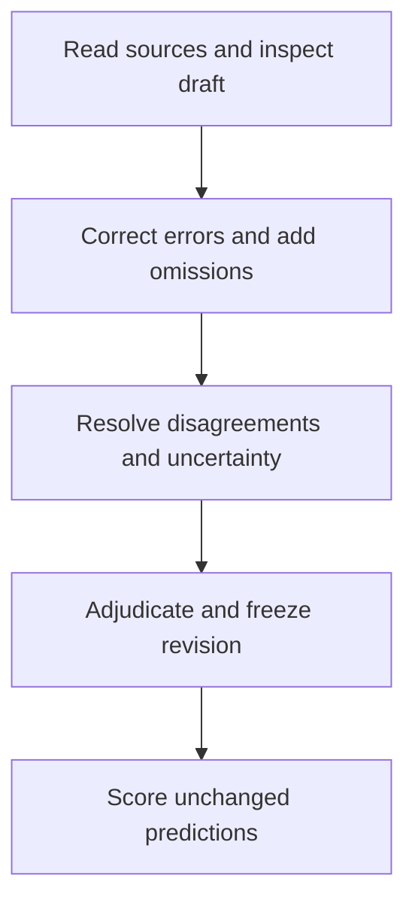

# Evaluation methods

PERLA evaluates whether an extraction recovers the scientific facts in a
source-checked reference **and assigns them to the correct experimental context**.
It does not use citation validity, JSON completeness, or record count as a proxy
for scientific accuracy.

## Scope and evidence status

| Component | Available in this repository | What it establishes |
| --- | --- | --- |
| Extraction and review workflow | Implementation, tests and operational guides | How predictions and corrections are produced and retained |
| Deterministic scorer | Versioned rules and regression tests | Behavior on the tested representations and error cases |
| Worked example | Synthetic source, simulated review, exported reference and expected scores | A reproducible software integration check, not extraction accuracy |
| Expert reference release | Export tooling and development-cohort manifest; no frozen real-paper labels bundled here | A release must separately identify adjudicated items and permitted access |
| Expert validation of scoring | Protocol below; no completed agreement study bundled here | Agreement with expert pairing and fact judgments remains to be measured |
| Held-out model/human comparison | Study requirements below; no completed results bundled here | No claim of superiority or generalization follows from the software tests |

Read [the worked example](../workflows/scoring-example.md) first to reproduce a result.
The [scoring reference](../workflows/evaluation.md) defines the implemented rules;
[the review guide](../workflows/review-to-benchmark.md) gives the operational commands.

## Construct the reference

Experts read the main paper and supporting information, correct proposed records,
and add omitted schema-relevant information. The reference therefore incorporates
both correction of pre-annotations and a source-wide search for omissions. Report
the sources and scientific categories actually inspected, rather than inferring
review coverage from individual record approvals.

Keep families, particular specimens, measurement observations, population summaries,
and stability tests distinct. For example, reverse and forward scans can describe
one cell; the mean of 20 cells is a population result, not a second scan of that cell.
Correct values, units and their associations together. Do not infer a stability
specimen's identity from an unrelated champion result.

Declare a source policy before scoring. The extraction workflow uses parser text
and tables, not page images. Figure classification is a separate image-based workflow.
An assessment of information lost from figures requires source-checked figure-only
facts; counts or classifications of panels are not themselves fact-level labels.
Apply the same inclusion policy to reference and predictions, or report text-accessible
and figure-only coverage separately.

The administrator adjudicates the current revision. Export checks current record
decisions and deterministic evidence validity. It cannot automatically establish that
an expert searched every relevant passage or interpreted it correctly. Review uncertainty
is retained explicitly; the current scorer masks **whole records**, not individual fields.
Publish the number and scope of abstentions alongside scores.

Pre-annotation is part of the reference-creation method and must be disclosed. A
second expert's source-based audit can assess remaining omissions and disagreements.
Record which audit was actually performed; do not describe a proposed audit as completed.

## Measure extraction quality

A scored fact includes its scientific value and its recorded context. For example,
PCE = 20% must belong to the correct specimen and scan. A value on the wrong scan
does not earn strict credit. Matching first estimates which records refer to the
same objects, then one-to-one fact comparison determines credit.

The primary profile covers performance, population statistics, stability, stack,
composition and processing. Report each group's true, predicted and matched counts,
precision, recall and F1. A wrong value contributes both an unmatched prediction and
an unmatched reference fact. Extra predictions reduce precision; missing facts reduce
recall. Duplicate predictions cannot reuse one reference fact.

The group-balanced F1 gives equal weight to populated scientific groups so a long
processing description does not alone determine the paper's headline. This is an
explicit weighting choice, not an empirically established measure of scientific
utility. Retain pooled counts, per-group scores, and paper-level results so readers
can inspect the effect of weighting. Groups empty on both sides are excluded, not
awarded perfect scores.

| Report view | Interpretation |
| --- | --- |
| Correct value in correct context | Primary scientific agreement |
| Value only | Diagnose numbers/materials recovered but misattributed |
| Attribution only | Diagnose context recovered even when values are wrong |
| Citation validation | Verify source pointers and literal presence, not scientific entailment |

The scorer makes no LLM calls. It uses declared numeric tolerances, explicit aliases,
and conservative comparison of formulas, ranges and text. Scalar measurements with
explicit units and unambiguous identity have simpler comparison rules than chemical
synonyms or differently grouped processing steps. This is a distinction in the rules,
not measured extraction accuracy. Read the [matching and equality contract](
../workflows/evaluation.md#matching-which-records-refer-to-the-same-thing).

## Validate the scorer

Validate scientific comparison separately from software correctness. Use source-checked
development corrections and additions to assemble cases with expected record pairings
and fact judgments. Preserve the reviewed input paths, source evidence, judgment and
rationale. Make the expected decisions before inspecting the scorer's proposed credit.

Include missing measurements, extra stack materials, wrong precursor attribution,
equivalent units, swapped scan directions, repeated steps, and alternative chemical
representations. Check **false credit and false rejection**, including plausible
negative pairs. Do not restrict the audit to identical-input checks or obvious errors.

Run the fixed cases with the default configuration and a predeclared set of alternative
matching thresholds and tolerances. Compare pairings and credited paths, not just F1.
The threshold is a heuristic, not a calibrated confidence; tolerances address numeric
representation, not experimental error bars. Publish changes in decisions and unresolved
cases. Select any revised rules using development cases, version them, then freeze
them before held-out evaluation. Do not edit correct expert labels to satisfy the matcher.

The worked example and regression tests are executable checks supporting this process.
They do not substitute for expert-established cases. Source-checked corrections and
additions supply development cases; record their provenance and expected judgments.

## Comparison studies

These studies answer different questions and must not share an unlabeled headline:

| Study | Evaluation unit | Primary interpretation |
| --- | --- | --- |
| Rich-schema benchmark | Scientific fact with context, against frozen reference | Correctness and completeness within reviewed scope |
| Historical-database comparison | Claims in a common reduced-schema projection, judged by experts | Supported-claim precision in the shared representation |
| Blinded preference | Expert rubric response for anonymous A/B candidates | Preference, not reference-relative recall |

The current historical comparison treats numeric values and unit fields as separate
scalar claims. Its precision is therefore not the rich scorer's quantity-in-context
precision. Projection loses information; report projection coverage/issues separately.
See [the historical comparison protocol](../workflows/expert-comparison.md).

For an independent-human-versus-model benchmark, freeze unseen papers, main/SI access,
figure policy, model/configuration, schema, scorer, time allowance, permitted tools and
analysis plan. Specify equal-time work or best achievable quality. The human contestant
must not see the model output or reference. Adjudicate the reference separately; an
expert's correction session is not an independent-human extraction baseline.

Use identical presentation for paired preference, conceal origin, randomize sides,
and offer tie/cannot-judge responses. Freeze rubrics and the sampling/analysis plan
before collecting confirmatory judgments. The implementation's dataset aggregator
provides single-system paper-bootstrap intervals, **not paired significance tests**.

Papers used to change parsing, extraction, schema or scoring rules remain development
papers. Retain every assigned paper: a failed run is not silently removed. An empty,
valid extraction has zero recall where truth has facts; invalid or missing artifacts
are separately recorded failures. Record the intended roster and reconcile it with
reported results; the current aggregator does not enforce roster completeness.

## Release and reproducibility

For a scientific release, provide:

1. A fixed code revision, environment specification, scorer versions/configuration,
   cohort, inclusion/exclusion reasons and development/test assignment.
2. Adjudicated reference revisions with schema, content and evidence hashes; review
   scope, uncertainty, provenance of pre-annotations and any independent audit.
3. Unchanged prediction artifacts, per-paper reports, aggregate counts, failed runs,
   matching issues and observed cost coverage. Link artifacts supporting numeric claims.
4. Expert scorer-validation cases/results and the frozen comparison analysis plan.
5. Access instructions and a privacy/redistribution check for every released file.

Raw review exports can include identities, comments and original uploads. Preserve
them privately; the exporter is not an anonymization tool. Never redact a frozen
artifact in place. A public derivative requires its own consistent hashes and version.
Source access may be controlled even when the scoring example and code are public.

If reference labels change, release a new version and rescore all saved predictions
against it. A comparison of model A/truth v1 with model B/truth v2 confounds model
changes with label changes.
