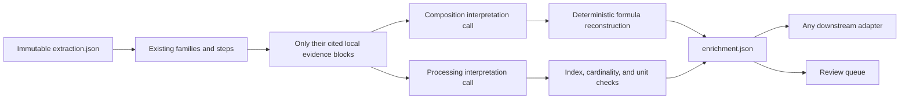

<!-- generated-by: gsd-doc-writer -->
# Interpret composition and processing

`extraction.json` preserves what the paper reports. It intentionally does not turn a
formula into crystallographic site assignments or treat an unfamiliar process label
as a predefined database field. The default enrichment stage makes those semantic
decisions separately, after extraction and evidence validation.

This is a normal extraction stage, not a NOMAD-specific repair. It runs by default
and produces a reusable `EnrichmentAudit`. NOMAD currently consumes accepted results;
another exporter can use the same artifact without repeating the calls.

## What the calls may decide

The composition call receives only families with a reported formula, existing
constituents, and their cited blocks. It proposes A-, B-, and X-site terms. A proposal
is accepted automatically only when all three sites are present and the proposed
terms exactly reconstruct the reported formula after removing typographic formatting.
Mixed or grouped formulas that cannot be reconstructed exactly remain
`needs_review`; the code does not contain a catalogue of material-specific ions.
The reported formula must also occur in its valid cited source block.

The processing call receives existing steps with indexed materials and atomic
conditions plus their cited blocks. It may map a condition index to temperature,
duration, or atmosphere, and a material index to solute, solvent, antisolvent, or
other. It cannot emit a new measured value. Numeric mappings are accepted only when
the referenced source value has an explicit compatible number and unit. Dangling,
duplicate, or incompatible pointers remain reviewable or are rejected.
Referenced conditions and material names must occur in the step's cited evidence.

## Artifacts and cost

| Artifact | Purpose |
| --- | --- |
| `enrichment.json` | Complete typed audit, including accepted, reviewable, rejected, and failed decisions |
| `enrichment.schema.json` | JSON Schema for validating the audit independently |
| `composition_proposals.json` | Composition-only review queue |
| `processing_proposals.json` | Processing-only review queue |

At most two batched model calls are added per paper, and a call is skipped when there
is no corresponding extracted record. Requests use local evidence rather than the
complete paper and share the normal content-addressed model cache. Use
`--enrichment-model` to select a different schema-capable model or `--no-enrichment`
for a cost or ablation run.

Enrichment never rewrites `extraction.json`. This separation keeps reported facts,
model interpretation, deterministic acceptance, and later human correction distinct.
