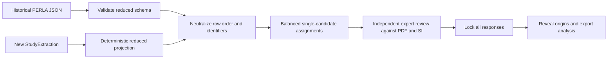

# Compare the historical database with a new extraction

Use the workbench's **Extractor study** for a blinded expert comparison. This is an
evaluation workflow, not a shortcut for creating ground truth: its responses are
stored separately and never modify reviewed scientific records.

## Question the experiment answers

The primary question is whether an output contains atomic claims that an expert can
support from the paper. Secondary questions cover omitted facts, extra records, wrong
links, chemical detail, relationship fidelity, NOMAD usefulness, and active review
time. Together these are more informative than asking only “which JSON do you like?”

## Bias controls

- Pre-register papers, reviewers, outcomes, exclusions, and analysis before the
  confirmatory run. Keep a held-out paper set that did not influence either workflow.
- Give both candidates the same paper, SI, schema, normalization, labels, layout, and
  PDF tools. The workbench hashes each source and both candidate payloads.
- Each reviewer initially sees only one candidate for a paper. Assignments are
  balanced across reviewers and the A/B mapping is randomized per paper. This avoids
  learning the paper from one output before scoring the other.
- Preserve `cannot_determine`, ties across aggregate scores, missing records, and
  “both inadequate” outcomes. Do not force a preference.
- Mark experts who developed either extractor and report their results separately.
- Never use comparison responses as ground truth. Adjudicate a separate ground-truth
  dataset when recall must be measured against a complete reference.

Run a 6–8 paper usability pilot first. Fix only protocol and interface problems, then
freeze the design and use roughly 24–30 representative papers for the confirmatory
study. Assign at least two experts per candidate-paper combination where resources
allow, and balance candidate exposure within every reviewer.

## Prepare a comparison in the app

An administrator opens **Extractor study → Create comparison** and supplies:

1. an existing review-app paper ID and dataset split;
2. the corresponding historical `PerovskiteSolarCells` JSON;
3. the new rich `StudyExtraction` JSON;
4. exact reviewer IDs; and
5. a randomization seed recorded in the pre-registration.

The server validates the historical payload directly. It projects the rich payload
through `to_reduced_with_report`, freezes projection issues, hashes the reviewed PDF
and SI, randomizes A/B, and stores only the seed's SHA-256 hash. Invalid input is not
accepted as a comparison.

The reduced schema is a deliberate common denominator for the primary accuracy
comparison. It does not imply that the reduced model is the new extractor's preferred
output. Relationship and NOMAD usefulness ratings preserve that limitation as a
separate outcome, and projection issues remain in the analysis export.

The scored projection omits free-text compatibility notes, catch-all additional
parameters, evidence IDs, and internal record IDs. Those remain hash-protected in the
native payload. Identical path/value claims repeated across flat rows are shown once;
experts count duplicate rows and wrong relationships separately. This prevents
provenance bookkeeping and repeated stack descriptions from dominating the accuracy
score or revealing which workflow produced an output.

## Expert task

For every displayed scalar claim, select:

- **Correct** — the source supports both value and meaning;
- **Incorrect** — the field is relevant but its value or interpretation is wrong;
- **Unsupported** — the candidate asserts something the source does not report; or
- **Cannot tell** — the source does not permit a reliable decision.

Numbers and units are separate atomic claims. An incorrect or unsupported judgment
requires a main-paper or SI page. Add omitted schema-relevant facts separately and
count extra/missing records and wrong links. **Save draft** keeps an immutable
revision; **Submit final review** locks the common-schema response.

Only then does the app reveal the assigned workflow's complete native JSON—not its
identity. The expert rates chemical detail, relationships, verification ease, NOMAD
usefulness, and whether the result is suitable as a starting point for expert database
curation. This second immutable response measures native utility without letting the
richer representation influence the primary accuracy judgments.

## Outcomes and reveal

Candidate identity stays sealed until every assigned response for that paper is
final. The administrator endpoint
`GET /api/comparison-export/<comparison_id>` then returns candidate and source hashes,
the A/B mapping, every accuracy and native-utility response, projection issues, active
time, structural-error counts, rating means, curation-suitability counts, and supported
atomic precision:

\[
\text{precision} = \frac{\text{correct}}
{\text{correct} + \text{incorrect} + \text{unsupported}}
\]

`cannot_determine` is reported but excluded from that denominator. Omission counts are
useful diagnostics, not source-relative recall, unless a separate adjudicated ground
truth establishes the complete denominator. Compare candidates with reviewer- and
paper-aware uncertainty (for example, a mixed-effects model or a clustered bootstrap),
not by treating individual fields as independent replicates.

## Pilot interpretation

Use the pilot to learn whether experts understand the labels, can find source evidence,
and complete the task in reasonable time. Do not use it to tune the extractor on those
same papers and then report the resulting score as confirmatory evidence. If the new
workflow wins on rich native utility but loses fields at the reduced projection, report
both facts; the projection boundary is part of the result, not an error to hide.
