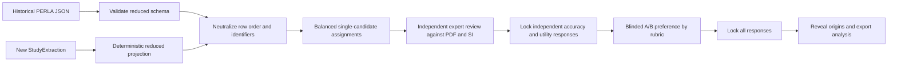

# Compare the historical database with a new extraction

Use the workbench's **Extractor study** for a blinded expert comparison. This is an
evaluation workflow, not a shortcut for creating ground truth: its responses are
stored separately and never modify reviewed scientific records.

The app collects source-supported correctness judgments, then ratings of the full
extractions, then paired preferences. Responses remain separate from scientific
reference records.


```mermaid
flowchart LR
    O[Historical PERLA JSON] --> N[Validate reduced schema]
    X[New StudyExtraction] --> P[Deterministic reduced projection]
    N --> B[Neutralize row order and identifiers]
    P --> B
    B --> A[Balanced single-candidate assignments]
    A --> R[Independent expert review against PDF and SI]
    R --> I[Lock independent accuracy and utility responses]
    I --> Q[Blinded A/B preference by rubric]
    Q --> F[Lock all responses]
    F --> U[Reveal origins and export analysis]
```

## Assignment and visibility

Each reviewer initially sees one anonymous candidate per paper. The workbench
balances assignments across reviewers and randomizes A/B mapping per paper.
Candidate and source hashes identify the inputs. Final independent responses are
locked before the paired preference stage becomes available.

## Prepare a comparison in the app

An administrator opens **Extractor study → Create comparison** and supplies:

1. an existing review-app paper ID and dataset split;
2. the corresponding historical `PerovskiteSolarCells` JSON;
3. the new rich `StudyExtraction` JSON;
4. exact reviewer IDs; and
5. a randomization seed.

The server validates the historical payload directly. It projects the rich payload
through `to_reduced_with_report`, freezes projection issues, hashes the reviewed PDF
and SI, randomizes A/B, and stores only the seed's SHA-256 hash. Invalid input is not
accepted as a comparison.

The reduced schema is a deliberate common denominator for the primary accuracy
comparison. It does not imply that the reduced model is the new extractor's preferred
output. Relationship and NOMAD usefulness ratings preserve that limitation as a
separate outcome, and projection issues remain in the analysis export.

The scored projection omits free-text compatibility notes, catch-all additional
parameters, evidence IDs, and internal record IDs. Those remain hash-protected in the
native payload. Identical path/value claims repeated across flat rows are shown once;
experts count duplicate rows and wrong relationships separately. This prevents
provenance bookkeeping and repeated stack descriptions from dominating the accuracy
score or revealing which workflow produced an output.

## Relationship to the rich-schema benchmark

This workflow scores claims in a shared reduced-schema projection and separately
collects native-utility and A/B preferences. It is not the rich-schema scorer:
numeric values and unit fields are separate claims here, whereas the rich scorer
checks scientific quantities together with their context. Do not compare their
precision numbers as if they used the same denominator. See the [scoring reference](evaluation.md).

## Expert task

For every displayed scalar claim, select:

- **Correct** — the source supports both value and meaning;
- **Incorrect** — the field is relevant but its value or interpretation is wrong;
- **Unsupported** — the candidate asserts something the source does not report; or
- **Cannot tell** — the source does not permit a reliable decision.

Numbers and units are separate atomic claims. An incorrect or unsupported judgment
requires a main-paper or SI page. Add omitted schema-relevant facts separately and
count extra/missing records and wrong links. **Save draft** keeps an immutable
revision; **Submit final review** locks the common-schema response.

Only then does the app reveal the assigned workflow's complete native JSON—not its
identity. The expert rates chemical detail, relationships, verification ease, NOMAD
usefulness, and whether the result is suitable as a starting point for expert database
curation. This second immutable response measures native utility without letting the
richer representation influence the primary accuracy judgments.

After that independent rating is locked, the app shows anonymous candidates A and B
together. The expert records a separate preference for each stored rubric:

- factual correctness;
- coverage and completeness;
- chemical detail;
- relationships between records;
- evidence traceability;
- NOMAD readiness;
- expert curation effort; and
- overall preference.

Every rubric accepts **Candidate A**, **Candidate B**, **Tie**, **Both inadequate**, or
**Cannot judge**. The interface also records confidence, rationale, and active time.
This paired stage answers which trade-offs experts actually prefer without replacing
the independent accuracy measurements or forcing one global winner.

The interface places a reproducible decision rubric beside every criterion. Each one
states its minimum acceptable bar and the specific evidence that warrants preferring
one candidate. Across all criteria, select A or B only for a meaningful advantage;
select **Tie** when both are adequate but no reliable advantage remains; select **Both
inadequate** when neither reaches the stated minimum; and select **Cannot judge** when
the source, outputs, or reviewer expertise cannot support the comparison. These rules
are stored with each comparison when it is created. The page renders those stored
definitions, and both analysis exports preserve them, so an active study cannot
silently inherit later wording changes.

## Outcomes and reveal

Candidate identity stays sealed until every assigned response for that paper is
final. The administrator endpoint
`GET /api/comparison-export/<comparison_id>` then returns candidate and source hashes,
the A/B mapping, every accuracy, native-utility, and pairwise-preference response,
projection issues, active time, structural-error counts, rating means,
curation-suitability counts, rubric-level preference counts, and supported atomic
precision:

```text
supported-claim precision = correct / (correct + incorrect + unsupported)
```

`cannot_determine` is reported but excluded from that denominator. Omission counts are
useful diagnostics, not source-relative recall, unless a separate adjudicated ground
truth establishes the complete denominator. The export does not perform a paired statistical comparison.
