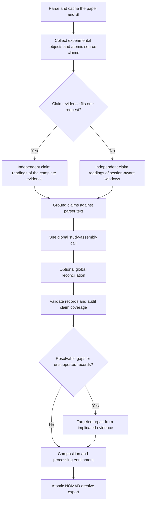

<!-- generated-by: gsd-doc-writer -->
# Extract a study

PERLA separates reading the paper from constructing database records. The first
model pass writes a neutral ledger of source claims and the experimental objects
they describe. A later pass assembles the final study schema from that ledger and
the cited source passages. This distinction prevents every treatment, specimen, or
measurement condition from becoming a separate device family.

## Source claims and experimental objects

The claim ledger is deliberately less committed than the output schema. It records
what the authors say, what real-world object the statement concerns, and whether
that object is a study target, supporting context, or uncertain. Object roles are
generic experimental roles such as device design, processing arm, characterization
specimen, population, performance measurement, and stability experiment.

Claims are atomic. Their `raw_value` contains one exact value or outcome rather than a
whole procedure. For example, a sentence assigning one concentration to three named
solutes becomes `raw_value: "1.4 M"` with three explicitly shared targets. A sentence
with two different concentrations becomes two claims.
Every object and claim cites parser-produced evidence spans. Python checks that the
chosen spans occur in the named source blocks before the ledger can guide assembly.
Unsupported ledger entries remain visible in `claim_grounding.json` but are not
presented to the assembler as paper facts.

Context objects do not imply top-level records. A film made only for XRD, a processing
variant applied to one architecture, or a population mean may inform a device record
without creating a new device family. The model may mark uncertain scope rather than
guessing.

## Long papers and supplements

`--claim-mode auto` uses complete-document claim calls when the request fits
`--single-call-max-input-tokens`; otherwise it uses section-aware windows. Windows are
only a reading strategy: their grounded claims are combined before any final records
are built. Study assembly and reconciliation always receive the combined ledger and
run globally, so records are not independently invented in separate windows and
merged afterward.

Window planning follows parser blocks, pages, and section paths. It does not search
for domain-specific field names. Oversized blocks stay intact instead of being
truncated. `--dry-run` reports the claim mode and planned semantic calls without
calling a model.

By default, `--claim-recall-passes 2` reads every complete document or window twice
with independently worded instructions. The second pass receives the same bounded
parser evidence—not the first model response—and the grounded union guides assembly.
This costs another claim call per window, but prevents one omitted ledger entry from
being an unrecoverable single point of failure. Use one pass only as an evaluated cost
ablation.

## Global assembly and reconciliation

The assembler receives the grounded ledger plus the passages cited by its entries and
a one-span local neighborhood needed to interpret their grammar.
It constructs the complete `StudyExtraction` in one response, keeping device
families, individual devices, performance observations, populations, and stability
tests distinct. It must leave a field unreported when no source claim supports it.

By default, a second global pass re-reads the same compact evidence and returns a
complete corrected study. It may recover missed records or values and remove
unsupported duplicates. A failed reconciliation cannot destroy the valid first
draft, which remains in `draft_extraction.json`. Use `--no-refinement` only for a
measured cost/quality ablation.

The estimate for this global request is checked against
`--assembly-max-input-tokens`. Exceeding it produces an explicit failed run and an
inspectable empty result instead of relying on provider-side truncation. Raising the
limit is a conscious model-context decision recorded in `run_configuration.json`.

## Claim-aware audit and targeted repair

`claim_coverage_audit.json` compares the assembled records with the grounded ledger.
It reports:

- target objects or claims with matching records and evidence;
- possible matches that require review;
- unmatched target claims;
- context and uncertain objects, which are not counted as missing records;
- top-level records that no target object supports; and
- shared quantities whose named targets did not each receive an atomic value.

A numerical claim is covered only when a linked record contains the claim's raw value
in an atomic `ReportedValue` cited to the same local evidence. Sharing a citation with
some other value is only a possible match.

The audit is a review queue, not an accuracy score. A model can still misunderstand
scope, so final quality must be measured against reviewed ground truth.

When the audit or local validation exposes a resolvable problem, one targeted repair
call receives only the affected records and implicated passages. It may add or replace
complete typed records. It may remove a record only when the worklist identifies that
exact record as unsupported. The candidate is accepted only when validation and
semantic claim-coverage issues do not increase. The gate intentionally does not
reward a larger value count: unsupported extra records are defects, not recall.

## Evidence and atomic values

PERLA divides parser blocks into stable sentence, table-row, or bounded text spans.
The model returns supplied `span_id` values; Python inserts exact quotations and
`block_id` values before validation. The model therefore chooses evidence without
spending output tokens copying it or being able to alter it. The complete catalog is
written to `evidence_spans.json`.

Each `ReportedValue` represents one semantic quantity. An uncertainty or range may
remain attached to that quantity, but different metrics in one table row must remain
separate values. Device-specific process coordinates belong to
`IndividualDevice.reported_properties`; stage-specific aging conditions belong to
`StabilityCheckpoint.conditions`.

This workflow is text-only. It never sends rendered PDF pages or images to a model.
Formula recovery is limited to what the selected parser preserves in text and tables;
unreadable chemistry remains a review item rather than a vision-assisted guess.

## Artifacts and failure behavior

The run directory contains the complete scientific parse in `document.json`, the
claim ledger and its schema, grounding decisions, the assembled draft, validation
results, claim-coverage audits, repair artifacts, and the final `extraction.json`.
Raw requests and failures remain under `requests/`.

Every response must first satisfy the provider's strict JSON Schema and then the richer
Pydantic model. A retryable transport failure is resubmitted once; output truncation is
not retried. If JSON passes the provider schema but fails Pydantic relationship checks,
one validation-repair request receives the rejected JSON and the compact validation
errors. That exact follow-up is preserved as
`requests/<call>.validation-repair.request.json`, and usage totals include both paid
responses. No open-ended correction loop is used.

Provider usage is captured before JSON decoding. A charged malformed response is
therefore included in token and cost totals, and a monetary budget fails closed before
another request when the provider did not return usable cost information.

Parser and ledger failures fail open where safe: the full scientific evidence remains
available, and an empty ledger falls back to complete source evidence. A failed initial
study assembly produces a valid empty extraction with an unresolved note. A failed optional
reconciliation or rejected repair preserves the preceding valid result. Local
validation never silently drops unsupported scientific records.

After validation, compact semantic passes interpret composition and processing roles
from existing records and their cited evidence. These enrichments write separate
audits and do not rewrite `extraction.json`. The workflow then exports one pinned
NOMAD archive per atomic source record. The adapter revalidates accepted enrichment
against the original parser blocks before applying it. See
[Interpret composition and processing](enrichment.md) and
[Export to NOMAD](nomad-export.md).

## Model choice

Any LiteLLM model used here must support the requested structured response. Model
choice affects recall, scope classification, and semantic linking; schema conformance
alone is not evidence of extraction quality. Compare models against independently
reviewed ground truth, especially for device identity and chemical composition.

For runtime settings, see the [CLI reference](../reference/cli.md).
