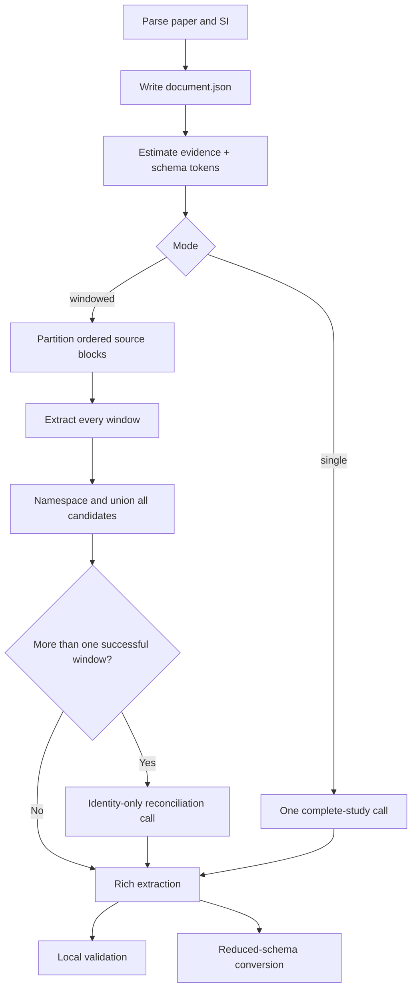

<!-- generated-by: gsd-doc-writer -->
# Extract a study

The workflow optimizes first for a coherent view of the complete study. A single model
call sees all evidence when the estimated request fits the configured limit. Only long
inputs use windows.

## Select a mode

`--mode auto` is the default. It selects `single` when the estimated complete request
is at most `--single-call-max-input-tokens`, otherwise `windowed`.

Use `--mode single` only when the selected provider can accept the complete request.
Use `--mode windowed` to test long-document behavior independently of the estimate.
`--dry-run` reports the selected mode and planned number of calls before any model
request.

## Long supplements

Window planning operates on parser-produced source blocks, pages, and section paths;
it does not search for photovoltaic property names. Every block is primary evidence in
exactly one window. Adjacent structural groups stay together when they fit, large
sections split at page or block boundaries, and an oversized block remains intact in a
window of its own instead of being truncated.

When the complete main paper fits the context allowance, supplement windows receive it
as read-only context. The extraction prompt allows a candidate only when at least one
of its evidence references points to that window's primary evidence. This retains
cross-document context without duplicating the main paper's candidates.

Successful window results are namespaced and combined without record deletion. If
more than one window succeeds, a separate schema-constrained call proposes only
cross-window equivalence groups. Local reconciliation accepts groups only when their
members, entity kinds, and evidence are valid; rejected proposals remain visible in
`reconciliation.json`.

## Failure behavior

The workflow writes parser output, configuration, and schema before model extraction.
A single-call failure produces a valid empty `extraction.json` with an unresolved note.
In windowed mode, successful windows remain usable when another window fails. Raw
request and failure artifacts stay under `requests/`.

Local validation never silently removes unsupported records. Read the rich extraction
and `validation.json` together, or use `grounded_facts.json` when you explicitly want
only locally source-matched facts.

## Model choice

The default model is the frontier model encoded in the current CLI. You can pass any
LiteLLM provider-prefixed model that supports the requested strict JSON schema and
parameters. Model choice affects recall and semantic linking; schema conformance alone
is not evidence of extraction quality. Compare models against independently reviewed
ground truth, especially on device inventory and chemical composition.

For all runtime settings, see the [CLI reference](../reference/cli.md).
