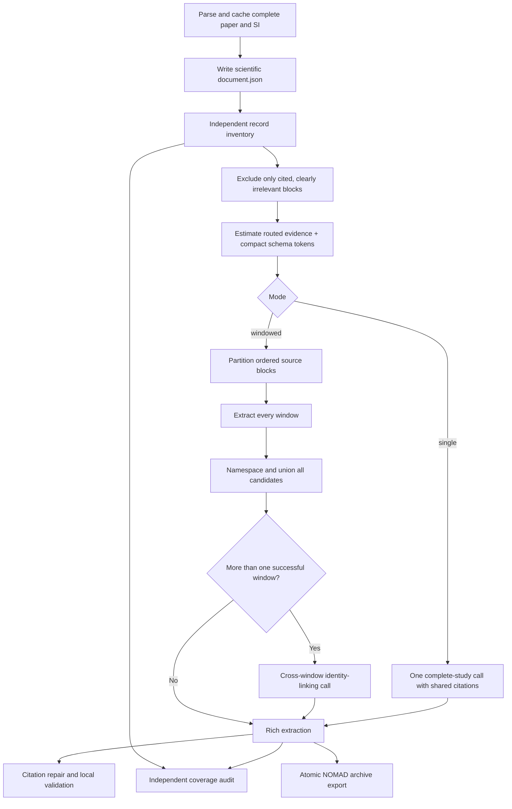

<!-- generated-by: gsd-doc-writer -->
# Extract a study

The workflow optimizes first for a coherent view of the complete study. A shallow,
independent inventory identifies present-study records and blocks that are clearly
irrelevant. The complete parser-selected scientific evidence remains in
`document.json` (and the unfiltered parse remains cached); routing only reduces the
evidence sent to the detailed extraction. A single detailed call is preferred after
routing, and only the remaining long inputs use windows.

## Select a mode

`--mode auto` is the default. It selects `single` when the estimated complete request
after conservative routing is at most `--single-call-max-input-tokens`, otherwise
`windowed`.

Use `--mode single` only when the selected provider can accept the complete request.
Use `--mode windowed` to test long-document behavior independently of the estimate.
`--dry-run` reports the selected mode and planned number of calls before any model
request.

## Inventory and evidence routing

The inventory extracts no detailed values and never sees the final extraction. It
lists candidate record identities with evidence and may propose exclusions. An
exclusion is applied only when its quotation occurs in the named source block, and a
block cited by any inventory candidate is always retained. Unknown or invalid
decisions are ignored. If inventory generation fails, routing fails open and the
complete scientific evidence view continues to extraction.

The default inventory uses the less expensive Terra tier while detailed extraction
uses Sol. `--inventory-model` can select any schema-capable LiteLLM model, and
`--no-inventory` disables both routing and the independent coverage audit for a
controlled ablation.

After extraction, inventory candidates are compared with the rich records. Exact
quote overlap is marked covered, shared-block-only evidence is a possible match, and
the rest is unmatched. `coverage_audit.json` is a recall-review queue, not an automatic
record insertion mechanism.

## Compact transport and atomic values

The model defines each quotation once in an `evidence_catalog` and refers to its ID
from scientific records. PERLA expands those references into the ordinary nested
`EvidenceCitation` objects before validating or writing `extraction.json`; the public
schema therefore remains unchanged.

Each `ReportedValue` represents one semantic quantity. An uncertainty or range may
remain attached to that quantity, but a table row containing different metrics must
be emitted as separate values. Shared citations keep that atomic representation from
repeating the same source row in the model response.

## Long supplements

Window planning operates on parser-produced source blocks, pages, and section paths;
it does not search for photovoltaic property names. Every block is primary evidence in
exactly one window. Adjacent structural groups stay together when they fit, large
sections split at page or block boundaries, and an oversized block remains intact in a
window of its own instead of being truncated.

When the complete main paper fits the context allowance, supplement windows receive it
as read-only context. The extraction prompt allows a candidate only when at least one
of its evidence references points to that window's primary evidence. This retains
cross-document context without duplicating the main paper's candidates.

Successful window results are namespaced and combined without record deletion. If
more than one window succeeds, a separate schema-constrained call proposes only
cross-window identity links. Local validation attaches a link only when its candidate
IDs, entity kind, and evidence are valid; rejected proposals remain visible in
`identity_links.json`.

## Failure behavior

The workflow writes parser output, configuration, and schema before model extraction.
A single-call failure produces a valid empty `extraction.json` with an unresolved note.
In windowed mode, successful windows remain usable when another window fails. Raw
request and failure artifacts stay under `requests/`.

Local validation never silently removes unsupported records. Read the rich extraction
and `validation.json` together, or use `grounded_values.json` when you explicitly want
only locally source-matched reported values.

Before validation, an invalid source pointer is repaired only when its unchanged quote
has exactly one match across the parsed evidence. Zero or multiple matches remain
review findings. Every decision is recorded in `citation_repairs.json`.

After validation, the workflow writes one pinned NOMAD archive per atomic source
record and a conversion report. See [Export to NOMAD](nomad-export.md). The historical
reduced schema is an optional compatibility output rather than an intermediate format.

## Model choice

The default model is the frontier model encoded in the current CLI. You can pass any
LiteLLM provider-prefixed model that supports the requested strict JSON schema and
parameters. Model choice affects recall and semantic linking; schema conformance alone
is not evidence of extraction quality. Compare models against independently reviewed
ground truth, especially on device inventory and chemical composition.

For all runtime settings, see the [CLI reference](../reference/cli.md).
