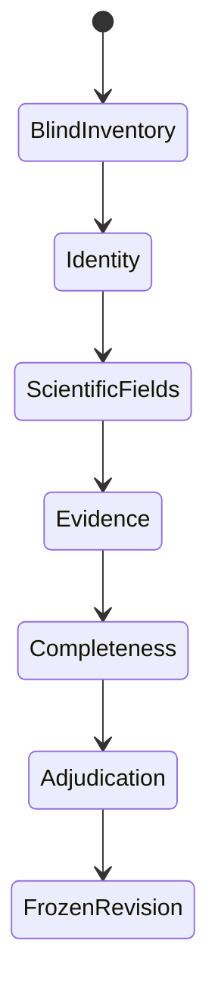

<!-- generated-by: gsd-doc-writer -->
# Build ground truth

Ground truth is a reviewed scientific dataset, not an edited model response. The
extraction is useful pre-annotation; the review protocol supplies an independent recall
check, source requirements, and adjudication.

Use the [quality-first seed workflow](quality-first-ground-truth.md) to generate the
pre-annotation and preserve its cost and model provenance. A seed may be exceptionally
detailed and fully source-verified while still being scientifically wrong. It becomes
ground truth only after review and final adjudication.

## Evidence boundary

The `full_study` scope includes claims explicitly reported in the supplied main paper
or Supporting Information. Do not digitize plot traces, interpolate, infer unreported
identities, or copy values from cited background literature. Record unresolved source
ambiguity in `unresolved_notes`.

## Review sequence



1. **Blind inventory.** Search every imported source and record expected counts before
   the interface reveals model candidates. Count device families, individual devices,
   performance observations, population statistics, and stability tests. The submitted
   source list is workflow coverage, not an extraction outcome.
   Separately census the numbered figures in the main paper as described below.
   After submission, use the imported coverage, refinement, and targeted-repair
   audits as attention queues—not as evidence or automatic corrections.
2. **Identity.** Separate variants, individual devices, protocols, aggregates, and
   stability specimens. Accept an identity link only with positive source evidence.
3. **Scientific fields.** Review stack order, each absorber or subcell's formula and
   constituents, processing, performance, and stability. Mark every complete record
   as verified, uncertain, or needing correction.
4. **Evidence.** Additions and replacements require an exact quote from an imported
   evidence block. Removals require a counterevidence explanation.
5. **Completeness.** Repeat a paper-wide search for missing records and finish every
   quality gate.
6. **Adjudication.** An administrator resolves reviewer disagreement before freezing
   the ground-truth revision.

### Correct records in the workbench

**Show in paper** resolves the citation by its exact evidence-block ID, opens the
correct main-paper or supplement page, and displays the block ID and quote above the
PDF. Matching text is highlighted when the PDF text layer contains it. If the page can
be opened but the quote cannot be matched exactly, the workbench says so instead of
pretending that a highlight succeeded. Manual source or page navigation clears the
active citation.

Use the source selector above the paper to move between **Main paper** and
**Supporting information (SI)**. The workbench clears the previous page while the new
source loads, reports which source and page it is opening, and shows a visible error if
that request fails. A large SI can take several seconds on its first hosted load; its
rendered page and text are then cached by the browser for faster revisits.

Use **Correct fields** when the record exists but a value is wrong. Use **Copy as
missing record** when the current record is a useful starting point for another device
or measurement; the copy receives a new ID and the original remains unchanged. Use
**Add missing record** for a blank draft generated from the current Pydantic schema.
Both additions require evidence and are validated as part of the complete study before
they are saved.

The correction dialog offers two views of the same record. **Fields** is the guided
form; every field label shows its exact JSON Pointer path in the full study, such as
`/individual_devices/0/device_id`. **Raw record JSON** exposes the complete selected
record for reviewers who prefer direct structured editing. Moving back to Fields parses
the JSON immediately and keeps the raw editor open when it is invalid. Saving either
view still checks the complete `StudyExtraction`, including links and evidence, so raw
editing does not bypass scientific validation.

Use **Remove extra record** only when the paper does not support that record. The
workbench deletes only the selected record and never cascades to linked measurements.
If another record still refers to it, removal is disabled and each dependency is shown
as a link. Review those linked records first: reassign a valid measurement to the right
device or family, or remove the linked record if it is also extra. The backend applies
the same reference check, so an invalid removal cannot be forced through the API.

Edits use a known base revision and are rejected when stale. The full
`StudyExtraction` is validated after every mutation. Truth and its new audit event are
then committed together as one immutable revision, so concurrent reviewers cannot
produce a truth/event mismatch. Editing a record changes its content digest and
invalidates the previous record decision automatically.

Reviewers can inspect **My annotations** at any time and download their own persisted
event ledger for the selected split. The server derives this response from immutable
revisions using the authenticated reviewer identity; it does not accept another user
ID from the browser. The personal export includes exact mutations, evidence, decisions,
audits, stages, and current-versus-superseded decision state, but it is not a substitute
for the administrator's adjudicated data-PR bundle.

**Download review files** supports an offline handoff. Any reviewer can download the
original main-paper PDF, the SI when one was imported, and the latest validated
`StudyExtraction` as standalone JSON. The JSON filename records the dataset split and
source revision and remains directly readable by the Pydantic model. It deliberately
does not contain the event ledger or wrapper metadata. Editing this local copy does not
change the workbench: send it through the agreed review handoff or apply its corrections
in the record editor so they become attributable revision events.

## Stored artifacts

For each paper, the workbench keeps authoritative immutable state:

| Path | Meaning |
| --- | --- |
| `state/sources/<split>/<paper>.json` | Seed, source document, provenance manifest, and initial revision |
| `state/revisions/<split>/<paper>/<revision>.json` | Atomic validated truth and audit-history snapshot |

It also materializes convenient exports after every successful commit:

| Path | Meaning |
| --- | --- |
| `seeds/<split>/<paper>.json` | Immutable model extraction |
| `<split>/<paper>.json` | Compiled, Pydantic-validated rich ground truth |
| `events/<split>/<paper>.json` | Current exported reviewer history, including before/after values, evidence, and decisions |
| `documents/<split>/<paper>.json` | Imported evidence blocks |
| `manifests/<split>/<paper>.json` | Schema, source, model configuration, and seed digest |

The latest immutable rich revision is authoritative. Generate NOMAD archives—or the
optional reduced representation—with deterministic adapters rather than curating
multiple ground truths independently.

## Freeze a revision for a data PR

The mutable review directory is deliberately ignored by Git. After an administrator
completes adjudication, freeze one paper from the repository root:

```bash
python review_workbench/export_ground_truth.py \
  --review-data review_data \
  --split dev \
  --paper-id 10.1126--science.adf0194
```

The command writes an atomic, immutable directory under
`data/study_extraction/ground_truth/v1/<split>/<paper_id>/`:

| File | PR reviewer checks |
| --- | --- |
| `ground_truth.json` | Final rich `StudyExtraction` records and evidence citations |
| `seed_extraction.json` | Original model result, kept separate for error analysis |
| `review_events.json` | Complete corrections, decisions, stage gates, and adjudication history |
| `manifest.json` | Schema and source provenance, frozen revision, validation counts, reviewers, and content hashes |

The exporter requires `document.json` internally so it can resolve citations, but does
not commit the parser document or copyrighted PDFs. It refuses export unless the latest
event is adjudication, every current record has an adjudicator decision, the complete
Pydantic schema is valid, and deterministic evidence validation reports no issue.
Repeated export of identical content is a no-op; a differing existing item is never
overwritten implicitly.

The administrator can also use **Download PR bundle** in the workbench after
adjudication. Unzip its four files into the same version/split/paper directory. Before
opening the data PR, review the diff and run:

```bash
python -m pytest -q review_workbench/tests
```

## Dataset splits

- **Calibration** exposes schema, instructions, and interface problems. Do not report
  final performance on papers used to design the workflow.
- **Development** supports prompt and workflow iteration.
- **Test** remains locked until the extraction design is fixed. Use independent review
  and adjudication for final test papers.

A paper inspected while designing prompts, schemas, routing, validation, or model
selection is no longer held out. Move it to calibration or development; do not retain a
`test` label merely because an earlier directory used that name.

Sample across publishers, SI length, table density, parser difficulty, device count,
architecture, stability reporting, and chemical complexity. Exclude reviews, news,
views, and perspectives before extraction.

## Main-text figure-loss analysis

The inventory includes a mandatory, separate census of numbered main-text figures.
It does not census SI figures, and the main/SI scope is no longer represented by
reviewer checkboxes. Submitting the inventory records all imported sources as the
paper-wide record-search scope; figure counts answer a different question: what would
a text-and-table-only extractor miss because it does not inspect main-text figures?

Record four counts per paper:

- **figures reviewed:** numbered main-text figures, with a multi-panel figure counted
  once;
- **schema-relevant figures:** reviewed figures containing at least one fact that fits
  `StudyExtraction`, even when the fact is repeated in text or a caption;
- **figure-only records:** complete schema records supported by a figure but not
  explicitly reported in running text, captions, or tables; and
- **figure-only atomic values:** individual schema field instances that would otherwise
  be missing. Count stored values, not pixels, curve samples, or inferred values.

Do not digitize traces or guess visually ambiguous values during this census, and do
not insert an approximate visual reading into the text-evidenced ground truth. After
adjudication, calculate:

- record loss as `figure_only_records / (final_records + figure_only_records)`; and
- field-value loss as `figure_only_atomic_values /
  (final_populated_atomic_values + figure_only_atomic_values)`.

These estimate the share of otherwise recoverable schema content excluded by a
text-only boundary. Separately,
`schema_relevant_figures / figures_reviewed` states how often main-text figures matter
at all.

## Evaluation

Report inventory precision and recall separately for device families, individual
devices, observations, population statistics, and stability tests. Then report field
agreement on correctly linked records, evidence-link validity, and errors by reporting
level. Correct fields on matched devices must not hide a device the extractor missed.

Freeze source hashes, schema and truth revisions, parser, model, prompt, and scoring
configuration with every published result. See [workbench deployment](../deployment/review-workbench.md)
for local and hosted operation.
