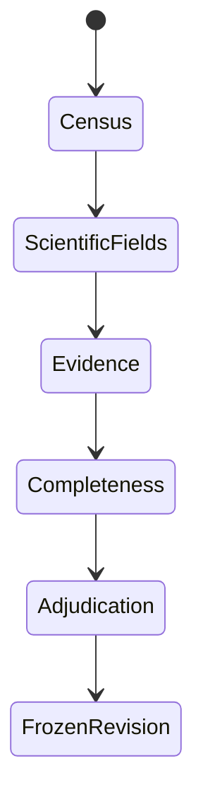

<!-- generated-by: gsd-doc-writer -->
# Build ground truth

Ground truth is a reviewed scientific dataset, not an edited model response. The
extraction is useful pre-annotation; the review protocol supplies an independent recall
check, source requirements, and adjudication.

Use the [quality-first seed workflow](quality-first-ground-truth.md) to generate the
pre-annotation and preserve its cost and model provenance. A seed may be exceptionally
detailed and fully source-verified while still being scientifically wrong. It becomes
ground truth only after review and final adjudication.

## Evidence boundary

The `full_study` scope includes claims explicitly reported in the supplied main paper
or Supporting Information. Do not digitize plot traces, interpolate, infer unreported
identities, or copy values from cited background literature. Record unresolved source
ambiguity in `unresolved_notes`.

## Review sequence



1. **Record and figure census.** Search every imported source and record expected
   counts independently of the model extraction. The interface keeps model candidates
   visible because their device context helps reviewers navigate the paper, but their
   number is not the census answer. Count device families, individual devices,
   performance observations, population statistics, and stability tests. The submitted
   source list is workflow coverage, not an extraction outcome.
   A **device family** is one complete photovoltaic design defined by its functional
   layer materials, absorber composition, and topology. A different treatment,
   thickness, or measurement purpose does not create another family when that design
   is unchanged; characterization-only films and partial stacks are not families. An
   **individual device** is one particular measured specimen, such as a champion,
   representative, or certified cell. Several scans or stability checkpoints on that
   specimen do not create more devices; a mean or distribution is a population
   statistic rather than a device. A stability test contains all checkpoints belonging
   to one aging experiment.
   Separately census the numbered figures in the main paper as described below.
   After submission, use the imported coverage, refinement, and targeted-repair
   audits as attention queues—not as evidence or automatic corrections.
2. **Scientific fields.** Review stack order, each absorber or subcell's formula and
   constituents, processing, performance, and stability. Choose **All fields match
   source** only when every displayed field and the record itself are supported. Choose
   **Cannot establish** for genuine source ambiguity or **Correct fields** when a value
   is wrong or missing.
3. **Evidence.** Additions and replacements require an exact quote from an imported
   evidence block. Removals require a counterevidence explanation.
4. **Completeness.** Repeat a paper-wide search for missing records and finish every
   quality gate.
5. **Adjudication.** An administrator resolves reviewer disagreement before freezing
   the ground-truth revision.

### Correct records in the workbench

**Show in paper** resolves the citation by its exact evidence-block ID, opens the
correct main-paper or supplement page, and displays the block ID and quote above the
PDF. Matching text is highlighted when the PDF text layer contains it. If the page can
be opened but the quote cannot be matched exactly, the workbench says so instead of
pretending that a highlight succeeded. Manual source or page navigation clears the
active citation.

Use the source selector above the paper to move between **Main paper** and
**Supporting information (SI)**. The workbench clears the previous page while the new
source loads, reports which source and page it is opening, and shows a visible error if
that request fails. A large SI can take several seconds on its first hosted load; its
rendered page and text are then cached by the browser for faster revisits.

Use **Correct fields** when the record exists but a value is wrong. Use **Copy as
missing record** when the current record is a useful starting point for another device
or measurement; the copy receives a new ID and the original remains unchanged. Use
**Add missing record** for a blank draft generated from the current Pydantic schema.
Both additions require evidence and are validated as part of the complete study before
they are saved.

The correction dialog offers two views of the same record. **Fields** is the guided
form; every field label shows its exact JSON Pointer path in the full study, such as
`/individual_devices/0/device_id`. **Raw record JSON** exposes the complete selected
record for reviewers who prefer direct structured editing. Moving back to Fields parses
the JSON immediately and keeps the raw editor open when it is invalid. Saving either
view still checks the complete `StudyExtraction`, including references and evidence, so raw
editing does not bypass scientific validation.

Review-priority labels describe provenance or the current reviewer's action; they are
not correctness judgments. **Added during the second extraction read** means the record
was absent from the first draft. **Revised during the second extraction read** means at
least one field changed between the first and second model reads. **You marked this for
correction** records the reviewer's own pending decision. Composition status **Passed
automated checks** means only that the proposed A/B/X assignment satisfied deterministic
consistency checks; it still requires comparison with the source. The workbench shows
these explanations beside each affected record.

Use **Remove extra record** only when the paper does not support that record. The
workbench deletes only the selected record and never cascades to linked measurements.
Dependency guidance appears only after the reviewer explicitly chooses removal—not
while correcting fields. If another record still refers to it, removal is disabled and
the interface states how many devices, measurements, or tests would lose their link and
provides a button for each. Reassign a valid linked record to the right device or family,
or remove that linked record if it is also unsupported. The backend applies
the same reference check, so an invalid removal cannot be forced through the API.

Each edit names the saved version it started from. If somebody else saves the same
paper first, the workbench does not overwrite their work. It asks the reviewer to load
the latest saved version, check the intended change again, and resubmit it. Exact
revision numbers remain in server logs for diagnosis rather than appearing in the
reviewer interface. The full `StudyExtraction` is validated after every mutation.
Truth and its new audit event are then committed together as one
immutable revision, so concurrent reviewers cannot produce a truth/event mismatch.
Editing a record changes its content digest and invalidates the previous record
decision automatically.

Reviewers can open **My edits & undo** at any time. **Current work** gives each paper a
direct route back to Records or Census and offers a paper-scoped reset. **History**
contains the append-only event ledger, which can also be downloaded for the selected
split. A correction can be undone while its saved result
is still the current value. Undo creates a new validated event that points to the
original edit; it does not delete either action from history. If somebody subsequently
changed the same value, the undo action is unavailable so it cannot overwrite that
newer work. Record decisions can be changed by selecting a different decision during
record review. **Reset all current progress** clears all current decisions, census
results, and completed stages for the reviewer in the selected dataset. The immutable
history remains available. Because scientific corrections change shared ground truth,
the reset does not bulk-revert them; each remains individually undoable only while its
saved value is untouched and schema-valid.

The server derives the personal activity response from immutable revisions using the
authenticated reviewer identity; it does not accept another user ID from the browser.
The personal export includes exact mutations, evidence, decisions,
audits, stages, and current-versus-superseded decision state, but it is not a substitute
for the administrator's adjudicated data-PR bundle.

**Files & upload** supports an offline handoff. Any reviewer can download the original
main-paper PDF, the SI when one was imported, the latest validated `StudyExtraction`
as standalone JSON, and an editable Excel review workbook. The paper workbook contains
every record; **Download Excel for this device** produces a smaller form with the
device and the family, performance, population, and stability context needed to judge
it. Reviewers select a complete-record outcome on **Record review**. Field corrections
are separated into one tab per scientific record type present in the paper. Each field
row contains exactly one scalar value, its JSON Pointer, type, and evidence. The first
columns repeat the readable record, family, and device context. **Device family only**
marks a family-level link—not a claim that a particular individual device contributed
to a population statistic. **No explicit family/device link** remains visibly
unlinked rather than being guessed. Reviewers change only yellow value, type, note,
and evidence cells. Rows may be sorted or filtered; their stable identity,
relationship context, and membership may not change.

Upload the reviewed `.xlsx` from the same menu. The workbench accepts it only if its
paper, schema, source truth, revision, sheets, rows, paths, and identifiers still match
the generated contract. Corrections require exact evidence, and the complete rich
study must pass Pydantic validation. A correction is also rejected when it introduces
a new grounding failure—for example, when a replacement `raw_value` does not occur in
its cited passage. The entire import becomes one reviewer-attributed
revision with its workbook hash, before/after records, field notes, and decisions; a
conflict saves nothing. It is visible and undoable in **My edits & undo**. Adding,
copying, reassigning, or removing records remains a browser task because those changes
affect record identity and links.

The JSON filename records the dataset split and source revision and remains directly
readable by the Pydantic model. It deliberately does not contain the event ledger or
wrapper metadata. Editing that local JSON does not change the workbench; use the Excel
return path or apply corrections in the record editor so they become attributable
revision events.

## Recover a batch of offline reviews

When experts return workbooks from an older seed, preserve their feedback before
regenerating anything. From the repository root, compile them against the matching run
directories:

```bash
PYTHONPATH=.:src python -m review_workbench.compile_review_batch \
  --workbook "paper-a - Reviewer.review.xlsx" \
  --workbook "paper-b - Reviewer.review.xlsx" \
  --run-root results/extraction-batch-a \
  --run-root results/extraction-batch-b \
  --output-dir review_data/revised-ground-truth/reviewer-date
```

The compiler archives each workbook byte-for-byte and writes a provisional rich truth,
the complete reviewer feedback, and a manifest with source hashes and validation
findings. It never applies a stale scalar correction automatically. Only a record with
an affirmative decision and the unqualified note `ok` enters the provisional verified
subset. Caveats, uncertainty, missing decisions, changed record IDs, and all correction
proposals remain in `adjudication.json`.

This output is an adjudication worklist, not a benchmark. Resolve its queued records in
the workbench, complete the census and completeness pass, and use the ordinary frozen
export only after administrator adjudication. This conservative intermediate step lets
the team use clear expert agreement immediately without silently turning prose or a
stale spreadsheet into ground truth.

## Turn reviewer findings into final records

Use the browser for scientific structure and the workbook for repeated scalar edits.
The **Records** tab exposes the common corrections directly:

| Reviewer finding | Action |
| --- | --- |
| A value, unit, material, condition, or link is wrong | **Correct fields** |
| The same scientific object was extracted twice | **Merge duplicate** and choose the record to keep; explicit links move with it |
| A result is in the wrong collection, such as a best-device value stored as a population statistic | **Change record type**, complete the corrected record, and save both removal and addition together |
| A complete record is missing | **Add missing record**, or **Duplicate and edit** when a nearby variant provides a useful starting shape |
| A record is unsupported | **Remove extra record**; if it has dependents, relink or remove those first |
| Many scalar values need correction | Download the Excel workbook, edit yellow cells, and upload it |

Merge and record-type changes are atomic: the server validates the complete resulting
`StudyExtraction` before saving anything. They appear in **My edits & undo**, retain the
reviewer's explanation and evidence where applicable, and can be reversed while the
affected records remain unchanged. A correction changes the shared candidate truth;
**All fields match source** and **Cannot establish from source** are review decisions
only and do not rewrite scientific data.

## Stored artifacts

For each paper, the workbench keeps authoritative immutable state:

| Path | Meaning |
| --- | --- |
| `state/sources/<split>/<paper>.json` | Seed, source document, provenance manifest, and initial revision |
| `state/revisions/<split>/<paper>/<revision>.json` | Atomic validated truth and audit-history snapshot |

It also materializes convenient exports after every successful commit:

| Path | Meaning |
| --- | --- |
| `seeds/<split>/<paper>.json` | Immutable model extraction |
| `<split>/<paper>.json` | Compiled, Pydantic-validated rich ground truth |
| `events/<split>/<paper>.json` | Current exported reviewer history, including before/after values, evidence, and decisions |
| `documents/<split>/<paper>.json` | Imported evidence blocks |
| `manifests/<split>/<paper>.json` | Schema, source, model configuration, and seed digest |

The latest immutable rich revision is authoritative. Generate NOMAD archives—or the
optional reduced representation—with deterministic adapters rather than curating
multiple ground truths independently.

## Freeze a revision for a data PR

The mutable review directory is deliberately ignored by Git. After an administrator
completes adjudication, freeze one paper from the repository root:

```bash
python review_workbench/export_ground_truth.py \
  --review-data review_data \
  --split dev \
  --paper-id 10.1126--science.adf0194
```

The command writes an atomic, immutable directory under
`data/study_extraction/ground_truth/v1/<split>/<paper_id>/`:

| File | PR reviewer checks |
| --- | --- |
| `ground_truth.json` | Final rich `StudyExtraction` records and evidence citations |
| `seed_extraction.json` | Original model result, kept separate for error analysis |
| `review_events.json` | Complete corrections, decisions, stage gates, and adjudication history |
| `manifest.json` | Schema and source provenance, frozen revision, evidence-document version and hash, validation counts, reviewers, and content hashes |

The exporter uses the exact evidence-document version bound to the frozen revision so
regenerated citations are never checked against an older parse. It does not commit the
parser document or copyrighted PDFs. It refuses export unless the latest
event is adjudication, every current record has an adjudicator decision, the complete
Pydantic schema is valid, and deterministic evidence validation reports no issue.
Repeated export of identical content is a no-op; a differing existing item is never
overwritten implicitly.

The manifest also records the generated study-schema hash and any final
`uncertain` record decisions. Those keys are an evaluation abstention mask: the
evaluator does not silently treat reviewer uncertainty as exact truth.

The administrator can also use **Download PR bundle** in the workbench after
adjudication. Unzip its four files into the same version/split/paper directory. Before
opening the data PR, review the diff and run:

```bash
python -m pytest -q review_workbench/tests
```

## Dataset splits

- **Calibration** exposes schema, instructions, and interface problems. Do not report
  final performance on papers used to design the workflow.
- **Development** supports prompt and workflow iteration.
- **Test** remains locked until the extraction design is fixed. Use independent review
  and adjudication for final test papers.

A paper inspected while designing prompts, schemas, routing, validation, or model
selection is no longer held out. Move it to calibration or development; do not retain a
`test` label merely because an earlier directory used that name.

Sample across publishers, SI length, table density, parser difficulty, device count,
architecture, stability reporting, and chemical complexity. Exclude reviews, news,
views, and perspectives before extraction.

## Main-text figure-loss analysis

The inventory includes a subfigure census for numbered main-text figures. It does not
census SI figures. Add one entry for every panel—for example, Figure 2a and Figure
2b—not one aggregate answer for the paper. This granularity lets us distinguish a J–V
panel from a device schematic in the same numbered figure.

For each panel, record its main figure number, optional panel label, PDF page, a short
description, and printed x- and y-axis labels. Choose one primary class:

- **J–V**;
- **EQE**, including integrated EQE;
- **population statistics**, including box, scatter, and violin plots;
- **stability**, when device performance is followed over time;
- **characterization**, such as IR, Raman, XPS, or XRD;
- **device structure**, including schematics and annotated microscopy; or
- **other**, including process diagrams.

Also record how numeric data are presented—explicit labels, an inset table, plotted
values, mixed, or none—and whether recovery is straightforward, partly
straightforward, requires digitization, not applicable, or uncertain. “Straightforward”
means that values are printed; it does not mean that points could be estimated from a
curve.

Mark whether the panel contains any fact represented by `StudyExtraction`. For a
schema-relevant panel, count complete schema records and individual atomic field values
that are visible there but absent from running text, captions, and tables. Count stored
field instances, not pixels or sampled curve points. When one fact spans multiple
panels, assign it to the single panel providing the clearest support so totals are not
duplicated. Do not add approximate visual readings to the text-evidenced ground truth.

The app presents these rows as a one-panel-at-a-time queue. **Confirm and next** marks
an unchanged suggestion as checked; editing any field marks it as corrected. Progress
counts only confirmed or corrected panels, and the server refuses to save a census
containing unchecked suggestions. Draft changes are retained in the reviewer's browser
for the same imported seed until the complete census is submitted. Arrow keys or
`J`/`K` move through the current filter and `V` confirms the open panel.

Paper-level figure, relevant-figure, figure-only-record, and figure-only-value totals
are derived from the panel rows. Older aggregate-only or panel-level censuses remain
readable, but their panels must be explicitly checked before an updated census can be
saved. The administrator feedback download includes `figure_panels.csv`, including
proposal identity and review status, and a JSON summary grouped by class, numeric
presentation, and extraction effort.

Caption-grounded drafts can be generated without sending figures to a vision model:

```bash
python review_workbench/figure_census.py \
  --documents-dir results/review-v1 \
  --output review_workbench/review_app/figure-census-proposals.json \
  --model openrouter/openai/gpt-5.6-sol:exacto \
  --max-cost-usd 2
```

The command sends only main-text caption blocks, uses schema-constrained output, caches
validated responses, and rejects missing or invented caption identifiers. These rows
are suggestions rather than review events. The app pre-fills them only for a reviewer
who has no saved census, labels them as caption-derived, and persists them only after
the reviewer checks and saves the form. Because captions often omit axes and inset
contents, the generator must return uncertainty rather than infer what is visible.

For the actual figure-loss study, captions are insufficient: panel boundaries, axis
labels, inset tables, and printed annotations live in the image. First localize and
render crops without making any model request:

```bash
python review_workbench/figure_vision_batch.py \
  --runs-dir results/review-v1 \
  --output-dir results/figure-census \
  --proposal-output results/figure-census/render-report.json \
  --render-only
```

Each crop is tied to its PDF hash, page, rectangle, caption block, Docling version,
rendering settings, and image hash. Captions that cannot be localized unambiguously
are listed as failures for manual inspection; the code does not guess a rectangle.
Rerunning with the same inputs uses those verified crops.

The review app loads only the open paper's proposal and keeps every field editable.
When deterministic localization coordinates are available, it renders the active
subfigure crop directly from the stored PDF; no extra model call or external image
transfer occurs. Reviewers can also jump from the current panel to its main-paper page, add a missed panel,
remove an extra panel, correct its class, axes, presentation, or relevance, and enter
the verified figure-only record and atomic-value counts. Filters expose unchecked,
uncertain, schema-relevant, or all panels. Captions without an automatic image match
are called out explicitly and must be added manually. A stable proposal identifier
keeps visual candidates attached when a reviewer corrects a figure or panel label.
Saving creates a reviewer event; it never mutates the static model proposal.

An optional image-capable model can propose panels and visibly printed values. This is
a separate, explicit command because it transmits figure crops to the configured model
provider:

```bash
python review_workbench/figure_vision_batch.py \
  --runs-dir results/review-v1 \
  --output-dir results/figure-census \
  --proposal-output review_workbench/review_app/figure-census-proposals.json \
  --model openai/gpt-5.6 \
  --max-model-calls 40 \
  --max-cost-usd 20
```

The batch checkpoints after every paper, shares one global call and cost budget, and
records per-paper failures without discarding completed work. The model may transcribe
only values visibly printed as annotations or inset-table cells. Axis ticks, sampled
curve points, and visually estimated coordinates are prohibited. A deterministic
text comparison marks whether each proposed value also occurs in extracted text, but
never declares an unmatched value “figure-only.” The reviewer sees the candidate and
makes that judgment while viewing the paper. Request logs retain image hashes and byte
counts rather than duplicating base64-encoded paper images.

After review, extract `figure_panels.csv` from the administrator feedback download and
score the frozen proposal:

```bash
python review_workbench/figure_census_evaluation.py \
  --proposal review_workbench/review_app/figure-census-proposals.json \
  --gold-csv feedback/figure_panels.csv \
  --reviewer-id REVIEWER_ID \
  --output results/figure-census/evaluation.json
```

The evaluator reports panel precision/recall/F1 first. Class, numeric-presentation,
recoverability, relevance, and axis-label agreement are calculated only for panels
whose paper, figure number, and panel label match exactly. If the CSV contains several
reviewers, selecting one or supplying a separately adjudicated CSV is mandatory; the
tool does not silently pool conflicting annotations.

The administrator feedback ZIP includes both `figure_census_proposals.json` (the exact
starting point shown in the app) and `figure_panels.csv` (current human annotations),
while the lossless event history preserves superseded edits and resets. This makes
model-to-human corrections directly retrievable for the next pipeline evaluation.

After adjudication, calculate:

- record loss as `figure_only_records / (final_records + figure_only_records)`; and
- field-value loss as `figure_only_atomic_values /
  (final_populated_atomic_values + figure_only_atomic_values)`.

These estimate the share of otherwise recoverable schema content excluded by a
text-only boundary. Separately,
`schema_relevant_figures / figures_reviewed` states how often main-text figures matter
at all.

## Evaluation

Report inventory precision and recall separately for device families, individual
devices, observations, population statistics, and stability tests. Then report field
agreement on correctly linked records, evidence-link validity, and errors by reporting
level. Correct fields on matched devices must not hide a device the extractor missed.

Freeze source hashes, schema and truth revisions, parser, model, prompt, and scoring
configuration with every published result. See [workbench deployment](../deployment/review-workbench.md)
for local and hosted operation and [Evaluate an extraction](evaluation.md) for the
executable scoring contract.
