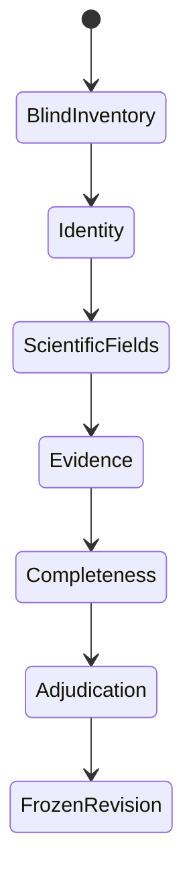

<!-- generated-by: gsd-doc-writer -->
# Build ground truth

Ground truth is a reviewed scientific dataset, not an edited model response. The
extraction is useful pre-annotation; the review protocol supplies an independent recall
check, source requirements, and adjudication.

## Evidence boundary

The `full_study` scope includes claims explicitly reported in the supplied main paper
or Supporting Information. Do not digitize plot traces, interpolate, infer unreported
identities, or copy values from cited background literature. Record unresolved source
ambiguity in `unresolved_notes`.

## Review sequence



1. **Blind inventory.** Search the paper and SI and record expected counts before the
   interface reveals model candidates. Count device families, individual devices,
   performance observations, population statistics, and stability tests.
2. **Identity.** Separate variants, individual devices, protocols, aggregates, and
   stability specimens. Accept an identity link only with positive source evidence.
3. **Scientific fields.** Review stack order, absorber composition and constituents,
   processing, performance, and stability. Mark every complete record as verified,
   uncertain, or needing correction.
4. **Evidence.** Additions and replacements require an exact quote from an imported
   evidence block. Removals require a counterevidence explanation.
5. **Completeness.** Repeat a paper-wide search for missing records and finish every
   quality gate.
6. **Adjudication.** An administrator resolves reviewer disagreement before freezing
   the ground-truth revision.

Edits use a known base revision and are rejected when stale. The full
`StudyExtraction` is validated after every mutation. Truth and its new audit event are
then committed together as one immutable revision, so concurrent reviewers cannot
produce a truth/event mismatch. Editing a record changes its content digest and
invalidates the previous record decision automatically.

## Stored artifacts

For each paper, the workbench keeps authoritative immutable state:

| Path | Meaning |
| --- | --- |
| `state/sources/<split>/<paper>.json` | Seed, source document, provenance manifest, and initial revision |
| `state/revisions/<split>/<paper>/<revision>.json` | Atomic validated truth and audit-history snapshot |

It also materializes convenient exports after every successful commit:

| Path | Meaning |
| --- | --- |
| `seeds/<split>/<paper>.json` | Immutable model extraction |
| `<split>/<paper>.json` | Compiled, Pydantic-validated rich ground truth |
| `events/<split>/<paper>.json` | Current exported reviewer history, including before/after values, evidence, and decisions |
| `documents/<split>/<paper>.json` | Imported evidence blocks |
| `manifests/<split>/<paper>.json` | Schema, source, model configuration, and seed digest |

The latest immutable rich revision is authoritative. Generate the reduced
representation with the deterministic adapter rather than curating two ground truths
independently.

## Freeze a revision for a data PR

The mutable review directory is deliberately ignored by Git. After an administrator
completes adjudication, freeze one paper from the repository root:

```bash
python review_workbench/export_ground_truth.py \
  --review-data review_data \
  --split dev \
  --paper-id 10.1126--science.adf0194
```

The command writes an atomic, immutable directory under
`data/study_extraction/ground_truth/v1/<split>/<paper_id>/`:

| File | PR reviewer checks |
| --- | --- |
| `ground_truth.json` | Final rich `StudyExtraction` records and evidence citations |
| `seed_extraction.json` | Original model result, kept separate for error analysis |
| `review_events.json` | Complete corrections, decisions, stage gates, and adjudication history |
| `manifest.json` | Schema and source provenance, frozen revision, validation counts, reviewers, and content hashes |

The exporter requires `document.json` internally so it can resolve citations, but does
not commit the parser document or copyrighted PDFs. It refuses export unless the latest
event is adjudication, every current record has an adjudicator decision, the complete
Pydantic schema is valid, and deterministic evidence validation reports no issue.
Repeated export of identical content is a no-op; a differing existing item is never
overwritten implicitly.

The administrator can also use **Download PR bundle** in the workbench after
adjudication. Unzip its four files into the same version/split/paper directory. Before
opening the data PR, review the diff and run:

```bash
python -m pytest -q review_workbench/tests
```

## Dataset splits

- **Calibration** exposes schema, instructions, and interface problems. Do not report
  final performance on papers used to design the workflow.
- **Development** supports prompt and workflow iteration.
- **Test** remains locked until the extraction design is fixed. Use independent review
  and adjudication for final test papers.

Sample across publishers, SI length, table density, parser difficulty, device count,
architecture, stability reporting, and chemical complexity. Exclude reviews, news,
views, and perspectives before extraction.

## Evaluation

Report inventory precision and recall separately for device families, individual
devices, observations, population statistics, and stability tests. Then report field
agreement on correctly linked records, evidence-link validity, and errors by reporting
level. Correct fields on matched devices must not hide a device the extractor missed.

Freeze source hashes, schema and truth revisions, parser, model, prompt, and scoring
configuration with every published result. See [workbench deployment](../deployment/review-workbench.md)
for local and hosted operation.
