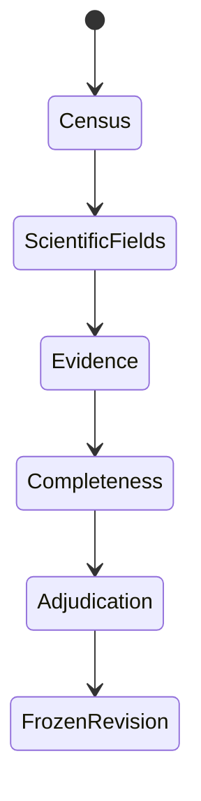

<!-- generated-by: gsd-doc-writer -->
# Build ground truth

Use the review workbench to check extracted records against the paper, correct errors,
and add missing information. A saved edit creates a reviewed draft; final adjudication
and export produce a frozen reference.

For multiple papers, [generate and import a batch](quality-first-ground-truth.md).
The [evaluation method](../methods/benchmark.md) explains how reviewed references
are used to score predictions.

## Evidence boundary

The `full_study` scope includes claims explicitly reported in the supplied main paper
or Supporting Information. Do not digitize plot traces, interpolate, infer unreported
identities, or copy values from cited background literature. Record unresolved source
ambiguity in `unresolved_notes`.

## Finish an existing expert review

Administrators, and reviewers when enabled by the deployment, can open
**Finalize ground truth** from the app header. This is a
shorter route for papers that experts have already reviewed; it does not repeat
the full review sequence below.

1. Choose a paper. The queue shows proposed corrections first, then records without
   a current approval, then unresolved completeness notes. Unchanged records with
   only positive reviewer decisions do not need another individual click.
   **What changed and what still needs checking** summarizes prepared review guidance.
   Use **Jump to a review decision** to go straight to a correction or record.
2. Compare **Current** and **Proposed**, read the supporting passage, and use
   **Show source in paper** when needed. **Accept correction & approve** saves the
   corrected records. **Keep current version** approves the current records instead.
   Both decisions apply to each complete affected record; expand its full JSON if
   the difference alone is not enough. Long changes and quotations are collapsed;
   expand them to inspect every field. **Later** leaves the question open.
3. Use **Edit in review** for a different correction, then reopen finalization.
   **Undo my last decision** reverses your saved decision without erasing history.
   An old suggestion cannot overwrite records that changed after it was prepared.
4. For records checked together against a paper or earlier workbook, use
   **Check records together**, select only those you have checked, and state the
   review basis. Historical workbook comments alone do not count as current approvals.
5. When no questions remain, confirm that you accept the reviewed records and have
   checked the main paper and available SI for omissions. **Finalize & download**
   produces the frozen-reference ZIP used by the scorer, including `ground_truth.json`,
   its manifest, evidence document, and review history. The app validates the source
   citations before finalization. Passing these checks does not establish scientific
   correctness; the person finalizing remains responsible for that judgment.

Progress is shared. A question resolved by one finalizer does not need to be resolved
again by another. The history records who made each decision. Coordinate which papers
you work on; if someone saves a change while you are reviewing, reload before saving.
See [deployment permissions](../deployment/review-workbench.md#let-reviewers-finalize-references)
to enable this for existing reviewers.

Administrators can use **Load prepared suggestions** to import a private finalization-plan JSON file, not
an extraction file. Importing saves proposals without applying or approving them.
The plan must match the current study content. A refined plan can list earlier
proposal IDs in `supersedes` to retire a broad checklist from the active queue.
The original proposals and reviewer uploads remain in history; retiring a checklist
does not approve its records or apply any correction. New proposal IDs must be unique.
A count mismatch asks for investigation; it never deletes
records automatically. Finalization exports one paper at a time.

### Account for earlier Excel reviews

A prepared plan can connect original workbook comments to today's records. Open
**Original workbook review** to see the comment, its sheet and cell, the values
the reviewer saw, and the corresponding current records. The original file's
SHA-256 identifies the preserved upload. A record that disappeared is shown as
having no current counterpart; disappearance does not mean the concern was fixed.

The administrator preparing the plan must check these correspondences. They are
not automatic record matches or transferred approvals. The import checks that
every supplied comment occurs once, the per-workbook counts match the supplied
inventory, and all proposed record links exist. It cannot establish that the
inventory includes every comment in an external workbook; compare that inventory
with the original upload when preparing the plan.

Related comments are grouped into specific decisions. Confirming how a comment
was handled does **not** approve all fields of its linked record. Record approvals
remain separate and bound to the current content. Both the original comments and
the admin's decisions are included in the exported review history. Changing the
study after a comment decision reopens that decision for checking.

## Review sequence


```mermaid
stateDiagram-v2
    [*] --> Census
    Census --> ScientificFields
    ScientificFields --> Evidence
    Evidence --> Completeness
    Completeness --> Adjudication
    Adjudication --> FrozenRevision
```

1. **Record and figure census.** Search every imported source and record expected
   counts independently of the model extraction. The interface keeps model candidates
   visible because their device context helps reviewers navigate the paper, but their
   number is not the census answer. Count device families, individual devices,
   performance observations, population statistics, and stability tests. The submitted
   source list is workflow coverage, not an extraction outcome.
   A **device family** is one complete photovoltaic design defined by its functional
   layer materials, absorber composition, and topology. A different treatment,
   thickness, or measurement purpose does not create another family when that design
   is unchanged; characterization-only films and partial stacks are not families. An
   **individual device** is one particular measured specimen, such as a champion,
   representative, or certified cell. Several scans or stability checkpoints on that
   specimen do not create more devices; a mean or distribution is a population
   statistic rather than a device. A stability test contains all checkpoints belonging
   to one aging experiment.
   Separately census the numbered figures in the main paper as described below.
   After submission, use the imported coverage, refinement, and targeted-repair
   audits as attention queues—not as evidence or automatic corrections.
2. **Scientific fields.** Review stack order, each absorber or subcell's formula and
   constituents, processing, performance, and stability. Choose **All fields match
   source** only when every displayed field and the record itself are supported. Choose
   **Cannot establish** for genuine source ambiguity or **Correct fields** when a value
   is wrong or missing.
3. **Evidence.** Additions and replacements require an exact quote from an imported
   evidence block. Removals require a counterevidence explanation.
4. **Completeness.** Reconcile the paper-wide search for missing records with the
   corrected study and finish every quality gate. Record omissions found during
   source reading, their resolution, the reviewed scope and remaining uncertainty.
5. **Adjudication.** An administrator resolves reviewer disagreement before freezing
   the ground-truth revision.

### Correct records in the workbench

**Show in paper** resolves the citation by its exact evidence-block ID, opens the
correct main-paper or supplement page, and displays the block ID and quote above the
PDF. Matching text is highlighted when the PDF text layer contains it. If the page can
be opened but the quote cannot be matched exactly, the workbench says so instead of
pretending that a highlight succeeded. Manual source or page navigation clears the
active citation.

Use the source selector above the paper to move between **Main paper** and
**Supporting information (SI)**. The workbench clears the previous page while the new
source loads, reports which source and page it is opening, and shows a visible error if
that request fails. A large SI can take several seconds on its first hosted load; its
rendered page and text are then cached by the browser for faster revisits.

Use **Correct fields** when the record exists but a value is wrong. Use **Copy as
missing record** when the current record is a useful starting point for another device
or measurement; the copy receives a new ID and the original remains unchanged. Use
**Add missing record** for a blank draft generated from the current Pydantic schema.
Both additions require evidence and are validated as part of the complete study before
they are saved.

The correction dialog offers two views of the same record. **Fields** is the guided
form; every field label shows its exact JSON Pointer path in the full study, such as
`/individual_devices/0/device_id`. **Raw record JSON** exposes the complete selected
record for reviewers who prefer direct structured editing. Moving back to Fields parses
the JSON immediately and keeps the raw editor open when it is invalid. Saving either
view still checks the complete `StudyExtraction`, including references and evidence, so raw
editing uses the same schema and evidence checks as the guided form.

Device-family corrections have a focused **Device stack** editor. Each row exposes the
layer material and function, with controls to reorder, add, or remove layers. Less
frequently changed composition, material-form, and property fields remain in a
collapsed section on that row. Reordering updates the sequence numbers; stable layer
IDs and evidence stay attached. Removing a layer clears references to its ID from
absorber components and processing steps without deleting their scientific content.
The raw stack string remains available as the paper's
verbatim representation, but changing it does not silently rewrite the structured
layers.

Review-priority labels describe provenance or the current reviewer's action; they are
not correctness judgments. **Added during the second extraction read** means the record
was absent from the first draft. **Revised during the second extraction read** means at
least one field changed between the first and second model reads. **You marked this for
correction** records the reviewer's own pending decision. Composition status **Passed
automated checks** means only that the proposed A/B/X assignment satisfied deterministic
consistency checks; it still requires comparison with the source. The workbench shows
these explanations beside each affected record.

Use **Remove extra record** only when the paper does not support that record. The
workbench deletes only the selected record and never cascades to linked measurements.
Dependency guidance appears only after the reviewer explicitly chooses removal—not
while correcting fields. If another record still refers to it, removal is disabled and
the interface states how many devices, measurements, or tests would lose their link and
provides a button for each. Reassign a valid linked record to the right device or family,
or remove that linked record if it is also unsupported. The backend applies
the same reference check, so an invalid removal cannot be forced through the API.

Each edit names the saved version it started from. If somebody else saves the same
paper first, the workbench does not overwrite their work. It asks the reviewer to load
the latest saved version, check the intended change again, and resubmit it. Exact
revision numbers remain in server logs for diagnosis rather than appearing in the
reviewer interface. The full `StudyExtraction` is validated after every mutation.
Truth and its new audit event are then committed together as one
immutable revision, so concurrent reviewers cannot produce a truth/event mismatch.
Editing a record changes its content digest and invalidates the previous record
decision automatically.

Reviewers can open **My edits & undo** at any time. **Current work** gives each paper a
direct route back to Records or Census and offers a paper-scoped reset. **History**
contains the append-only event ledger, which can also be downloaded for the selected
split. A correction can be undone while its saved result
is still the current value. Undo creates a new validated event that points to the
original edit; it does not delete either action from history. If somebody subsequently
changed the same value, the undo action is unavailable so it cannot overwrite that
newer work. Record decisions can be changed by selecting a different decision during
record review. **Reset all current progress** clears all current decisions, census
results, and completed stages for the reviewer in the selected dataset. The immutable
history remains available. Because scientific corrections change shared ground truth,
the reset does not bulk-revert them; each remains individually undoable only while its
saved value is untouched and schema-valid.

The server derives the personal activity response from immutable revisions using the
authenticated reviewer identity; it does not accept another user ID from the browser.
The personal export includes exact mutations, evidence, decisions,
audits, stages, and current-versus-superseded decision state, but it is not a substitute
for the administrator's adjudicated data-PR bundle.

**Files & upload** supports an offline handoff. Any reviewer can download the original
main-paper PDF, the SI when one was imported, the latest validated `StudyExtraction`
as standalone JSON, and an editable Excel review workbook. The paper workbook contains
every record; **Download Excel for this device** produces a smaller form with the
device and the family, performance, population, and stability context needed to judge
it. Reviewers select a complete-record outcome on **Record review**. Field corrections
are separated into one tab per scientific record type present in the paper. Each field
row contains exactly one scalar value, its JSON Pointer, type, and evidence. The first
columns repeat the readable record, family, and device context. **Device family only**
marks a family-level link—not a claim that a particular individual device contributed
to a population statistic. **No explicit family/device link** remains visibly
unlinked rather than being guessed. Reviewers change only yellow value, type, note,
and evidence cells. Rows may be sorted or filtered; their stable identity,
relationship context, and membership may not change.

Upload the reviewed `.xlsx` from the same menu. The workbench accepts it only if its
paper, schema, source truth, revision, sheets, rows, paths, and identifiers still match
the generated contract. Corrections require exact evidence, and the complete rich
study must pass Pydantic validation. A correction is also rejected when it introduces
a new grounding failure—for example, when a replacement `raw_value` does not occur in
its cited passage. The entire import becomes one reviewer-attributed
revision with its workbook hash, before/after records, field notes, and decisions; a
conflict saves nothing. It is visible and undoable in **My edits & undo**. Adding,
copying, reassigning, or removing records remains a browser task because those changes
affect record identity and links.

The JSON filename records the dataset split and source revision and remains directly
readable by the Pydantic model. It deliberately does not contain the event ledger or
wrapper metadata. Editing that local JSON does not change the workbench; use the Excel
return path or apply corrections in the record editor so they become attributable
revision events.

## Older or offline feedback

For workbooks based on an older extraction, use the
[reconciliation guide](review-to-benchmark.md#prepare-the-reconciliation-package).
It preserves original files and comments alongside the current saved study.
Older approvals are not automatically applied to changed records.

## Turn reviewer findings into final records

Use the browser for scientific structure and the workbook for repeated scalar edits.
The **Records** tab exposes the common corrections directly:

| Reviewer finding | Action |
| --- | --- |
| A value, unit, material, condition, or link is wrong | **Correct fields** |
| The same scientific object was extracted twice | **Merge duplicate** and choose the record to keep; explicit links move with it |
| A result is in the wrong collection, such as a best-device value stored as a population statistic | **Change record type**, complete the corrected record, and save both removal and addition together |
| A complete record is missing | **Add missing record**, or **Duplicate and edit** when a nearby variant provides a useful starting shape |
| A record is unsupported | **Remove extra record**; if it has dependents, relink or remove those first |
| Many scalar values need correction | Download the Excel workbook, edit yellow cells, and upload it |

Merge and record-type changes are atomic: the server validates the complete resulting
`StudyExtraction` before saving anything. They appear in **My edits & undo**, retain the
reviewer's explanation and evidence where applicable, and can be reversed while the
affected records remain unchanged. A correction changes the shared candidate truth;
**All fields match source** and **Cannot establish from source** are review decisions
only and do not rewrite scientific data.

## Stored artifacts

For each paper, the workbench keeps authoritative immutable state:

| Path | Meaning |
| --- | --- |
| `state/sources/<split>/<paper>.json` | Seed, source document, provenance manifest, and initial revision |
| `state/revisions/<split>/<paper>/<revision>.json` | Atomic validated truth and audit-history snapshot |

It also materializes convenient exports after every successful commit:

| Path | Meaning |
| --- | --- |
| `seeds/<split>/<paper>.json` | Immutable model extraction |
| `<split>/<paper>.json` | Current schema-valid reviewed draft; not necessarily adjudicated |
| `events/<split>/<paper>.json` | Current exported reviewer history, including before/after values, evidence, and decisions |
| `documents/<split>/<paper>.json` | Imported evidence blocks |
| `manifests/<split>/<paper>.json` | Schema, source, model configuration, and seed digest |

The latest immutable rich revision is authoritative. Generate NOMAD archives—or the
optional reduced representation—with deterministic adapters rather than curating
multiple ground truths independently.

## Freeze a revision for a data PR

The mutable review directory is deliberately ignored by Git. After an administrator
completes adjudication, freeze one paper from the repository root:

```bash
python review_workbench/export_ground_truth.py \
  --review-data review_data \
  --split dev \
  --paper-id 10.1126--science.adf0194
```

The command writes an atomic, immutable directory under
`data/study_extraction/ground_truth/v1/<split>/<paper_id>/`:

| File | PR reviewer checks |
| --- | --- |
| `ground_truth.json` | Final rich `StudyExtraction` records and evidence citations |
| `seed_extraction.json` | Original model result, kept separate for error analysis |
| `review_events.json` | Complete corrections, decisions, stage gates, and adjudication history |
| `manifest.json` | Schema and source provenance, frozen revision, evidence-document version and hash, validation counts, reviewers, and content hashes |

The exporter uses the exact evidence-document version bound to the frozen revision so
regenerated citations are never checked against an older parse. It does not commit the
parser document or copyrighted PDFs. It refuses export unless the latest
event is adjudication, every current record has a verified adjudicator decision, the complete
Pydantic schema is valid, and deterministic evidence validation reports no issue.
Repeated export of identical content is a no-op; a differing existing item is never
overwritten implicitly.

The format-4 manifest records the schema hash and final review history. An uncertain
decision can be saved during review, but blocks final adjudication and export.
Resolve the record against the source or keep the paper pending. A reported range
or an explicitly unknown relationship can be verified as such; do not invent detail.
The scorer uses every record in the frozen reference and never excludes predictions
because of reviewer uncertainty.

The administrator can also use **Download PR bundle** in the workbench after
adjudication. Before publishing, inspect all four files for private reviewer identities,
comments and source content. The exporter is not an anonymization tool. Preserve the
originals privately; any public derivative needs a new, internally consistent version
and hashes. Follow the [publication checklist](../deployment/review-workbench.md#publishing-reviewed-data).
Then review the proposed data diff and run:

```bash
python -m pytest -q review_workbench/tests
```

## Dataset splits

The workbench separates `calibration`, `dev` and `test` datasets.
Calibration and development contain papers used to adjust the workflow; a test split
is for held-out evaluation. The label alone does not establish independence from
development.

<span id="main-text-figure-loss-analysis"></span>

## Review figures

The Census tab contains a separate main-paper subfigure queue. Reviewers can correct
panel classes, descriptions, axes, relevance and counts of information present only
in figures. See [Review and classify figures](figure-review.md) for instructions,
proposal generation and classification evaluation.

## Evaluate a frozen reference

Use the [scoring reference](evaluation.md) for field selection, matching and score
interpretation. [From corrections to a benchmark](review-to-benchmark.md) shows the
export and evaluation commands.
