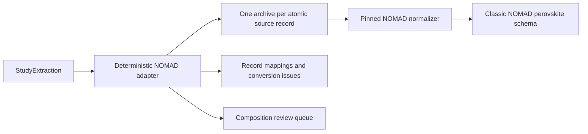

<!-- generated-by: gsd-doc-writer -->
# Export to NOMAD

`StudyExtraction` is the evidence-faithful ground truth. The default workflow projects
it directly into the pinned NOMAD LLM extraction schema; it does not pass through the
historical reduced PERLA schema.

## Atomic archive boundary

Performance observations, population statistics, and stability tests become separate
archives. They are never combined just because they refer to the same family. An
individual device without a measurement and an otherwise unrepresented family also
receive construction-only archives. Shared family composition, layers, and processing
are copied into each linked archive.

The adapter converts an atomic numeric value only when its name, number, and unit map
unambiguously to a NOMAD field. Everything else remains in structured
`additional_notes`, with source IDs and evidence block IDs, and produces a conversion
issue where a target field was rejected.

## Chemical composition

The reported absorber formula is copied to both NOMAD `long_form` and `formula`.
Perovskite site ions are populated only when the rich extraction explicitly labels a
constituent as an A-, B-, or X-site ion. Its amount becomes a coefficient only when the
source value explicitly calls itself a stoichiometric coefficient or fraction.

`composition_projection.json` records one of four states for every family:

- `ready`: all exported site assignments and coefficients were explicit;
- `partial`: a formula was preserved but no site assignment was explicit;
- `needs_review`: a site was explicit but a coefficient was not; or
- `not_reported`: neither a formula nor explicit site ions were extracted.

This artifact is the input queue for a future optional chemical-enrichment pass. Such
proposals should remain separate from `extraction.json` until they pass deterministic
checks or human review.

## Files

| Artifact | Purpose |
| --- | --- |
| `nomad/*.archive.json` | Standalone NOMAD-uploadable archives |
| `nomad/manifest.json` | Source-to-file mappings, pinned target, and issues |
| `nomad_export.json` | Complete archives and conversion report in one file |
| `composition_projection.json` | Reviewable chemical-normalization readiness |

The adapter targets `perovskite-solar-cell-database==1.2.14` at commit
`afd75e69ebb07c8f7f82d203231b70f488e40997`. Local Pydantic models validate every
normal run. The optional `nomad` dependency and manual CI job additionally compare the
outbound fields with the installed upstream schema.

## Historical reduced export

Pass `--reduced-export` only when an older consumer still needs `reduced.json` and
`reduced_conversion.json`. That adapter remains deterministic and reported, but is no
longer on the default route to NOMAD.
