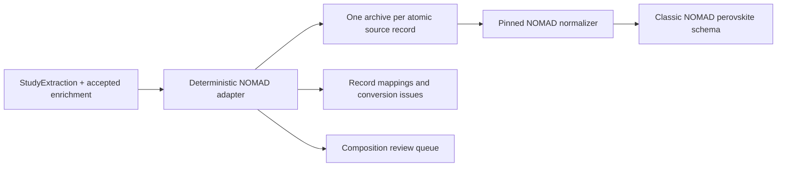

<!-- generated-by: gsd-doc-writer -->
# Export to NOMAD

`StudyExtraction` is the evidence-faithful ground truth. The default workflow projects
it directly into the pinned NOMAD LLM extraction schema; it does not pass through the
historical reduced PERLA schema.

## Atomic archive boundary

Performance observations, population statistics, and stability tests become separate
archives. They are never combined just because they refer to the same family. An
individual device without a measurement and an otherwise unrepresented family also
receive construction-only archives. Shared family composition, layers, and processing
are copied into each linked archive.

The adapter converts an atomic numeric value only when its name, number, and unit map
unambiguously to a NOMAD field. Everything else remains in structured
`additional_notes`, with source IDs and evidence block IDs, and produces a conversion
issue where a target field was rejected.

## Chemical composition

Each scoped absorber receives its own composition projection. For a family containing
exactly one absorber, the reported formula is copied to both NOMAD `long_form` and
`formula`.
Perovskite site ions come either from explicit source claims or from an accepted
enrichment proposal that exactly reconstructs that formula. Processing fields and
solution roles likewise consume only accepted index-based proposals. See
[Interpret composition and processing](enrichment.md).

The classic NOMAD cell slot cannot faithfully represent several perovskite absorbers
in one tandem. In that case the adapter does not choose one or create fictitious cells:
all absorber records stay in structured additional context, every composition remains
in `composition_projection.json`, and a conversion issue makes the limitation visible.

`composition_projection.json` records one of four states for every absorber:

- `ready`: assignments were explicit or passed exact formula reconstruction;
- `partial`: a formula was preserved but no site assignment was explicit;
- `needs_review`: a site was explicit but a coefficient was not; or
- `not_reported`: neither a formula nor explicit site ions were extracted.

All proposals remain separate from `extraction.json`; reviewable ones are never
silently projected into NOMAD.

## Files

| Artifact | Purpose |
| --- | --- |
| `nomad/*.archive.json` | Standalone NOMAD-uploadable archives |
| `nomad/manifest.json` | Source-to-file mappings, pinned target, and issues |
| `nomad_export.json` | Complete archives and conversion report in one file |
| `composition_projection.json` | Reviewable chemical-normalization readiness |

The adapter targets `perovskite-solar-cell-database==1.2.14` at commit
`afd75e69ebb07c8f7f82d203231b70f488e40997`. Local Pydantic models validate every
normal run. The optional `nomad` dependency and manual CI job additionally compare the
outbound fields with the installed upstream schema.

## Historical reduced export

Pass `--reduced-export` only when an older consumer still needs `reduced.json` and
`reduced_conversion.json`. That adapter remains deterministic and reported, but is no
longer on the default route to NOMAD.
