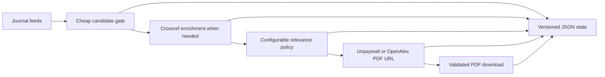

# Discover papers with PapersBot

PapersBot is the literature intake step. It checks journal feeds, selects entries
that may report perovskite photovoltaic devices, resolves open-access PDF URLs, and
downloads new papers. It does not extract scientific values; downloaded PDFs can be
passed to `perla-extract` separately.



## Install and run

Feed parsing and HTTP clients are optional dependencies so they do not enlarge a
deployment that only performs extraction.

```bash
pip install 'perla-extract[papersbot]'

perla-papersbot downloaded_papers \
  --state-dir .papersbot-state
```

The command prints a JSON run summary to stdout and progress logs to stderr. It
verifies that each downloaded response starts with a PDF signature rather than
silently saving an HTML error page.

## Configure feeds and selection

The package ships a maintained feed list and a small JSON selection policy. Both are
data files, not coded branches. Replace the feed list with either a comment-friendly
text file or repeated URLs:

```bash
perla-papersbot papers --feeds-file my-feeds.txt

perla-papersbot papers \
  --feed https://example.org/feed.xml \
  --feed https://example.net/atom.xml
```

A selection policy requires at least one literal term from each group and can exclude
publication types by title. The first group is the inexpensive gate used before a
metadata request. For example:

```json
{
  "required_groups": [
    ["perovskite", "perovskites"],
    ["solar cell", "solar cells", "photovoltaic"]
  ],
  "excluded_title_terms": ["review", "perspective", "news"]
}
```

Pass the file with `--selection-file selection.json`. Selection details can therefore
evolve without adding property-specific logic to either PapersBot or the scientific
extractor.

## Incremental state

`STATE_DIR/state.json` contains a versioned `papers` mapping with the feed entry,
DOI, status, attempt count, resolved PDF URL, downloaded path, last error, and update
time. Terminal entries are not processed again. Transient errors and papers without
an open PDF are retried up to `--max-attempts`.

The scheduled GitHub workflow caches this directory between runs and publishes newly
downloaded PDFs together with the state file as an artifact. Set `OA_EMAIL` as a
repository variable to enable Unpaywall; OpenAlex remains the fallback.

## Python API

Clients are injectable for tests or alternative runtime integrations.

```python
from perla_extract.papersbot import run_papersbot

result = run_papersbot(
    "downloaded_papers",
    state_dir=".papersbot-state",
    feeds_file="my-feeds.txt",
)
```
