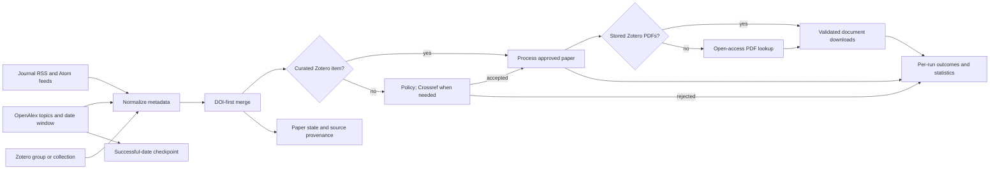

# Discover papers with PapersBot

PapersBot is the literature intake step. Journal feeds find newly announced papers
quickly; OpenAlex topic queries recover relevant work from journals whose feeds are
missing, sparse, or inaccessible; and a Zotero group can provide a curated intake
queue with stored PDFs. PapersBot merges overlapping records by DOI, selects works
that may report perovskite photovoltaic devices, and downloads PDFs. It does not
extract scientific values; downloaded PDFs can be passed to `perla-extract` separately.



## Install and run

Feed parsing and HTTP clients are optional dependencies so they do not enlarge a
deployment that only performs extraction.

```bash
pip install 'perla-extract[papersbot]'

perla-papersbot downloaded_papers \
  --state-dir .papersbot-state
```

The command prints a JSON run summary to stdout and progress logs to stderr. It
verifies that each downloaded response starts with a PDF signature rather than
silently saving an HTML error page.

Every ordinary option also accepts a `PAPERSBOT_` environment variable, such as
`PAPERSBOT_DOWNLOAD_DIR`, `PAPERSBOT_STATE_DIR`, `PAPERSBOT_RSS`,
`PAPERSBOT_OPENALEX`, and `PAPERSBOT_LOG_FILE`. This keeps cron configuration out of
long command lines. See [Internal PapersBot cron job](../deployment/papersbot-cron.md)
for a complete deployment.

For automation, preserve structured logs in addition to the live console:

```bash
perla-papersbot downloaded_papers \
  --state-dir .papersbot-state \
  --log-file papersbot.log.jsonl \
  > papersbot-result.json
```

## Configure feeds and selection

The package ships a maintained feed list and a small JSON selection policy. Both are
data files, not coded branches. Replace the feed list with either a comment-friendly
text file or repeated URLs:

```bash
perla-papersbot downloaded_papers --feeds-file my-feeds.txt

perla-papersbot downloaded_papers \
  --feed https://example.org/feed.xml \
  --feed https://example.net/atom.xml
```

A selection policy requires at least one literal term from each group and can exclude
publication types by title. Before a metadata request, any term from any required
group is enough to keep a sparse feed entry. Crossref can then supply the missing
groups. This makes group order irrelevant without sending every feed item to a metadata
service. For example:

```json
{
  "required_groups": [
    ["perovskite", "perovskites"],
    ["solar cell", "solar cells", "photovoltaic"]
  ],
  "excluded_title_terms": ["review", "perspective", "news"],
  "openalex": {
    "topic_ids": ["T10247", "T10624", "T12309"],
    "initial_lookback_days": 30,
    "overlap_days": 7
  }
}
```

Pass the file with `--selection-file selection.json`. Selection details can therefore
evolve without adding property-specific logic to either PapersBot or the scientific
extractor.

The packaged policy uses OpenAlex topics
[`T10247`](https://openalex.org/T10247) (perovskite materials),
[`T10624`](https://openalex.org/T10624) (silicon and solar-cell technology), and
[`T12309`](https://openalex.org/T12309) (solar-cell performance optimization). Topic
retrieval is intentionally a broad, high-recall discovery step, not the final
relevance decision: the same local policy is applied to OpenAlex and feed metadata.
The two broader solar-cell topics recover tandem papers that OpenAlex may not assign
to the perovskite topic; they do not bypass the perovskite relevance requirement.
Change the IDs in the policy when the project scope changes.

On its first run, PapersBot queries the configured lookback period. Later runs start
at the last successful end date minus the overlap, which catches delayed indexing.
DOI deduplication makes repeated results cheap. The checkpoint advances only after
every cursor page has been read. Explicit dates support reproducible backfills:

```bash
perla-papersbot downloaded_papers \
  --openalex-start-date 2025-01-01 \
  --openalex-end-date 2025-12-31
```

Use `--no-openalex` or `--no-rss` to isolate one source for diagnosis. At least one
source must remain enabled. `OPENALEX_EMAIL` is sent as the API contact address;
`OA_EMAIL` is accepted as its fallback. `OPENALEX_API_KEY` supplies optional bearer
authentication for a larger free request budget. Requests use the supported 100-item
page size and bounded GET-only retries for rate limits and transient service errors.
Set `UNPAYWALL_EMAIL` to enable Unpaywall.

## Use a Zotero group library

A group with a publicly readable library needs only its numeric group ID. A public
group whose library is restricted to members still requires a member's API key. This
command uses Zotero as the sole discovery source:

```bash
perla-papersbot downloaded_papers \
  --no-rss \
  --no-openalex \
  --zotero-group-id 123456
```

Pass `--zotero-collection-key ABCD1234` to ingest only one collection. This is the
Zotero API collection key—typically the final eight-character component of a
collection URL—not the collection's display name. Member-only libraries require an
API key:

```bash
export ZOTERO_API_KEY="your-zotero-key"

perla-papersbot downloaded_papers \
  --zotero-group-id 123456 \
  --zotero-collection-key ABCD1234
```

Top-level bibliographic items enter the same relevance policy, state, and retry path
as feed and OpenAlex records. If an accepted item has stored PDF attachments,
PapersBot downloads all of them before trying an open-access resolver. A stored attachment can
therefore be ingested even when the parent has no DOI; DOI-free records from other
sources still cannot be resolved reliably.

### Journal-club intake

A designated collection can act as an explicit human queue. Members add a reference
or PDF with the ordinary Zotero clients; PapersBot treats membership in that collection
as approval for extraction, even when the paper would fail the automated title and
keyword policy:

```bash
perla-papersbot downloaded_papers \
  --zotero-group-id 123456 \
  --zotero-collection-key ABCD1234 \
  --zotero-curated
```

`--zotero-curated` requires a collection key: treating an entire group as approved
would make an accidental addition indistinguishable from a deliberate extraction
request. If an item was previously rejected, moving it into the curated collection
reopens it despite its terminal state.

The integration is intentionally read-only. It never creates items, changes tags, or
uploads files to Zotero; its key can therefore be restricted to read access for this
one group. Stored attachments are copied only into the configured local download
directory, where the deployment's access and retention policy applies. Contributors
remain responsible for adding copies that the group is authorized to use.

Every stored PDF child is retained in `PaperRecord.documents`, including its Zotero
key, label, original filename, local path, hash, source URL, and access basis. A
top-level stored PDF also enters the queue. The bot does not infer whether a Zotero
attachment is the article or supporting information: both are downloaded, and their
human-facing metadata remains available for a downstream reviewer or extraction
planner to assign the role.

For unattended runs, the Zotero options keep short, service-specific environment
names alongside the generic `PAPERSBOT_` command options:

| Environment variable | Default | Purpose |
| --- | --- | --- |
| `ZOTERO_GROUP_ID` | unset | Numeric group library ID |
| `ZOTERO_COLLECTION_KEY` | unset | Optional input collection API key |
| `ZOTERO_API_KEY` | unset | Credential for member-only library reads |
| `ZOTERO_CURATED` | `false` | Treat the configured input collection as human-approved |

Boolean opt-ins accept `1`, `true`, `yes`, or `on` (case-insensitive). The API key is
never written to `state.json`, run ledgers, or logs. Keep it in the scheduler's secret
store or a permission-restricted environment file.

These controls follow Zotero's official
[Web API basics](https://www.zotero.org/support/dev/web_api/v3/basics).

## Incremental state

`STATE_DIR/state.json` contains a versioned `papers` mapping keyed by DOI whenever one
is available. Each record retains all discovery sources, OpenAlex metadata, status,
attempt count, retained document records, last error, and update time. Format version
5 introduced the document list while preserving the first-document scalar fields for
older consumers. State also
stores the last fully successful OpenAlex date. Version-one feed identifiers are
migrated to DOI keys as papers reappear. Terminal entries are not processed again
unless a member newly adds a previously rejected paper to the curated collection.
Transient errors and papers without an open PDF are replayed from state up to
`--max-attempts`, even after an RSS item leaves its feed or an OpenAlex record falls
outside the overlap window. A downloaded record is also reopened when a local file is
missing or no longer matches its recorded hash.

Every invocation also checkpoints `STATE_DIR/runs/<run-id>.json` and
`STATE_DIR/last_run.json`. A run record contains timestamps, a non-secret configuration
fingerprint, source/date configuration, raw and DOI-deduplicated discovery counts,
OpenAlex pages/results/reported API cost, Zotero reads and attachment downloads,
aggregate outcome/skip/retry counts, source failures, and one outcome for every unique
paper processed or skipped. The per-run file is therefore the source for longitudinal
statistics; console logs are only the live operational view. An interrupted invocation
remains marked `running` or `failed` rather than masquerading as a successful empty
run. Retry counts retain the preceding status (`error` or `no_pdf`), while skip counts
retain both the reason and existing paper status, such as `terminal:downloaded` or
`max_attempts:no_pdf`.

The files are ordinary JSON, so no application-specific reader is required:

```bash
jq '{status, source_counts, openalex, zotero, outcome_counts, skip_counts, retry_counts}' \
  .papersbot-state/last_run.json

jq -s 'map({run_id, started_at, status, outcome_counts})' \
  .papersbot-state/runs/*.json
```

The supported unattended deployment is an internal cron job with persistent,
access-controlled storage. See the deployment guide for exact service-account,
secret-file, locking, monitoring, backup, and log-rotation instructions.

## Python API

Clients are injectable for tests or alternative runtime integrations.

```python
from perla_extract.papersbot import run_papersbot

result = run_papersbot(
    "downloaded_papers",
    state_dir=".papersbot-state",
    feeds_file="my-feeds.txt",
    zotero_group_id="123456",
    zotero_api_key=None,  # Only publicly readable libraries need no key.
)
```

`pdf_sources` accepts ordered implementations of the exported `PdfSource` protocol.
A source can return one `AcquiredPdf` or a list; every item becomes a separately
hashed `PaperDocument`. The defaults are stored Zotero attachments followed by public open-access locations.
This is the extension point for an institutionally authorized retrieval mechanism;
each implementation reports its source and access basis without changing discovery or
selection.
