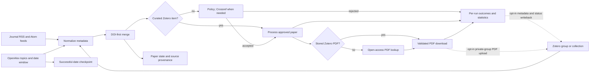

# Discover papers with PapersBot

PapersBot is the literature intake step. Journal feeds find newly announced papers
quickly; OpenAlex topic queries recover relevant work from journals whose feeds are
missing, sparse, or inaccessible; and a Zotero group can provide a curated intake
queue with stored PDFs. PapersBot merges overlapping records by DOI, selects works
that may report perovskite photovoltaic devices, and downloads PDFs. It does not
extract scientific values; downloaded PDFs can be passed to `perla-extract` separately.



## Install and run

Feed parsing and HTTP clients are optional dependencies so they do not enlarge a
deployment that only performs extraction.

```bash
pip install 'perla-extract[papersbot]'

perla-papersbot downloaded_papers \
  --state-dir .papersbot-state
```

The command prints a JSON run summary to stdout and progress logs to stderr. It
verifies that each downloaded response starts with a PDF signature rather than
silently saving an HTML error page.

For automation, preserve structured logs in addition to the live console:

```bash
perla-papersbot downloaded_papers \
  --state-dir .papersbot-state \
  --log-file papersbot.log.jsonl \
  > papersbot-result.json
```

## Configure feeds and selection

The package ships a maintained feed list and a small JSON selection policy. Both are
data files, not coded branches. Replace the feed list with either a comment-friendly
text file or repeated URLs:

```bash
perla-papersbot papers --feeds-file my-feeds.txt

perla-papersbot papers \
  --feed https://example.org/feed.xml \
  --feed https://example.net/atom.xml
```

A selection policy requires at least one literal term from each group and can exclude
publication types by title. Before a metadata request, any term from any required
group is enough to keep a sparse feed entry. Crossref can then supply the missing
groups. This makes group order irrelevant without sending every feed item to a metadata
service. For example:

```json
{
  "required_groups": [
    ["perovskite", "perovskites"],
    ["solar cell", "solar cells", "photovoltaic"]
  ],
  "excluded_title_terms": ["review", "perspective", "news"],
  "openalex": {
    "topic_ids": ["T10247", "T10624", "T12309"],
    "initial_lookback_days": 30,
    "overlap_days": 7
  }
}
```

Pass the file with `--selection-file selection.json`. Selection details can therefore
evolve without adding property-specific logic to either PapersBot or the scientific
extractor.

The packaged policy uses OpenAlex topics
[`T10247`](https://openalex.org/T10247) (perovskite materials),
[`T10624`](https://openalex.org/T10624) (silicon and solar-cell technology), and
[`T12309`](https://openalex.org/T12309) (solar-cell performance optimization). Topic
retrieval is intentionally a broad, high-recall discovery step, not the final
relevance decision: the same local policy is applied to OpenAlex and feed metadata.
Change the IDs in the policy when the project scope changes.

On its first run, PapersBot queries the configured lookback period. Later runs start
at the last successful end date minus the overlap, which catches delayed indexing.
DOI deduplication makes repeated results cheap. The checkpoint advances only after
every cursor page has been read. Explicit dates support reproducible backfills:

```bash
perla-papersbot papers \
  --openalex-start-date 2025-01-01 \
  --openalex-end-date 2025-12-31
```

Use `--no-openalex` or `--no-rss` to isolate one source for diagnosis. At least one
source must remain enabled. `OPENALEX_EMAIL` is sent as the API contact address;
`OA_EMAIL` is accepted as its fallback. Set `UNPAYWALL_EMAIL` to enable Unpaywall.

## Use a Zotero group library

A public group needs only its numeric group ID. This command uses Zotero as the sole
discovery source:

```bash
perla-papersbot papers \
  --no-rss \
  --no-openalex \
  --zotero-group-id 123456
```

Pass `--zotero-collection-key ABCD1234` to ingest only one collection. This is the
Zotero API collection key—typically the final eight-character component of a
collection URL—not the collection's display name. Private groups and all writes also
require an API key:

```bash
export ZOTERO_API_KEY="your-zotero-key"

perla-papersbot papers \
  --zotero-group-id 123456 \
  --zotero-collection-key ABCD1234
```

Top-level bibliographic items enter the same relevance policy, state, and retry path
as feed and OpenAlex records. If an accepted item has a stored PDF attachment,
PapersBot downloads it before trying an open-access resolver. A stored attachment can
therefore be ingested even when the parent has no DOI; DOI-free records from other
sources still cannot be resolved reliably.

### Journal-club intake

A designated collection can act as an explicit human queue. Members add a reference
or PDF with the ordinary Zotero clients; PapersBot treats membership in that collection
as approval for extraction, even when the paper would fail the automated title and
keyword policy:

```bash
perla-papersbot papers \
  --zotero-group-id 123456 \
  --zotero-collection-key ABCD1234 \
  --zotero-curated
```

`--zotero-curated` requires a collection key: treating an entire group as approved
would make an accidental addition indistinguishable from a deliberate extraction
request. If an item was previously rejected, moving it into the curated collection
reopens it despite its terminal state.

Writeback is deliberately opt-in. It mirrors DOI-bearing discoveries—including
rejected records—so false negatives remain visible, and it replaces only tags owned
by PERLA. Human tags, notes, annotations, collections, and bibliographic edits are
never overwritten. Optimistic Zotero item versions protect concurrent journal-club
edits. Managed tags include:

```text
perla:status:downloaded
perla:source:openalex
perla:pdf:attached
perla:access:open-access
perla:curated
```

Configuring a group, collection, or API key is read-only by itself.
`--zotero-curated` changes selection but still does not write. `--zotero-save` permits
bibliographic-item creation and status-tag updates; PDF bytes require the additional
`--zotero-pdf-policy research-group` opt-in.

Use a separate output collection when curated intake and automated discovery share a
group. Otherwise bot-created rejected items would enter the human-approved queue on
the next run:

```bash
perla-papersbot papers \
  --zotero-group-id 123456 \
  --zotero-collection-key ABCD1234 \
  --zotero-output-collection-key WXYZ5678 \
  --zotero-curated \
  --zotero-save
```

If no output collection is configured in curated mode, new bot records remain at the
group-library top level. PapersBot rejects a configuration that uses the same key for
curated input and bot output.

### Internal PDF storage

PDF upload is a separate policy because metadata writeback should never imply copying
files. `research-group` enables Zotero's atomic three-stage file upload only after the
API reports that the destination group is private and permits file storage:

```bash
perla-papersbot papers \
  --zotero-group-id 123456 \
  --zotero-collection-key ABCD1234 \
  --zotero-output-collection-key WXYZ5678 \
  --zotero-curated \
  --zotero-save \
  --zotero-pdf-policy research-group
```

Existing stored PDF children are reused and never replaced. New attachment notes
record the source URL, access basis, acquisition purpose, and SHA-256 fingerprint. The
API key is sent only to Zotero; redirected downloads and storage-host uploads
deliberately omit it. An interrupted upload reuses its child attachment on the next
run.

This policy is intended for a defined internal scientific research and verification
group. It does not make a PDF publicly redistributable. Contributors remain responsible
for adding only lawfully accessed copies, as required by the
[Zotero Terms of Service](https://www.zotero.org/support/terms/terms_of_service). For a
German research organization, the relevant controlled-access and secure-retention
conditions are described in [§ 60d UrhG](https://www.gesetze-im-internet.de/urhg/__60d.html).
Confirm the project policy with the responsible university library or legal office.

For unattended runs, the Zotero options have direct environment equivalents:

| Environment variable | Default | Purpose |
| --- | --- | --- |
| `ZOTERO_GROUP_ID` | unset | Numeric group library ID |
| `ZOTERO_COLLECTION_KEY` | unset | Optional input collection API key |
| `ZOTERO_OUTPUT_COLLECTION_KEY` | unset | Optional collection API key for bot-created records |
| `ZOTERO_API_KEY` | unset | Credential for private reads or explicit writes |
| `ZOTERO_CURATED` | `false` | Treat the configured input collection as human-approved |
| `ZOTERO_SAVE` | `false` | Permit item creation and PERLA-owned status-tag updates |
| `ZOTERO_PDF_POLICY` | `never` | Set to `research-group` for verified-private-group upload |

Boolean opt-ins accept `1`, `true`, `yes`, or `on` (case-insensitive). The API key is
never written to `state.json`, run ledgers, or logs. In GitHub Actions, configure all
non-secret settings as repository variables and the key as a repository secret.

These controls follow Zotero's official [Web API basics](https://www.zotero.org/support/dev/web_api/v3/basics)
and [write-request protocol](https://www.zotero.org/support/dev/web_api/v3/write_requests).
Zotero documents attachment storage separately in its
[file-upload protocol](https://www.zotero.org/support/dev/web_api/v3/file_upload),
which PapersBot follows for authorization, storage transfer, and registration.

## Incremental state

`STATE_DIR/state.json` contains a versioned `papers` mapping keyed by DOI whenever one
is available. Each record retains all discovery sources, OpenAlex metadata, status,
attempt count, resolved PDF URL, downloaded path, last error, and update time. It also
stores the last fully successful OpenAlex date. Version-one feed identifiers are
migrated to DOI keys as papers reappear. Terminal entries are not processed again
unless a member newly adds a previously rejected paper to the curated collection.
Transient errors and papers without an open PDF are retried up to `--max-attempts`.

Every invocation also checkpoints `STATE_DIR/runs/<run-id>.json` and
`STATE_DIR/last_run.json`. A run record contains timestamps, a non-secret configuration
fingerprint, source/date configuration, raw and DOI-deduplicated discovery counts,
OpenAlex pages/results/reported API cost, Zotero item updates and PDF transfers,
aggregate outcome/skip/retry counts, source failures, and one outcome for every unique
paper processed or skipped. The per-run file is therefore the source for longitudinal
statistics; console logs are only the live operational view. An interrupted invocation
remains marked `running` or `failed` rather than masquerading as a successful empty
run. Retry counts retain the preceding status (`error` or `no_pdf`), while skip counts
retain both the reason and existing paper status, such as `terminal:downloaded` or
`max_attempts:no_pdf`.

The files are ordinary JSON, so no application-specific reader is required:

```bash
jq '{status, source_counts, openalex, zotero, outcome_counts, skip_counts, retry_counts}' \
  .papersbot-state/last_run.json

jq -s 'map({run_id, started_at, status, outcome_counts})' \
  .papersbot-state/runs/*.json
```

The scheduled GitHub workflow prevents overlapping runs, caches this directory between
runs, and publishes the complete state directory, JSON run summary, and structured
JSONL logs as an artifact. The preservation step runs even after a failed discovery
command so partial state remains inspectable. Downloaded PDFs are deliberately not
GitHub artifacts by default: a private Zotero input must not silently become a second,
potentially broader document store. Set the repository variable
`PAPERSBOT_ARCHIVE_PDFS=true` only when the repository's access and retention policy
is appropriate for every downloaded copy. Set `OA_EMAIL` as a repository variable to
identify OpenAlex requests and enable Unpaywall.

## Python API

Clients are injectable for tests or alternative runtime integrations.

```python
from perla_extract.papersbot import run_papersbot

result = run_papersbot(
    "downloaded_papers",
    state_dir=".papersbot-state",
    feeds_file="my-feeds.txt",
    zotero_group_id="123456",
    zotero_api_key=None,  # Public-group reads need no key.
)
```
