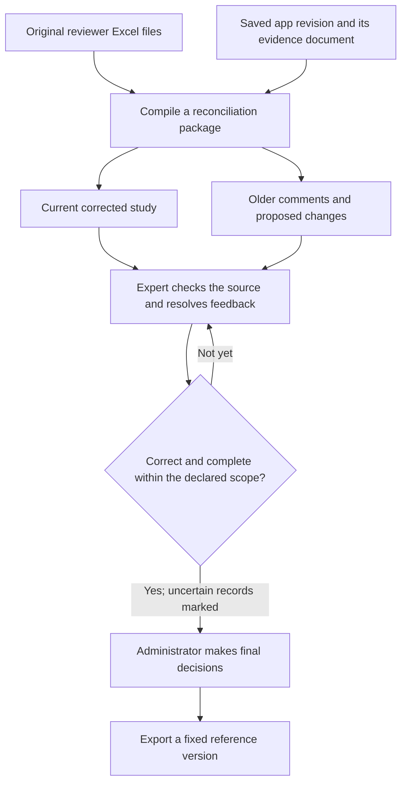
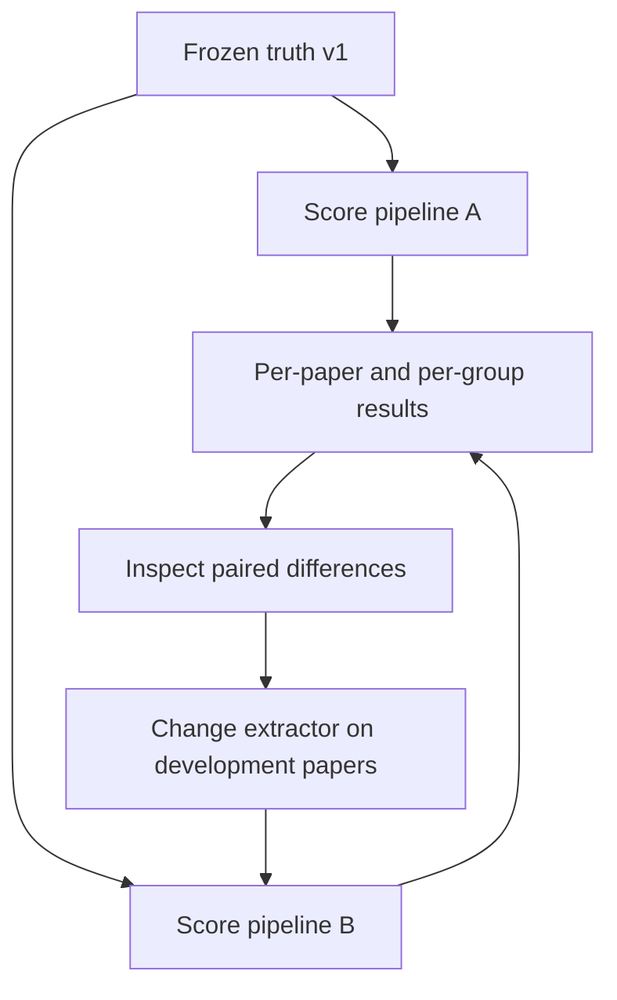

# From corrections to a benchmark

Use this guide to turn saved corrections into a reference and score extractions
against it. Resolve feedback, complete the final review, export that version, then
score the original predictions without editing them.

- [Evaluation methods](../methods/benchmark.md): inputs, source review, scoring and limitations.
- [Scoring reference](evaluation.md): matching, tolerances, fields and diagnostics.
- [Run the worked example](scoring-example.md): synthetic corrections and expected scores.

A **reviewed draft** includes saved corrections and additions. **Frozen ground truth**
is a version the administrator has approved for evaluation. Its manifest records
which review revision, source files and schema it uses, with hashes to identify their
content. Model output and unresolved comments are not a finished reference.

## Reconcile saved feedback



The browser revision already contains saved edits. The compiler uses that current
study; it does **not** replay old edits over it. Exact Excel bytes, cell comments,
proposed values, browser review history and evidence remain available separately.
Neither compiling a package nor scoring it changes the deployed app.

Older workbooks often refer to a different seed or to records that no longer exist.
Their comments are useful feedback, but their approvals must not automatically
verify a newer record just because its ID looks familiar. The package keeps older feedback separate from decisions on the current revision.

### Using expert feedback in practice

Start with the latest saved revision of each paper, not another extraction run.
Read the package's `adjudication.json` alongside the preserved workbook and paper. Resolve
one issue at a time:

| Feedback | Action in the current review | What must not happen |
| --- | --- | --- |
| A solvent appears in the finished stack | Check the methods; correct the stack and retain the solvent in the appropriate processing information | Delete all mentions of the solvent |
| Too many device families | Decide which are true design families versus variants or specimens; repair linked records when merging/removing | Pool champion, individual and average measurements |
| Incorrect precursor concentration | Correct the value, unit, chemical association and supporting evidence together | Attach a correct number to the wrong precursor |
| Missing population or stability data | Check main text and SI, add supported records, and establish only justified specimen links | Infer a population from one device, or link every stability test to the champion |
| “This is wrong” without a replacement | Consult the paper, request clarification, or mark the record uncertain | Treat the prose comment as a corrected label |
| An older workbook decision refers to a removed ID | Reconcile the scientific content manually against the current record structure | Reapply it by array position or fuzzy ID matching |

Preserve additions discovered while reading the paper just as carefully as edits
to existing records. Record which sources and scientific categories were checked
for omissions, and any remaining uncertainty. When resolving older feedback, retain
the findings of source searches already completed. A record-level approval alone does not document a source-wide
completeness check.

Before final adjudication, compare the census/completeness notes with the actual
records. A set of individually approved records can still be incomplete. If a census
and the extracted record count disagree, consult the source to determine whether
records are missing, grouped differently, or counted incorrectly. Do not invent
records to satisfy the census. Record how the discrepancy was resolved.

### Prepare the reconciliation package

Run from the repository with the project environment installed:

```bash
PYTHONPATH=.:src python -m review_workbench.compile_review_batch \
  --workbook "feedback/paper-a.review.xlsx" \
  --workbook "feedback/paper-b.review.xlsx" \
  --review-data review_data/snapshot \
  --output-dir review_data/reconciliation
```

`review_data/snapshot` must be a saved workbench storage snapshot containing its
`state` directory, not an arbitrary feedback-download ZIP. Alternatively, repeat
`--run-root` to supply extraction runs instead of `--review-data`; do not combine
the two modes. For current browser corrections, use the snapshot mode.

The command writes `batch_summary.json` and one package per paper. Each package's
path contains a hash of its inputs:

```text
reconciliation/
  batch_summary.json                    # Index of this compilation
  dev/<paper-id>/<package-hash>/
    provisional_ground_truth.json       # Current saved study, pending final review
    document.json                       # Evidence used by this revision
    adjudication.json                   # Feedback, proposals and browser decisions
    reviewer_workbook.xlsx               # Exact uploaded bytes, including comments
    review_source.json                  # Saved source metadata and seed
    review_revision.json                # Saved revision and review history
    manifest.json                       # Input identities, validation and hashes
```

The last two saved-review files are present in snapshot mode. Rerunning with different
inputs creates a different package; it does not overwrite earlier packages. The
batch index describes the latest compilation. A proposal is not applied merely
because it parses or passes a schema check.

### Freeze only after adjudication

Apply source-supported corrections through the current review workflow, resolve
completeness, and have an administrator complete adjudication. Then export:

```bash
python review_workbench/export_ground_truth.py \
  --review-data review_data/reviewed-snapshot \
  --split dev \
  --paper-id 10.0000--example \
  --output-root data/study_extraction/ground_truth/v1
```

The exporter checks that adjudication is the latest event, that the adjudicator has
saved a final decision for every current record, and that schema/evidence validation succeeds. A later
edit requires adjudication again. The frozen directory contains `ground_truth.json`,
the original `seed_extraction.json`, `review_events.json` and `manifest.json`.
Conflicting overwrites are refused. Publish a new version for later label changes.

The scorer leaves out records marked `uncertain` in the final review. It does not
exclude individual fields within a record. Keep the exact evidence document used
during review in the private source archive. The manifest records its version and
hash, but the four-file export includes neither the PDF nor the evidence document.


### Public release boundary

Keep review packages private unless they have been cleared for release. They can
contain reviewer identifiers, free-text comments, original uploads and source documents with redistribution
restrictions. Keep them outside the public repository.

The ground-truth exporter is **not an anonymization tool**. In particular,
`review_events.json` retains reviewer identifiers and comments. Review all exported
files before publication and obtain the necessary permissions. If a public release
needs anonymization, create a separate version and update its hashes to match the
released files. Preserve the unmodified originals privately.
Do not redact an existing frozen artifact in place or publish private feedback just
because export validation succeeded.


## Score a frozen revision

```bash
perla-evaluate \
  --truth data/study_extraction/ground_truth/v1/dev/10.0000--example \
  --prediction results/model-a/10.0000--example \
  --output results/model-a/10.0000--example/evaluation.json \
  --fail-on-scoring-issues
```

If the installed CLI is unavailable, use
`PYTHONPATH=src python -m perla_extract.study_extraction.evaluation_cli` with the same
arguments from the repository root. A full prediction directory supplies extraction,
evidence and saved run totals. A bare JSON is accepted, but supplies neither the
evidence checks nor the run totals.

Inspect these fields in order:

1. `benchmark`, input content hashes and `config`: are these the intended versions?
2. `prediction_validation`: do citations and references validate? This does not
   prove that a quote scientifically supports a claim.
3. `core_facts.issues`, `matches` and excluded records: did the scorer pair the right records, and what did it leave out?
4. `core_facts.groups`: where are precision and recall weak, and with how many facts?
5. `core_facts.value_only` and `core_facts.attribution`: are failures due to values,
   missing context, wrong associations or uncertain alignment?
6. Matched and unmatched JSON paths: inspect concrete errors with the paper.

`--fail-on-scoring-issues` saves the report, then returns an error if matching is
ambiguous. It does not fail on citation issues or enforce a minimum score.
Do not automatically repair predictions during scoring. Do not omit failed papers.

## Compare saved runs



```bash
perla-evaluate-dataset \
  --report results/model-a/paper-a/evaluation.json \
  --report results/model-a/paper-b/evaluation.json \
  --output results/model-a/dataset-evaluation.json \
  --fail-on-scoring-issues
```

Report all six group scores and their counts, the average across papers, its
bootstrap interval, matching issues, excluded records and run failures. Include
cost and latency only where measured. State how many papers contribute to each
average so missing or failed extractions remain visible.

The aggregator rejects mixed scoring configurations, schema versions, benchmark
splits and duplicate benchmark sources. It produces single-system intervals, not
a paired A/B significance test. Check that all intended papers are present and that
the compared systems used the same sources and their declared model configurations.

If an adjudicator later corrects a reference, release truth v2 and rescore **both saved
predictions** against v2. Do not compare A/v1 with B/v2 and attribute the difference
to an extractor improvement. Papers whose feedback changed prompts or scoring rules
are development papers, not a held-out test set.


## Validate scorer decisions

On development papers, compare the scorer's accepted and rejected matches with
expert judgments. Record the expected pairings, values and associations before
looking at the score. Include cases with equivalent chemical descriptions or
different ways of grouping the same information. The report retains
matched and unmatched JSON paths for this inspection. A mismatch may reflect a
comparison limitation rather than an extraction error; do not change a supported
reference fact simply to make it match.
