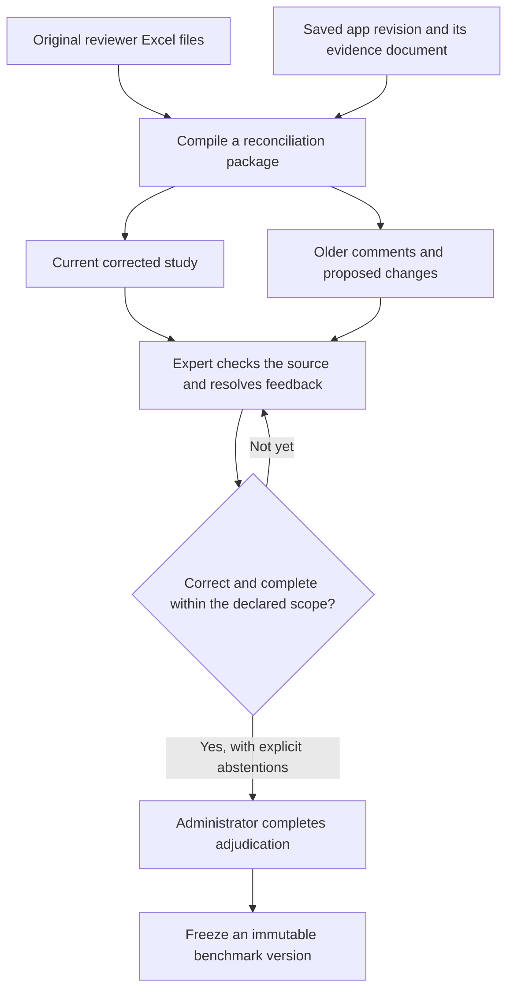
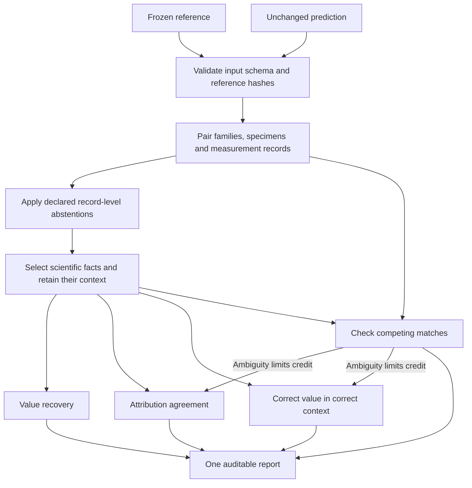
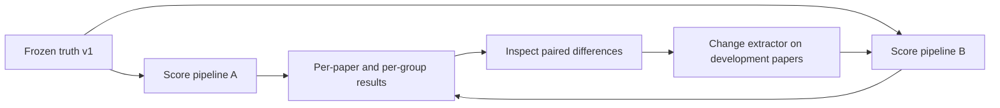

# From reviewer corrections to a benchmark

The objective is not to score against our latest model output. It is to build a
source-checked reference that experts have corrected, freeze it, then measure
unchanged human and model extractions against the same reference.

There are three different artifacts: **feedback**, a **reviewed draft**, and
**adjudicated ground truth**. Keeping these distinct prevents an old spreadsheet
approval or an unexamined model claim from becoming a benchmark label.

## 1. Where corrections go



The browser revision already contains saved edits. The compiler uses that current
study; it does **not** replay old edits over it. Exact Excel bytes, cell comments,
proposed values, browser review history and evidence remain available separately.
Neither compiling a package nor scoring it changes the deployed app.

Older workbooks often refer to a different seed or to records that no longer exist.
Their comments are useful feedback, but their approvals must not automatically
verify a newer record just because its ID looks familiar. The compiler distinguishes
workbook reconciliation from valid decisions on the current browser revision.

### Using expert feedback in practice

Start with the latest saved revision of each paper, not another extraction run.
Read its `adjudication.json` alongside the preserved workbook and paper. Resolve
one issue at a time:

| Feedback | Action in the current review | What must not happen |
| --- | --- | --- |
| A solvent appears in the finished stack | Check the methods; correct the stack and retain the solvent in the appropriate processing information | Delete all mentions of the solvent |
| Too many device families | Decide which are true design families versus variants or specimens; repair linked records when merging/removing | Pool champion, individual and average measurements |
| Incorrect precursor concentration | Correct the value, unit, chemical association and supporting evidence together | Attach a correct number to the wrong precursor |
| Missing population or stability data | Check main text and SI, add supported records, and establish only justified specimen links | Infer a population from one device, or link every stability test to the champion |
| “This is wrong” without a replacement | Consult the paper, request clarification, or abstain | Treat the prose comment as a corrected label |
| An older workbook decision refers to a removed ID | Reconcile the scientific content manually against the current record structure | Reapply it by array position or fuzzy ID matching |

Before final adjudication, compare the census/completeness notes with the actual
records. A set of individually approved records can still be incomplete. If a census
and the extracted record count disagree, consult the source to determine whether
records are missing, grouped differently, or counted incorrectly. Do not invent
records to satisfy the census. Record how the discrepancy was resolved.

### Prepare the reconciliation package

Run from the repository with the project environment installed:

```bash
PYTHONPATH=.:src python -m review_workbench.compile_review_batch \
  --workbook "feedback/paper-a.review.xlsx" \
  --workbook "feedback/paper-b.review.xlsx" \
  --review-data review_data/snapshot \
  --output-dir review_data/reconciliation
```

`review_data/snapshot` must be a saved workbench storage snapshot containing its
`state` directory, not an arbitrary feedback-download ZIP. Alternatively, repeat
`--run-root` to supply extraction runs instead of `--review-data`; do not combine
the two modes. For current browser corrections, use the snapshot mode.

The command emits `batch_summary.json` and content-addressed per-paper packages:

```text
reconciliation/
  batch_summary.json                    # Index of this compilation
  dev/<paper-id>/<package-hash>/
    provisional_ground_truth.json       # Current materialized study, not certified
    document.json                       # Evidence bound to this revision
    adjudication.json                   # Feedback, proposals and browser decisions
    reviewer_workbook.xlsx               # Exact uploaded bytes, including comments
    review_source.json                  # Saved source metadata and seed
    review_revision.json                # Saved revision and review history
    manifest.json                       # Provenance, validation and content hashes
```

The last two saved-review files are present in snapshot mode. Rerunning with different
inputs creates a different package; it does not overwrite earlier packages. The
batch index describes the latest compilation. A proposal is not applied merely
because it parses or passes a schema check.

### Freeze only after adjudication

Apply source-supported corrections through the current review workflow, resolve
completeness, and have an administrator complete adjudication. Then export:

```bash
python review_workbench/export_ground_truth.py \
  --review-data review_data/reviewed-snapshot \
  --split dev \
  --paper-id 10.0000--example \
  --output-root data/study_extraction/ground_truth/v1
```

The exporter checks that adjudication is the latest event, that the adjudicator has
reviewed every current record, and that schema/evidence validation succeeds. A later
edit requires adjudication again. The frozen directory contains `ground_truth.json`,
the original `seed_extraction.json`, `review_events.json` and `manifest.json`.
Conflicting overwrites are refused. Publish a new version for later label changes.

An `uncertain` final record is an explicit abstention, not a correct or incorrect
label. The current scorer masks whole records, not individual uncertain fields.
Retain the exact reviewed evidence document with the release's private source
archive; the manifest binds it by version and hash, but the four-file truth export
does not embed the PDF or evidence document.

### Public release boundary

The documentation and example paths on this page are public-facing. Actual review
packages are private working data by default: they can contain reviewer identifiers,
free-text comments, original uploads and source documents with redistribution
restrictions. Keep them outside the public repository.

The ground-truth exporter is **not an anonymization tool**. In particular,
`review_events.json` retains reviewer identifiers and comments. Review all exported
files before publication and obtain the necessary permissions. If a public release
needs anonymization, produce a separately versioned, internally consistent release
with matching provenance hashes; preserve the unmodified originals privately.
Do not redact an existing frozen artifact in place or publish private feedback just
because export validation succeeded.

## 2. How the scorer works



**Pairing** asks which objects describe the same family, specimen or observation.
Generated IDs are not scientific identities. The scorer uses one-to-one content
matching with parent-link and protocol preferences; it exposes every selected pair.
Pairing is an estimate and must be inspected on calibration examples.

A **fact** is one selected scientific claim, such as `PCE = 20%`, a layer material,
or a precursor concentration. Its **context** identifies where it belongs: device,
scan direction, layer, constituent, processing step or stability checkpoint. The
scorer never rewards merely having a nonempty JSON field.

### Three views of the same extraction

| Example | Values recovered? | Context correct? | Strict result |
| --- | --- | --- | --- |
| 20% predicted as 0.20 with an explicit fraction unit | Yes, compatible units | Yes | Correct |
| 20% predicted as 21% for the right reverse scan | No | Yes | Wrong value |
| Right efficiency attached to the wrong scan direction | Yes, if the record is paired | No | Wrong attribution |
| Annealing temperatures swapped between two numbered steps | Yes | Each temperature property still occupies a valid step | Both temperature-value matches fail |
| Two identical unnumbered annealing steps | Numbers may be present | Ambiguous | No strict credit for those steps; review flagged |

These are separate diagnostic assignments, not three independent quality scores to
average. Use strict correct-in-context F1 as the primary score; use the other views
to understand failure modes. A missing stability condition can invalidate several
strict matches even when the associated numbers were read correctly.

All three views preserve counts and original JSON paths. Wrong or missing facts
reduce recall; unsupported or duplicated predictions reduce precision. Unrelated
text, generated IDs, citation wording and empty placeholders earn no points.

### Which schema areas are most dependable to score?

This is confidence in **comparison rules**, not measured model extraction accuracy.

| Area | Most dependable cases | Cases needing more expert calibration |
| --- | --- | --- |
| Performance | Scalar PCE, Voc, Jsc and FF with explicit units, specimen and scan | Ambiguous specimen identity; range/uncertainty notation |
| Population | Explicit mean/median/standard deviation and sample size | Missing sample size, plot-only distributions, unclear statistical meaning |
| Stability | Explicit time, retained performance and test conditions | Missing conditions, unclear specimen links, differently grouped checkpoints |
| Stack | Structured materials, roles and explicit sequence | Chemical aliases, differently split layers, missing order |
| Composition | Exact formulas and named precursor amounts in comparable units | Chemical synonyms, symbolic compositions, different formula representations |
| Processing | Explicitly ordered operations, materials and numeric conditions | Prose paraphrases, different step granularity, unnumbered repeated operations |

Pint handles compatible units for single unqualified numbers. Chemical formulas,
ranges and qualified values use conservative literal rules. A small frozen operation
alias map can equate approved descriptions; it does not infer chemistry. See the
[complete scoring contract](evaluation.md) for tolerances, scope and limitations.

## 3. Run and inspect a score

```bash
perla-evaluate \
  --truth data/study_extraction/ground_truth/v1/dev/10.0000--example \
  --prediction results/model-a/10.0000--example \
  --output results/model-a/10.0000--example/evaluation.json \
  --fail-on-scoring-issues
```

If the installed CLI is unavailable, use
`PYTHONPATH=src python -m perla_extract.study_extraction.evaluation_cli` with the same
arguments from the repository root. A full prediction directory supplies extraction,
evidence and run-accounting artifacts; a bare JSON is a development-only shortcut.

Inspect these fields in order:

1. `benchmark`, input content hashes and `config`: are these the intended versions?
2. `prediction_validation`: do citations and references validate? This does not
   prove that a quote scientifically supports a claim.
3. `core_facts.issues`, `matches` and masked records: is alignment interpretable?
4. `core_facts.groups`: where are precision and recall weak, and with how many facts?
5. `core_facts.value_only` and `core_facts.attribution`: are failures due to values,
   missing context, wrong associations or uncertain alignment?
6. Matched and unmatched JSON paths: inspect concrete errors with the paper.

`--fail-on-scoring-issues` saves the report before returning an error. It is an
ambiguity gate, not a citation-validation gate or a minimum-quality threshold.
Do not automatically repair predictions during scoring. Do not omit failed papers.

## 4. Compare pipeline versions on a fixed reference



```bash
perla-evaluate-dataset \
  --report results/model-a/paper-a/evaluation.json \
  --report results/model-a/paper-b/evaluation.json \
  --output results/model-a/dataset-evaluation.json \
  --fail-on-scoring-issues
```

Report the six group scores, pooled fact counts, group-balanced paper average,
paper-bootstrap interval, matching issues, abstentions and run failures. Include
cost/latency only where measured. Averages without denominators can hide that a
model failed to extract several papers.

The aggregator rejects mixed scoring configurations, schema versions, benchmark
splits and duplicate benchmark sources. It produces single-system intervals, not
a paired A/B significance test. The caller must still enforce the planned paper
roster, shared source scope and fixed model configuration.

If an adjudicator later corrects a reference, release truth v2 and rescore **both saved
predictions** against v2. Do not compare A/v1 with B/v2 and attribute the difference
to an extractor improvement. Papers whose feedback changed prompts or scoring rules
are development papers, not a held-out test set.

## 5. Then compare with a human extractor

Use unseen papers and an independently adjudicated reference. The human contestant
must not see the model's extraction or the reference during extraction. Both sources
must use the same input scope, schema and frozen scorer. Declare whether you compare
equal-time work or best achievable quality.

For the preference study, render A and B in the same layout, randomize their sides,
hide origin and collect correctness, completeness, attribution, chemical detail and
correction-effort preferences separately. Include tie and cannot-judge choices.
Objective fact scores and subjective preference answer different questions; neither
replaces the other. See [Compare extraction workflows](expert-comparison.md).

## Maintenance contract

The code has separate responsibilities:

- `scoring_facts.py`: which scientific fields count, their context, equality rules
  and nested identity warnings. No model calls or paper-specific extraction rules.
- `evaluation.py`: record/fact assignment, uncertainty masks, diagnostics and
  dataset summaries, with explicit typed report models.
- `evaluation_cli.py` and `evaluation_dataset_cli.py`: input validation, provenance,
  configuration and report writing.
- `compile_review_batch.py` and `ground_truth_export.py` in `review_workbench`:
  preserve feedback and freeze adjudicated labels; they do not score predictions.

Changes to field selection or equality require a scoring-profile/version change,
regression tests and recomputing reports. Tests cover negative scientific examples
as well as unit conversion, order/ID invariance, ambiguity, provenance and the
adjudicated app-export-to-scorer path. Passing tests establishes implementation
behavior—not that the matcher agrees with experts on every future paper.
