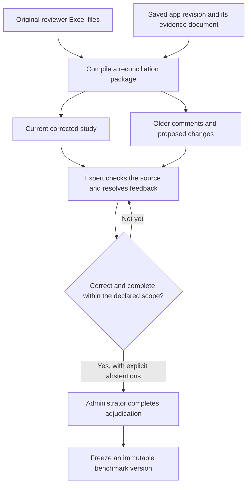
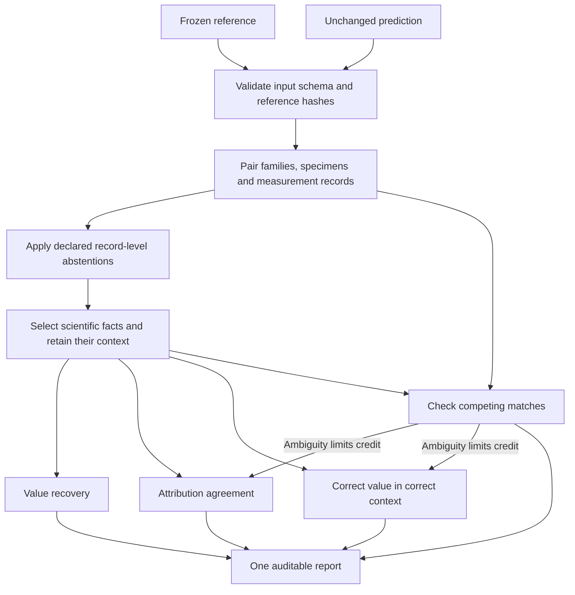
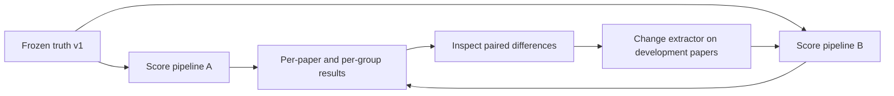

# From reviewer corrections to a benchmark

The objective is not to score against our latest model output. It is to build a
source-checked reference that experts have corrected, freeze it, then measure
unchanged human and model extractions against the same reference.

Our reference-building workflow includes an expert reading the papers to find
**missing information**, as well as correcting the extracted records. It is not
limited to accepting or rejecting what the model already produced. This supplies
both a correctness check and a source-based completeness check within the declared
review scope. Starting from pre-annotation does not invalidate that work or require
re-extracting every paper from scratch.

There are three different artifacts: **feedback**, a **reviewed draft**, and
**adjudicated ground truth**. Keeping these distinct prevents an old spreadsheet
approval or an unexamined model claim from becoming a benchmark label.

## 1. Where corrections go



The browser revision already contains saved edits. The compiler uses that current
study; it does **not** replay old edits over it. Exact Excel bytes, cell comments,
proposed values, browser review history and evidence remain available separately.
Neither compiling a package nor scoring it changes the deployed app.

Older workbooks often refer to a different seed or to records that no longer exist.
Their comments are useful feedback, but their approvals must not automatically
verify a newer record just because its ID looks familiar. The compiler distinguishes
workbook reconciliation from valid decisions on the current browser revision.

### Using expert feedback in practice

Start with the latest saved revision of each paper, not another extraction run.
Read its `adjudication.json` alongside the preserved workbook and paper. Resolve
one issue at a time:

| Feedback | Action in the current review | What must not happen |
| --- | --- | --- |
| A solvent appears in the finished stack | Check the methods; correct the stack and retain the solvent in the appropriate processing information | Delete all mentions of the solvent |
| Too many device families | Decide which are true design families versus variants or specimens; repair linked records when merging/removing | Pool champion, individual and average measurements |
| Incorrect precursor concentration | Correct the value, unit, chemical association and supporting evidence together | Attach a correct number to the wrong precursor |
| Missing population or stability data | Check main text and SI, add supported records, and establish only justified specimen links | Infer a population from one device, or link every stability test to the champion |
| “This is wrong” without a replacement | Consult the paper, request clarification, or abstain | Treat the prose comment as a corrected label |
| An older workbook decision refers to a removed ID | Reconcile the scientific content manually against the current record structure | Reapply it by array position or fuzzy ID matching |

Preserve additions discovered while reading the paper just as carefully as edits
to existing records. Record which sources and scientific categories were checked
for omissions, and any remaining uncertainty. If the expert has already completed
that search, reconcile and retain its results; do not treat missing app checkmarks
as evidence that the scientific review never happened. Conversely, a saved approval
on one record does not document a paper-wide completeness check.

Before final adjudication, compare the census/completeness notes with the actual
records. A set of individually approved records can still be incomplete. If a census
and the extracted record count disagree, consult the source to determine whether
records are missing, grouped differently, or counted incorrectly. Do not invent
records to satisfy the census. Record how the discrepancy was resolved.

### Prepare the reconciliation package

Run from the repository with the project environment installed:

```bash
PYTHONPATH=.:src python -m review_workbench.compile_review_batch \
  --workbook "feedback/paper-a.review.xlsx" \
  --workbook "feedback/paper-b.review.xlsx" \
  --review-data review_data/snapshot \
  --output-dir review_data/reconciliation
```

`review_data/snapshot` must be a saved workbench storage snapshot containing its
`state` directory, not an arbitrary feedback-download ZIP. Alternatively, repeat
`--run-root` to supply extraction runs instead of `--review-data`; do not combine
the two modes. For current browser corrections, use the snapshot mode.

The command emits `batch_summary.json` and content-addressed per-paper packages:

```text
reconciliation/
  batch_summary.json                    # Index of this compilation
  dev/<paper-id>/<package-hash>/
    provisional_ground_truth.json       # Current materialized study, not certified
    document.json                       # Evidence bound to this revision
    adjudication.json                   # Feedback, proposals and browser decisions
    reviewer_workbook.xlsx               # Exact uploaded bytes, including comments
    review_source.json                  # Saved source metadata and seed
    review_revision.json                # Saved revision and review history
    manifest.json                       # Provenance, validation and content hashes
```

The last two saved-review files are present in snapshot mode. Rerunning with different
inputs creates a different package; it does not overwrite earlier packages. The
batch index describes the latest compilation. A proposal is not applied merely
because it parses or passes a schema check.

### Freeze only after adjudication

Apply source-supported corrections through the current review workflow, resolve
completeness, and have an administrator complete adjudication. Then export:

```bash
python review_workbench/export_ground_truth.py \
  --review-data review_data/reviewed-snapshot \
  --split dev \
  --paper-id 10.0000--example \
  --output-root data/study_extraction/ground_truth/v1
```

The exporter checks that adjudication is the latest event, that the adjudicator has
reviewed every current record, and that schema/evidence validation succeeds. A later
edit requires adjudication again. The frozen directory contains `ground_truth.json`,
the original `seed_extraction.json`, `review_events.json` and `manifest.json`.
Conflicting overwrites are refused. Publish a new version for later label changes.

An `uncertain` final record is an explicit abstention, not a correct or incorrect
label. The current scorer masks whole records, not individual uncertain fields.
Retain the exact reviewed evidence document with the release's private source
archive; the manifest binds it by version and hash, but the four-file truth export
does not embed the PDF or evidence document.

### Validate the scorer without restarting the scientific review

Reference quality and scoring quality are separate questions. Use source-checked
corrections and additions from the development papers to build a small, explicit
set of expected scoring outcomes:

| Expert-established case | Expected scoring behavior |
| --- | --- |
| A supported measurement was missing from the seed and added during review | The unchanged seed loses recall for that measurement |
| A solvent was removed from the finished stack | The unchanged seed loses stack precision |
| A concentration was assigned to the wrong precursor | The value may be recovered, but correct-in-context credit is lost |
| The same supported value is written in equivalent units | No loss solely because of the unit representation |
| Two records or operations are scientifically equivalent but grouped or described differently | Inspect the pairing; do not automatically label the discrepancy an extraction error |

Check both credited and rejected matches, not only the total score. Add generic
regression cases for confirmed scoring defects, freeze the revised scoring rules,
and rescore all saved predictions together. Do not change the expert reference just
to make the scorer accept it. Papers used to revise extraction or scoring rules
remain development papers.

A second expert's source-based audit of a sample can estimate residual omissions,
disagreements and possible pre-annotation influence. It strengthens the reference;
it is not a reason to discard completed full-paper review. Report how the reference
was built, its scope, abstentions and any independent audit actually performed.

### Public release boundary

The documentation and example paths on this page are public-facing. Actual review
packages are private working data by default: they can contain reviewer identifiers,
free-text comments, original uploads and source documents with redistribution
restrictions. Keep them outside the public repository.

The ground-truth exporter is **not an anonymization tool**. In particular,
`review_events.json` retains reviewer identifiers and comments. Review all exported
files before publication and obtain the necessary permissions. If a public release
needs anonymization, produce a separately versioned, internally consistent release
with matching provenance hashes; preserve the unmodified originals privately.
Do not redact an existing frozen artifact in place or publish private feedback just
because export validation succeeded.

## 2. How the scorer works



**Pairing** asks which objects describe the same family, specimen or observation.
Generated IDs are not scientific identities. The scorer uses one-to-one content
matching with parent-link and protocol preferences; it exposes every selected pair.
Pairing is an estimate and must be inspected on calibration examples.

A **fact** is one selected scientific claim, such as `PCE = 20%`, a layer material,
or a precursor concentration. Its **context** identifies where it belongs: device,
scan direction, layer, constituent, processing step or stability checkpoint. The
scorer never rewards merely having a nonempty JSON field.

### Matching: which records refer to the same thing?

Matching and correctness are different decisions. A prediction with the wrong PCE
can still describe the right device; pairing those records lets us identify the
value error rather than calling the entire device missing.

The implemented matcher works in two levels:

1. **Pair whole records**, separately for families, individual devices, performance
   observations, population statistics and stability tests, in that order.
2. **Compare facts inside those pairings**, separately for each scientific group
   and property name. One prediction fact cannot satisfy several reference facts.

For whole records, the content-similarity formula is:

```text
content similarity = 0.75 × Jaccard(record-content tokens)
                   + 0.25 × Jaccard(canonical reported-property names)

Jaccard(A, B) = number of shared entries / number of distinct entries in either set
```

Record-content tokens include descriptions and materials. Eligible numeric claims
use canonical base-unit values and units, and metric names use the same explicit
aliases as fact scoring; other claims retain raw values and units. Canonical numbers
use 12 significant digits for lexical features only, never for the final comparison.
IDs and citations are excluded; parsed numbers are used only after their consistency
with the raw value has been checked. Text is
lowercased and punctuation simplified for this **candidate-matching step only**;
the later chemical-value comparison preserves case and punctuation. Two empty
token sets have similarity 1 by convention, not because they establish identity.

A candidate must reach `--minimum-record-similarity`, default **0.35**. This is a
heuristic similarity threshold, not a 35% confidence estimate. A surviving pair
receives an additional **2** in its assignment weight when its parent relationships
agree under already established pairings and its protocol fields agree. Protocol
fields are measurement type, scan direction, statistic type and sample size where
present. Both-missing parent fields can count as agreement; the bonus does not prove
that a link was reported. Families have no parent-link bonus.

The Hungarian algorithm selects a **maximum-total-weight, one-to-one assignment**
over all candidates of that record type. It does not choose each row's favourite
independently, and it does not optimize the number of matched records separately
from their weights. For example, with these illustrative eligible scores and no
differing parent bonuses:

| | Prediction A | Prediction B |
| --- | ---: | ---: |
| Reference 1 | 0.90 | 0.80 |
| Reference 2 | 0.85 | 0.40 |

Greedily assigning reference 1 to A would leave B for reference 2, totaling 1.30.
The global assignment instead uses 1→B and 2→A, totaling 1.65. This avoids a common
order-dependent matching error. Unmatched reference records reduce inventory recall;
unmatched predictions reduce inventory precision. Reported `matches[].similarity`
is the **unboosted** content similarity.

After pairing, facts compete only within the same scientific group, paired owner
and property name. Fact comparisons are binary: they either satisfy the selected
equality/context rule or they do not. There is no partial credit because two PCEs
are “fairly close” beyond the numeric tolerance. Layer and processing order comes
from explicit sequence fields, not JSON array position.

**Limitations to inspect:** values influence whole-record alignment, so this is
not an outcome-blind identity matcher. Similar specimens can still be confused,
and a badly paired family can affect its linked records. Equal-weight alternatives
in a selected pair's row or column are flagged using an internal absolute score
tolerance of `1e-12`; this does not find every possible alternative global optimum.
Repeated nested objects with indistinguishable recorded identities are also flagged.
Inspect `matches`, `core_facts.issues` and the original paths before accepting a
headline. A deterministic assignment is not proof of scientific identity.

The older `field_agreement.reported_values` diagnostic uses a different quantity
matcher: 80% canonical property-name agreement plus 20% raw-text token similarity,
with a 0.5 threshold, followed by a value comparison. It is retained for diagnosis,
not used to award the primary `core_facts` score.

### Numeric tolerances: when are two values equal?

For two eligible scalar `ReportedValue` entries, first convert compatible explicit
units to canonical base units on both sides, then apply Python's `math.isclose` rule:

```text
abs(reference − prediction)
    <= max(relative_tolerance × max(abs(reference), abs(prediction)),
           absolute_tolerance)
```

| Setting | Default | Meaning |
| --- | ---: | --- |
| `--numeric-relative-tolerance` | `1e-6` | Allow a difference proportional to the larger absolute value |
| `--numeric-absolute-tolerance` | `1e-9` | Allow a small difference near zero, in canonical base units |
| `--minimum-record-similarity` | `0.35` | Whole-record candidate threshold; unrelated to numeric accuracy |

These tolerances accommodate conversion/floating-point precision. They are **not**
experimental error bars, significant-figure inference, or permission to round an
extracted measurement freely. They apply to numeric reported values, including
numeric test context. Ordinary schema integers such as sample size and sequence
are compared exactly, not approximately.

Examples, assuming the property and scientific context also agree:

| Reference | Prediction | Result with defaults |
| --- | --- | --- |
| PCE 20% | PCE 0.20, explicitly dimensionless | Equal after conversion |
| PCE 20% | PCE 20.00001% | Equal within tolerance |
| PCE 20% | PCE 20.0001% | Different |
| PCE 20.0% | PCE 20.04% | Different; no automatic rounding-to-reported-precision rule |
| Time 1 hour | Time 3600 seconds | Equal after conversion |
| Temperature 65 °C | Temperature 338.15 K | Equal after conversion |
| PCE 20% | PCE 20 with no unit | Different; missing is not an explicit percent unit |
| PCE >20% | PCE 20% | Different; an inequality is not an exact value |

At PCE 20%, the relative allowance is approximately **0.00002 percentage points**,
not one percentage point. The absolute allowance is in base units: seconds for
time, Kelvin for temperature and a dimensionless fraction for percent. This prevents
the tolerance from changing when the same reference is expressed in another unit,
including an offset temperature scale. Freeze the scoring version and tolerances;
version-4 reports must not be mixed with older reference-unit-based scores.

Unordered context lists are compared as multisets with one-to-one matching under
these same equality rules. This preserves duplicates and handles whitespace/unit
changes without an artificial disagreement caused by sorting raw text. Explicit
layer and operation sequence is not treated as unordered.

Unit conversion is attempted only when each raw value is a single, unqualified
number, with no suffix or a suffix matching its stated unit. The parsed number
must agree with that raw number within an internal consistency check (`1e-9`
relative, `1e-12` absolute). That check is distinct from the scoring tolerance.
If both units are missing, eligible numbers can be compared without conversion;
the scorer does not infer what the missing unit was. Unrecognized units fall back
to conservative literal equality, not guessed conversion.

### Chemicals, ranges and free text

Ranges, uncertainties, inequalities and formulas do not become equivalent merely
because their parsed central number agrees. They fall back to literal comparisons
of normalized raw text, unit and parsed number. Unicode typography and repeated
whitespace are normalized; chemical case, punctuation and stoichiometry remain
significant. Equality of two representations does not itself validate either claim
against the paper.

Consequently, `CoO` is not `COO`, and the scorer does not infer that `MAPbI3` and
`CH3NH3PbI3` represent the same composition. Equivalent differently written ranges
or chemical names can produce conservative false disagreements. Inspect these on
development papers instead of hiding them in a generous universal tolerance.

Property names have explicit aliases for PCE, Voc, Jsc and FF. Operation names use
an explicit, frozen map: by default, `thermal annealing` maps to `annealing`.
Supply `--operation-aliases aliases.json` to replace the map, or `{}` to disable it.
This applies to fact comparison, not the lexical whole-record matching formula.
Other operation paraphrases are not inferred. Changing aliases can affect both
operation matches and their dependent condition matches; freeze the map before
held-out evaluation and retain it in each report.

### Is an LLM used as a judge?

**No. The implemented scorer makes no LLM or embedding calls.** It performs no
automatic semantic adjudication, source interpretation, or prediction repair.
The models used to generate extractions or figure classifications are separate
from this evaluation code.

This makes scores reproducible for fixed inputs, scorer version and configuration,
but limits semantic coverage. A future LLM-assisted review could help identify
equivalent operation descriptions, alternative chemical representations or disputed
record pairings. It should not decide basic arithmetic or silently change reference
labels. The following is a **proposed extension, not an implemented feature**:

1. Run the deterministic scorer and select unresolved semantic disagreements.
2. Give a judge the two claims, their surrounding device/measurement context and
   relevant source evidence. Hide system identity and allow `equivalent`,
   `different` and `cannot determine` with a source-grounded explanation.
3. Freeze the rubric, model/version and decoding settings; preserve requests,
   responses, input hashes, cost and cached decisions. A low temperature alone is
   not a guarantee of repeatability.
4. Measure judge agreement and failure modes against independently adjudicated
   expert decisions, including hard negatives and swapped A/B presentation.
5. Keep judge-assisted results separate from deterministic results. Human-confirmed
   reference corrections require a new truth version; general equivalence rules
   require a new scoring version. Rescore all contestants consistently.

An LLM judge can share the extractor's errors, prefer particular writing styles or
overlook a wrong specimen association. It is therefore an aid to adjudication, not
an independent ground truth by default. For the current workflow, experts resolve
semantic disagreements and the scorer retains its explicit comparison rules.

### Three views of the same extraction

| Example | Values recovered? | Context correct? | Strict result |
| --- | --- | --- | --- |
| 20% predicted as 0.20 with an explicit fraction unit | Yes, compatible units | Yes | Correct |
| 20% predicted as 21% for the right reverse scan | No | Yes | Wrong value |
| Right efficiency attached to the wrong scan direction | Yes, if the record is paired | No | Wrong attribution |
| Annealing temperatures swapped between two numbered steps | Yes | Each temperature property still occupies a valid step | Both temperature-value matches fail |
| Two identical unnumbered annealing steps | Numbers may be present | Ambiguous | No strict credit for those steps; review flagged |

These are separate diagnostic assignments, not three independent quality scores to
average. Use strict correct-in-context F1 as the primary score; use the other views
to understand failure modes. A missing stability condition can invalidate several
strict matches even when the associated numbers were read correctly.

All three views preserve counts and original JSON paths. Wrong or missing facts
reduce recall; unsupported or duplicated predictions reduce precision. Unrelated
text, generated IDs, citation wording and empty placeholders earn no points.

### Which schema areas are most dependable to score?

This is confidence in **comparison rules**, not measured model extraction accuracy.

| Area | Most dependable cases | Cases needing more expert calibration |
| --- | --- | --- |
| Performance | Scalar PCE, Voc, Jsc and FF with explicit units, specimen and scan | Ambiguous specimen identity; range/uncertainty notation |
| Population | Explicit mean/median/standard deviation and sample size | Missing sample size, plot-only distributions, unclear statistical meaning |
| Stability | Explicit time, retained performance and test conditions | Missing conditions, unclear specimen links, differently grouped checkpoints |
| Stack | Structured materials, roles and explicit sequence | Chemical aliases, differently split layers, missing order |
| Composition | Exact formulas and named precursor amounts in comparable units | Chemical synonyms, symbolic compositions, different formula representations |
| Processing | Explicitly ordered operations, materials and numeric conditions | Prose paraphrases, different step granularity, unnumbered repeated operations |

Pint handles compatible units for single unqualified numbers. Chemical formulas,
ranges and qualified values use conservative literal rules. A small frozen operation
alias map can equate approved descriptions; it does not infer chemistry. See the
[complete scoring contract](evaluation.md) for tolerances, scope and limitations.

## 3. Run and inspect a score

```bash
perla-evaluate \
  --truth data/study_extraction/ground_truth/v1/dev/10.0000--example \
  --prediction results/model-a/10.0000--example \
  --output results/model-a/10.0000--example/evaluation.json \
  --fail-on-scoring-issues
```

If the installed CLI is unavailable, use
`PYTHONPATH=src python -m perla_extract.study_extraction.evaluation_cli` with the same
arguments from the repository root. A full prediction directory supplies extraction,
evidence and run-accounting artifacts; a bare JSON is a development-only shortcut.

Inspect these fields in order:

1. `benchmark`, input content hashes and `config`: are these the intended versions?
2. `prediction_validation`: do citations and references validate? This does not
   prove that a quote scientifically supports a claim.
3. `core_facts.issues`, `matches` and masked records: is alignment interpretable?
4. `core_facts.groups`: where are precision and recall weak, and with how many facts?
5. `core_facts.value_only` and `core_facts.attribution`: are failures due to values,
   missing context, wrong associations or uncertain alignment?
6. Matched and unmatched JSON paths: inspect concrete errors with the paper.

`--fail-on-scoring-issues` saves the report before returning an error. It is an
ambiguity gate, not a citation-validation gate or a minimum-quality threshold.
Do not automatically repair predictions during scoring. Do not omit failed papers.

## 4. Compare pipeline versions on a fixed reference



```bash
perla-evaluate-dataset \
  --report results/model-a/paper-a/evaluation.json \
  --report results/model-a/paper-b/evaluation.json \
  --output results/model-a/dataset-evaluation.json \
  --fail-on-scoring-issues
```

Report the six group scores, pooled fact counts, group-balanced paper average,
paper-bootstrap interval, matching issues, abstentions and run failures. Include
cost/latency only where measured. Averages without denominators can hide that a
model failed to extract several papers.

The aggregator rejects mixed scoring configurations, schema versions, benchmark
splits and duplicate benchmark sources. It produces single-system intervals, not
a paired A/B significance test. The caller must still enforce the planned paper
roster, shared source scope and fixed model configuration.

If an adjudicator later corrects a reference, release truth v2 and rescore **both saved
predictions** against v2. Do not compare A/v1 with B/v2 and attribute the difference
to an extractor improvement. Papers whose feedback changed prompts or scoring rules
are development papers, not a held-out test set.

## 5. Then compare with a human extractor

Use unseen papers and a source-checked reference adjudicated separately from the
contestant outputs. The expert-curated development reference remains useful for
scorer calibration; it is not an unseen test set. The human contestant
must not see the model's extraction or the reference during extraction. Both sources
must use the same input scope, schema and frozen scorer. Declare whether you compare
equal-time work or best achievable quality.

Correcting a model draft and extracting independently are different tasks. Do not
present the expert's correction session as the independent-human contestant, or
treat that contestant's own output as the sole reference. Pre-annotation may assist
reference creation if its origin and the source-wide omission check are disclosed;
it must not be visible to the blinded human contestant.

For the preference study, render A and B in the same layout, randomize their sides,
hide origin and collect correctness, completeness, attribution, chemical detail and
correction-effort preferences separately. Include tie and cannot-judge choices.
Objective fact scores and subjective preference answer different questions; neither
replaces the other. See [Compare extraction workflows](expert-comparison.md).

## Maintenance contract

The code has separate responsibilities:

- `scoring_facts.py`: which scientific fields count, their context, equality rules
  and nested identity warnings. No model calls or paper-specific extraction rules.
- `evaluation.py`: record/fact assignment, uncertainty masks, diagnostics and
  dataset summaries, with explicit typed report models.
- `evaluation_cli.py` and `evaluation_dataset_cli.py`: input validation, provenance,
  configuration and report writing.
- `compile_review_batch.py` and `ground_truth_export.py` in `review_workbench`:
  preserve feedback and freeze adjudicated labels; they do not score predictions.

Changes to field selection or equality require a scoring-profile/version change,
regression tests and recomputing reports. Tests cover negative scientific examples
as well as unit conversion, order/ID invariance, ambiguity, provenance and the
adjudicated app-export-to-scorer path. Passing tests establishes implementation
behavior—not that the matcher agrees with experts on every future paper.
